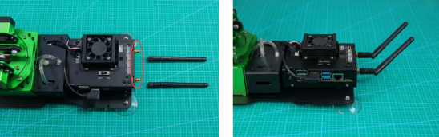
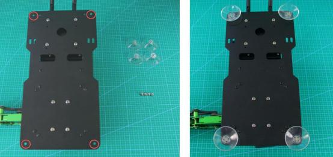
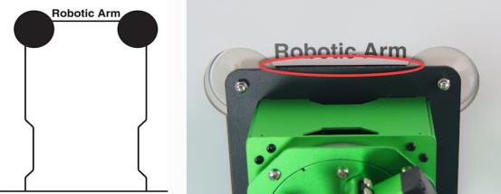
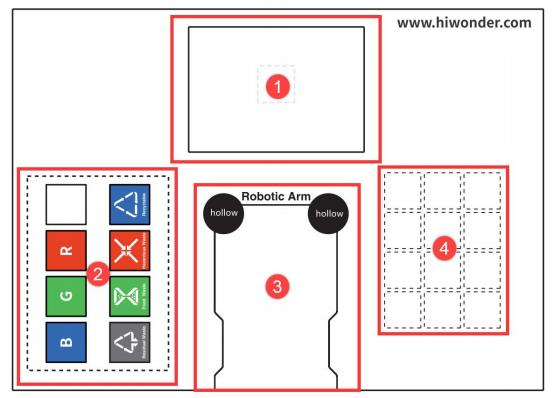
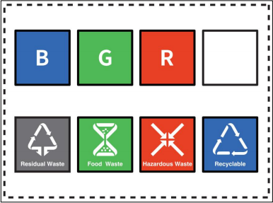
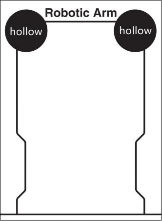
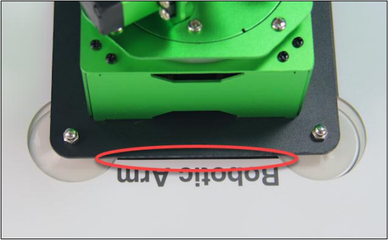

# 1. Getting Ready

## 1.1 JetMax Introduction

### 1.1.1 Introduction

JetMax is an intelligent robotic arm capable of deep learning and computer vision. Powered by Jetson Nano, it is equipped with high definition camera for effective interaction with perceived environment. JetMax is able to turn your AI ideas into reality.

Compared with traditional robotic arm, JetMax's end can be loaded with various end-of-tools, which makes it possible to pick, transfer goods, as well as suck the goods, draw and write with the suction cup and pen holder.

Combining with these features, JetMax can realize waste sorting, object sequencing, gesture recognition, etc. There is no doubt that we carry the functions of JetMax to its extreme.

### 1.1.2 Tutorial Guideline

**Step 1: have a understanding of the JetMax**

"**[1. Getting Ready](#anchor_1_1)**" includes "**[1.1 JetMax Introduction](#anchor_1_1)**" and "**[1.2 Getting Readying](#anchor_1_2)" and "**[1.3 Start the JetMax](#anchor_1_3)**". Through learning this chapter, you can gain a basic understanding of JetMax's structure, learn how to start JetMax and understand the device state after it is turned on.

**Step 2: control the JetMax via the APP**

In "**[2. Quick User Experience]()**", the materials, including "**[2.1 APP Control]()**" and "**[2.2 Color Threshold Setting]()**", are good helpers for you to play AI games. And "**2.2 Color Threshold Setting**" is optional. By reading it, you can know how to set the color value via the APP under different environment.

**Step 3: getting ready for AI vision games**

You can learn how to install and use No Machine in "**[3. AI Vision Games Lesson-\> 3.1 Set Development Environment]()**", as well as get a preliminary understanding of JetMax's system directory structure.

" Wi-Fi Modification" is an optional chapter. Through learning this chapter, you can set individualized name and password for JetMax. Besides, you can still quickly search the needed device Wi-Fi when multiple devices turn on at the same time.

**Step 4: learn how to play the AI games**

"**[3. AI Vision Games Lesson]()**" contains " **[3.2 Waste Sorting]()**" , "**[3.3 Object Sequencing]()**", "**[3.4 Color Sorting]()**", "**[3.5 Object Tracking]()**", "**[3.6 Numeric calculation]()**", "**[3.7 Block Stacking]()**", "**[3.8 Face Tracking]()**", "**[3.9 Emotion Recognition]()** "and "**[3.10 Gesture Recognition]()**".

In this chapter, you can learn to use the command line to start the AI vision games, have a simple understanding of implementation process and modify the program.

**Step 5: have a systematical learning about the advanced course**

The advanced courses consist of 2 chapters, including "**[4. Control Methods]()**" and "**[5. Various End-of-tools]()**".

The advanced AI vision games are divided into face tracking, emotion recognition and gesture recognition. In "**4. Control Methods**" you can learn how to control the robotic arm with wireless handle or mouse, and master how to use PC software, call the built-in actions, edit a simple action as well as import and export the action files.

In "**5.Various End-of-tools**", you can learn how to install different end-of-tools.

**Step 6: optional expanded courses**

"**[6.Advanced Program Lessons]()**", "**[7.OpenCV Basic Lesson]()**", "**[8.Deep Learning Lesson]()**" and "**[9.ROS Basic Lesson]()**"are optional. Whether read or not will not affect the playing experience.

"**6.Advanced Program Lessons**" includes "**[6.1 Jetson Nano Basic Lesson]()**", "**[6.2 JetsonNano Expansion Board Lesson]()**" and "**[6.3 Sensor&Module Expanded Course]()**".

Through learning the basic case, you can deepen your understanding of the JetsonNano controller and expansion board as well as master the essential operation. And also you are going to learn the fundamental sensor routine and learn how to combine the sensors with the vision module.

"**8.Deep Learning Lesson**" involves 10 lessons.

In this chapter, you can enhance your comprehension of the machine learning through getting basic knowledge of the machine learning and related libraries as well as combing with practical application.

"**9.ROS Basic Lesson**" contains 5 lessons.

This chapter is beneficial to your understanding of Ros system. You can know the ROS system layout, learn how to create software package and realize basic function, which is helpful for later Ros learning.

### 1.1.3 Product list

## 1.2 Getting Readying

### 1.2.1 Antenna, suction cup and device placement

Insert the antennas at the position shown in the figure below, then rotate to tighten them.

Install the suction cups to the four corners of the base, circled in the picture, and fix them with nuts.

Unfold the map on the desktop. Then place the robotic arm within the contour on the map. And the front of the robotic arm should be aligned with the front line of the contour, and the suction cups should fit the desktop tightly.

### 1.2.2 Map composition

Before controlling the JetMax, let's have a look at the map. The map consists of four parts, including ①vision recognition area, ② sorting area, ③ robotic arm placing area and ④ sequencing area.

① vision recognition area

The vision recognition area is the robotic arm's visual field. The cards and blocks to be recognized need to be placed within this area.

> [!NOTE]
>
> **Note: please don't place the cards or blocks in the edge of the recognition area so as to avoid recognition failure.**

② Sorting area

The robotic arm will transfer the cards or blocks from the recognition area to the placing area.

The functions of above areas are as follow.

|                             Icon                             |              Function               |
| :----------------------------------------------------------: | :---------------------------------: |
|  |            Stacking area            |
|  |       Red block placing area        |
|  |      Green block placing area       |
|  |       Blue block placing area       |
|  | Recyclable waste cards placing area |
|  | Hazardous waste cards placing area  |
|  |    Food waste cards placing area    |
|  |  Residual waste cards placing area  |

③ Robotic arm placing area

Please ensure that the front of the robotic arm should be aligned with this line.

④ Sequencing area

The robotic arm will transfer and sequence the number and alphabet cards to this area.

## 1.3 Start the JetMax

### 1.3.1 Power adaptor connection

Connect the power adaptor to the port of the expansion board as follow.

### 1.3.2 Boot up

1. Push the switch on the expansion board to "**ON**". After a while, the LED light on it will flash continuously. When the buzzer sounds "**beep**" for three times, it means the robotic arm boots up successfully.

   

2. After booting up, JetMax will be in AP direct connection mode by default and will launch a Wi-Fi starting with HW.

   

Next, you can move to Chapter 2 "**[2. Quick User Experience]()**".

