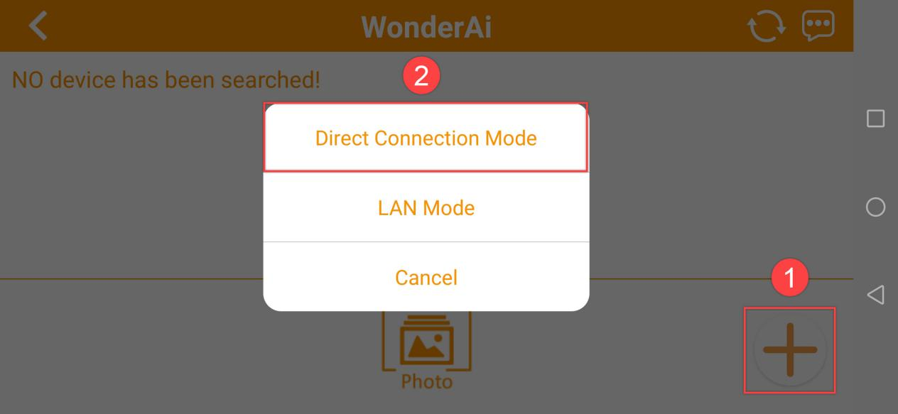
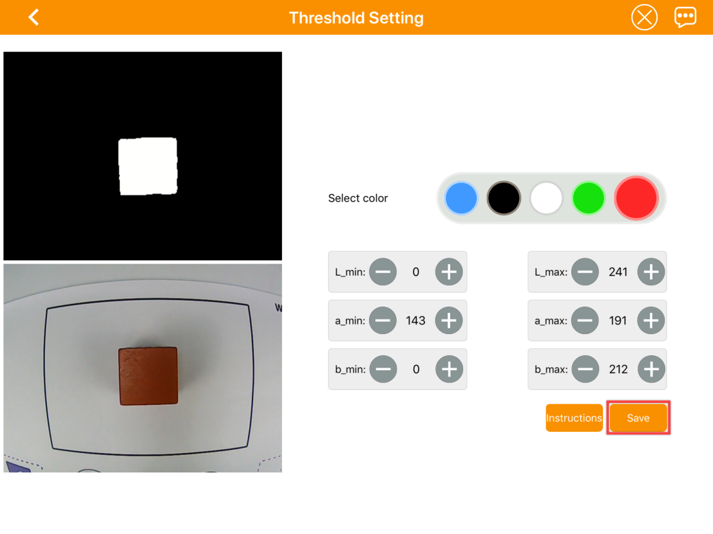

# 2. Quick User Experience

## 2.1 APP Control

For quick user experience, we connect to direct connection mode. In case of the choppy movement of the robotic arm, you can connect to Wi-Fi of 5G frequency band according to "**[2.1.4 LAN Mode Connection](#anchor_2_1_4)**".

### 2.1.1 Preparation

* **APP installation** 

Android user: you can find the installation package in **[Appendix](https://drive.google.com/drive/folders/1DdZzf90w1nmsgGjgrgxMLw_0GSzj8NOd?usp=sharing)** and transfer it to your phone for downloading. 

> [!NOTE]
>
> Note: please remember to enable all the permission for the APP, otherwise, it will affect the the function implementation.

iOS user: you can search "**WonderAi**" in App Store.

Before using the APP, please turn on GPS and Wi-Fi.

* **Boot up JetMax**

1)  Place JetMax on the map according to "**[1.Getting Ready/1.2 Getting Reading](https://wiki.hiwonder.com/projects/JetMax/en/latest/docs/1_Getting_Ready.html#getting-readying)**".

2)  Make sure the servo wire and air pump wire are secure. The wires on JetMax are connected before delivery.

3)  Switch on the button on Jetson Nano expansion board and wait for it to boot up.

### 2.1.2 Device connection 

When JetMax boots up successfully, it will generate a Wi-Fi starting with "**HW**". Open the "**WonderAi**" APP on your phone and connect to this Wi-Fi, then you can enjoy the AI games.

1)  Open the APP, then select JetMax as the picture below shown.

2)  Click "**+**" at the lower right button and select Direct Connection Mode.

3)  Next, follow the phone instruction to connect your phone to the Wi-Fi starting with "**HW**" in phone settings.

> [!NOTE]
>
> **Note: if you operate in iOS system, please don't return to the APP until the Wi-Fi icon appears above. Otherwise, the device cannot be searched.**

4)  Having connected, back to the APP. Then the phone will connect to the device automatically.

5)  When the below robotic arm icon appears, it means that the device is connected successfully.

### 2.1.3 Start the games

* **Position calibration**

Before playing the AI vision games, you need to calibrate the robotic arm's position to make it suck the object correctly. The operation is as follow.

1)  Place JetMax on the corresponding area on the map and ensure its baseboard is superimposed on the contour of robotic arm placing area.

2)  Click robotic arm icon to enter the mode selection interface, then select "**Position Calibration**"

3)  Click "**Start Position Calibration**".

4)  According to the prompt, place the AprilTag block directly under the suction nozzle. Only if the suction nozzle is at the center of the block when the robotic arm bends down, you can click "**Next**".

5)  When the 5 black dots on the screen coincide with the 5 colored dots on the AprilTag block, please click "**Complete**".

* **APP introduction**

**1. Robot control**

1)  Click JetMax icon to enter the main interface of game selection.

2)  Click "**Robot Control**" and select "**JetMax Desktop**".

3. The interface of "**Robot Control**" consists of two parts. The left side of the interface is the control area of robotic arm and suction nozzle. You can control them through the sliders and the buttons. At the right side, there is the real-time image transmitted by camera. The functions of the buttons at the left are as follow.

|                            Button                            | Function                                                     |
| :----------------------------------------------------------: | :----------------------------------------------------------- |
|  | Used to control the motion of the robotic arm. "Up" and "Down": control the end of the robotic arm to move up or down. "▲" and "▼": control the end of the robotic arm to move forward or backward. "◄"and "►": control the end of the robotic arm to move left or right. ●: make the robotic arm return to the initial posture |
|  | Used to control the motion of suction nozzle "Anti-clockwise" and "Clockwise": control the rotation of the suction nozzle "Lift": the air pump starts pumping "Release": the air pump stops pumping and the object will be released |
|  | Used to screenshot the real-time image                       |

> [!NOTE]
>
> **Special note: as the real-time image at the right side is mirror image, we should use the robotic arm as a reference to determine the direction when controlling the robotic arm.**

Next, we will control the robotic arm to suck a red block from the position on the left picture to the right picture.

The operation steps are as follow.

1. Place a red block in front of the robotic arm, and the block should not be too far away from the robotic arm.

2. Click "▲" to control the suction nozzle move directly above the block.

3. Then press "**Down**" button to make the suction nozzle down to fit the block.

4. Click "**Lift**" button to make the air pump start pumping.

5. Slide the "**Up**" button to control the suction nozzle move up to certain height, then stop.

6. Press "▼" button to control the robotic arm move backward.

7. Press "**Anti-clockwise**" button to control the suction nozzle to move to the left side of the picture.

8. Slide "**down**" button to control the suction nozzle to place the block on the desktop.

9. Click "**Release**" button to make the air pump stop pumping and release the block.

10. When the block is moved to the target position, click "●" button to make the robotic arm return to the initial posture.

4)  If you want to back to the game selection interface, you can click the blank area, then the title bar will appear. Next, click "" at the left side.

* **Waste sorting**

1)  Click "**Waste Sorting**" to enter this game.

2)  Place the waste cards to the recognition area on the map. Switch on "**Start**" button. Then the robotic arm will place the waste card to the waste placing area after recognition.

3)  If you want to stop the game, switch off "**Start**" button.

> [!NOTE]
>
> **Note:**
>
> * **Pay attention that the card should be parallel to the bottom line of recognition area. Otherwise, the robotic arm will place the cards incorrectly.**
>
> * **If JetMax sucks the cards wrongly, you can click "[2.1.3 Start the games->Position Calibration](#anchor_2_1_3)", then follow the instruction.**

* **Color sorting**

1)  Click "**Color Sorting**" to enter this game.

2)  Place the blocks to the recognition area. Then tick the color to be sorted. Lastly, switch on "**Start**" button to start the game. The robotic arm will place the blocks to the corresponding sorting area after recognition.

3)  If you want to quit this game, switch off "Start" button.

> [!NOTE]
>
> **Note:**
>
> * **keep the certain interval between the blocks.**
>
> * If the robotic arm cannot suck the blocks correctly, you can click "**[2.1.3 Start the games->Position Calibration](#anchor_2_1_3)** Calibration". Then follow the instruction to operate.
>
> * **If the robotic arm cannot recognize the color correctly, you can refer to the tutorial in "[2.Quick User Experience->2.2 Color Threshold Setting](#anchor_2_2)".**

* **Block stacking**

1)  Click "**Block Stacking**" to enter the game.

2)  Place the tag blocks to the recognition area. Then click "**Block Stacking**" to start the game. The robotic arm will pick and stack the blocks one by one in the stacking area after recognition.

3)  If you want to quit this game, you can switch off "**Start**" button.

> [!NOTE]
>
> **Note:**
>
> * **Keep the certain interval between the blocks.**
>
> * If the robotic arm cannot suck the blocks correctly, you can click "**[2.1.3 Start the games->Position Calibration](#anchor_2_1_3)**". Then follow the instruction to operate.

* **Object tracking**

1)  Click "**Object Tracking**" to enter the game.

2)  There are two tracking modes, namely color tracking and face tracking. Click "**Instruction**" to check how to install the camera under these two modes.

3)  The first mode is Color Tracking. Switch on the "**Color Tracking**" button to start the game. Move a colored block within the camera vision, then the robotic arm will move following the block.

4)  The second mode is Face Tracking. You need to install the camera facing forward. Switch on the "**Face Tracking**" button to start the game. After the game starts, the camera will move with the face.

5)  If you want to quit this game, switch off "**Color Tracking**" or "**Face Tracking**" button.

> [!NOTE]
>
> * **Please move the block within the camera vision and don't move the block too fast.**
>
> * **If the robotic arm cannot recognize the color correctly, you can refer to the tutorial in "[2.Quick User Experience-> 2.2 Color Threshold Setting](#anchor_2_2)".**

### 2.1.4 LAN Mode Connection(Optional)

* **LAN mode introduction**

LAN mode is to connect Jetson Nano to wireless router, which is more complicate. LAN mode and direct connection mode cannot be turned on simultaneously. If you want to back to direct connection mode, you can long press KEY1 on expansion board until LED1 flashes.

We take the operation on iOS APP for example. And it is also applicable to Android APP.

Before operation, please switch on Jetson Nano.

* **LAN mode connection**

1. In this lesson, we will connect to AP direct connection mode. Firstly, open WonderPi and click "**+**" button at the lower right corner and select "**LAN mode**". Follow the instruction to connect the Wi-Fi in phone settings.

2. Click the Wi-Fi you want to connect. Here I connect to LH_5G.

It is recommended to connect to 5G network. The difference between 2.4G and 5G frequency band is as follow.

The router supporting dual-frequency will distinguish the Wi-Fi name by default under the situation that 2.4 G and 5G are separated.

For example, Wi-Fi "**LH**" is 2.4 frequency band while "**LH_5G**" is 5G frequency band. If your network card does not support 5G frequency band, "**LH_5G**" cannot be searched. The Wi-Fi names vary from different router. The internal frequency band settings is the most important. When Wi-Fi of 5G frequency cannot be searched, you need to modify 5G as 2.4G.

3. Continue, enter the Wi-Fi password. If this interface doesn't occur, you can click " **LAN Mode**" again. Having entered the password, click "**Next**". Please ensure the password you enter is correct.

4. The APP will connect to the Wi-Fi automatically, later the prompt of "**Successful Connection**" will pop up. If you are prompted whether to join during the connection process, just click "**Join**".

5. After a while, the interface will switch back to the home interface where there is a robotic arm icon. And at the same time, LED1 on the expansion board will light up.

6. By long pressing the robotic arm icon, you can check the IP address and ID.

## 2.2 Color Threshold Setting

When we playing the AI vision games, the environment light will affect the JetMax's performance. And we can adjust the color threshold to cope with this.

Take adjusting red color for example, the operation steps are as follow.

1. Enter the main interface, then click  at the upper right corner to enter the interface of color threshold setting.

2. Place the red block within the recognition area on the map, then select the red icon.

3. Click "**Instruction**" button for help. According to the Lab color model diagram, red color is around "**+a**" zone, so we need to adjust the color threshold to "**+a**" zone.

4. Click "**OK**" to back to the setting interface. Set the parameters of **L_min, a_min and b_min** as 0, and the parameters of **L_max, a_max and b_max** as 255.

5)  Keep the values of "**a_max**" unchanged, while increase the values of "**a_min**" until the block image in the screen turns white and other area turns black.

6. Then based on the environment, adjust the value of **L_min, L_max, b_min and b_max.** If the color belongs to light red, you need to increase the value of "**L_min**". If it belongs to dark red, decrease the value of "**L_max**". If it belongs to dark red, decrease the value of "**L_max**". If it belongs to warm tone, increase the value of "**b_min**". If it belongs to cool tone, decrease the value of "**b_max**"

