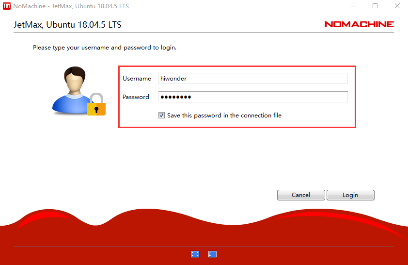
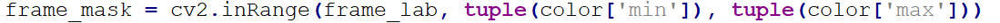
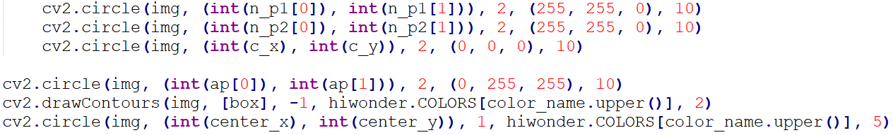
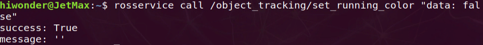

# 3. AI Vision Games Lesson

<p id="anchor_3_1"></p>

## 3.1 Set Development Environment

### 3.1.1 Remote Tool Installation and Connection

If you want to control the robotic arm to perform the games through PC, check the game source codes and modify the program, you need to read this material.

* **Preparation**

**1. Hardware preparation**

Please prepare a laptop or desktop computer. If you are using desktop computer, your own USB cable and wireless network card are required for the operation.

**2. NoMachine installation** 

NoMachine is a graphical software for remote controlling. After connecting the computer to the Wi-Fi created by Jetson Nano, we can directly control the Jetson Nano on our computer. Next, I will show you how to install this software in several steps.

1. Double click the "**[nomachine_8.4.2.exe](https://drive.google.com/drive/folders/1H8-GvIiYoX7tfdgVi2dDdVNzeJUe_a3W?usp=sharing)**" file in this folder, then click "**Next**"


2. Tick "**I accept the agreement**" and set the language as English.


3. Select the folder to install the software, then click "**Next**".


4. Wait to finish. Later on, the finishing prompt will pop up, then click "**Finish**".


5. After the installation is completed, click "**Yes**" to restart the computer in the pop-up window. Please don't skip this step!


<p id="anchor_device_connection"></p>

* **Device connection**

1)  Switch on JetMax. As the JetMax boots up successfully, it will create a Wi-Fi starting with HW. And you can search this Wi-Fi on your computer.


2)  Having connected, back to the NoMachine interface and double click the JetMax icon. Or you can enter "**192.168.149.1**" in the search box to login.


3. The prompt will pop up to ask you to enter the Username and Password. The username is "**hiwonder**" and password is "**hiwonder**". After entering, tick "**Save this password**" and click "**Login**". Later, keep clicking "**OK**" in the subsequent pop-up windows, then the Jetson Nano desktop will show up.



4. If the warning dialog box occurs, just click "**Cancel**". This is normal phenomenon. If black screen occurs, you can try to reboot up the Jetson Nano.


For the instructions of starting the games, please refer to the subsequent chapters.

* **Turn on remote NDIS compatible device**

If you are using desktop computer, you can turn on the NDIS compatible device for fluent running.

1. Connect the controller to the computer with the Android cable.


2. Next, install the NDIS driver. Right click "**Computer**" and select "**Attribute**". Then click "**Device Manager**" to find the NDIS driver and select "**Update driver**".


3. After the update is complete, follow step **[3.1.1 Remote Tool Installation and Connection->Device Connection](#anchor_device_connection)** to log in to the system. 

> [!NOTE]
>
> The login address needs to be changed to "**192.168.55.1**".

### 3.1.2 System Directory Introduction

* **Desktop layout**

The remote Jetson Nano system desktop is as follow.


These 6 icons need to be focused on.

|                           **Icon**                           |                  **Function**                  |
| :----------------------------------------------------------: | :--------------------------------------------: |
|  |          Color value adjustment tool           |
|  |                  Collect data                  |
|  |                Set servo angle                 |
|  |              Set servo deviation               |
|  |              Calibrate the camera              |
|  | Command line terminal for entering the command |

* **System structure introduction**

The entered commands must be case-sensitive and space sensitive. Keywords can be complemented by the TAB key.

1. Click  to open terminal.


2. Enter command "**cd ros/src/**" to enter the src folder.

```bash
cd ros/src/
```

3. Enter "**ls**" command and press "**Enter**" to list all the files. And we mainly focus on these three directories.


|         Name         |                           Function                           |
| :------------------: | :----------------------------------------------------------: |
|      Ai_JetMax       |        Program for robotic arm individual controlling        |
| jetmax_buildin_funcs |             Robotic arm APP controlling program              |
|     jetmax_demos     |        Program for robotic arm individual controlling        |
|        Sensor        | Control program of Jetson Nano expansion board and external sensor/ module |

4. Next, enter the directory of games and program source codes. In **Ai_JetMax** directory, enter "**cd Ai_JetMax/scripts/**" command. Then enter "ls" command to list all the folders and files in this directory. The files in red frame are game files.


The games for each game file are listed below.

|        File name        |                Games                 |
| :---------------------: | :----------------------------------: |
|     color_detect.py     |          Color recognition           |
|  apriltag_distance.py   |         AprilTag recognition         |
|     face_detect.py      |           Face recognition           |
|    color_position.py    |          Block positioning           |
|  apriltag_position.py   |         AprilTag positioning         |
|  apriltag_tracking.py   |          AprilTag tracking           |
|  number_recognition.py  |       Number card recognition        |
| waste_classification.py |        Waste card recognition        |
|  letter_recognition.py  |      Alphabet card recognition       |
|     color_angle.py      |       Color angle recognition        |
|       auto_reg.py       | Suction cup position auto adjustment |

5. In **jetmax_demos** directory, enter command "**cd jetmax_demos/scripts/**". Then enter "**ls**" command to list all the folders and files in this directory. The files in red frame are game files.


The games for each game file are listed below.

<table class="docutils-nobg" border="1">
<colgroup>
<col style="width: 35%" />
<col style="width: 65%" />
</colgroup>
<tbody>
<tr>
<td>
<p><strong>Game file</strong></p>
</td>
<td>
<p><strong>Games name</strong></p>
</td>
</tr>
<tr>
<td rowspan="2">
<p>apriltag_detect.py</p>
</td>
<td>
<p>AprilTag recognition</p>
</td>
</tr>
<tr>
<td>
<p>ApriTag recognition</p>
</td>
</tr>
<tr>
<td rowspan="2">
<p>visual_calculator.py</p>
</td>
<td>
<p>numerical calculation</p>
</td>
</tr>
<tr>
<td>
<p>numerical calculation experiment</p>
</td>
</tr>
<tr>
<td>
<p>shape_detection.py</p>
</td>
<td>
<p>shape recognition</p>
</td>
</tr>
<tr>
<td>
<p>face_expression.py</p>
</td>
<td>
<p>emotion recognition</p>
</td>
</tr>
<tr>
<td>
<p>hand_gesture.py</p>
</td>
<td>
<p>gesture recognition</p>
</td>
</tr>
<tr>
<td>
<p>smart_store.py</p>
</td>
<td>
<p>smart warehousing</p>
</td>
</tr>
<tr>
<td>
<p>face_expression_draw.py</p>
</td>
<td>
<p>emotion recognition and drawing</p>
</td>
</tr>
<tr>
<td>
<p>screw_nut.py</p>
</td>
<td>
<p>screw sorting</p>
</td>
</tr>
<tr>
<td>
<p>obj_classification.py</p>
</td>
<td>
<p>goods sorting</p>
</td>
</tr>
<tr>
<td>
<p>alphabetically_main.py</p>
</td>
<td>
<p>word spelling</p>
</td>
</tr>
<tr>
<td>
<p>face_mask_main.py</p>
</td>
<td>
<p>face mask recognition</p>
</td>
</tr>
<tr>
<td rowspan="4">
<p>simple_draw.py</p>
</td>
<td>
<p>Stick figure drawing</p>
</td>
</tr>
<tr>
<td>
<p>robotic arm draw stick figure</p>
</td>
</tr>
<tr>
<td>
<p>robotic arm draw expression</p>
</td>
</tr>
<tr>
<td>
<p>robotic arm write number</p>
</td>
</tr>
</tbody>
</table>

6. In sensor directory, enter "**cd Sensor/scripts/**" command first. Then enter "ls" command to list all the files and folders in this directory. The files in the red frame are game files.


The game for each file is listed below.

|         File name         |                             Game                             |
| :-----------------------: | :----------------------------------------------------------: |
|  serial_servo_control.py  |             Control rotation of serial bus servo             |
|   serial_servo_speed.py   |               Adjust speed of serial bus servo               |
|   serial_servo_read.py    |                Read state of serial bus servo                |
|   pwm_servo_control.py    |                   Control single PWM servo                   |
|    pwm_servo_speed.py     |                    Control speed of servo                    |
|    multi_pwm_servo.py     |                 Control multiple PWM servos                  |
|     buzzer_control.py     |                        Control buzzer                        |
|        dc_motor.py        |                       Control DC motor                       |
|      serial_port.py       |                     Control serial port                      |
|      fan_control.py       |                    Fan module experiment                     |
|         sonar.py          |                  Control ultrasonic sensor                   |
|      touch_sensor.py      |                    Touch sensor detection                    |
|    m1640_led_matrix.py    |                  Dot matrix module display                   |
|    digital_display.py     |                 Digital tube module display                  |
|     face_tracking.py      |                   Fan tracking and control                   |
|      sonar_radar.py       |                   Ultrasonic scan display                    |
|      sonar_color.py       | Ultrasonic and AI recognition, control and picking |
| face_expression_matrix.py |          Emotion recognition and dot matrix display          |
|   hand_gesture_tube.py    |         Gesture recognition and digital tube display         |
|     touch_control.py      |                        Touch control                         |

7. In "**jetmax_buildin_funcs**" directory, enter "**cd jetmax_buildin_funcs/**" command, then enter "**ls**" command to check the folder storing different AI game files.


Enter the corresponding folder, then enter the **scripts** folder to find the corresponding game file. For example, enter **waste_classification** folder to find the game file of waste sorting.


The game for each game file is listed below.

<table class="docutils-nobg" border="1">
<colgroup>
<col style="width: 35%" />
<col style="width: 65%" />
</colgroup>
<tbody>
<tr>
<td>
<p><strong><span class="mark">Game file</span></strong></p>
</td>
<td>
<p><strong><span class="mark">Game</span></strong></p>
</td>
</tr>
<tr>
<td rowspan="2">
<p>waste_classification_main.py</p>
</td>
<td>
<p>waste sorting</p>
</td>
</tr>
<tr>
<td>
<p>waste sorting experiment</p>
</td>
</tr>
<tr>
<td>
<p>alphabetically_main.py</p>
</td>
<td>
<p>object sequencing</p>
</td>
</tr>
<tr>
<td rowspan="2">
<p>color_sorting_main.py</p>
</td>
<td>
<p>color sorting</p>
</td>
</tr>
<tr>
<td>
<p><span class="mark">robotic arm color sorting</span></p>
</td>
</tr>
<tr>
<td rowspan="5">
<p>object_tracking_main.py</p>
</td>
<td>
<p>object tracking</p>
</td>
</tr>
<tr>
<td>
<p>face tracking</p>
</td>
</tr>
<tr>
<td>
<p>color tracking experiment</p>
</td>
</tr>
<tr>
<td>
<p>face tracking experiment</p>
</td>
</tr>
<tr>
<td>
<p>robotic arm color tracking</p>
</td>
</tr>
<tr>
<td>
<p>alletizing_main.py</p>
</td>
<td>
<p>intelligent stacking</p>
</td>
</tr>
</tbody>
</table>

## 3.2 Waste Sorting

### 3.2.1 Program logic

The process of waste sorting is divided into two parts.

**Step 1: recognize and sort**

Firstly, subscribe to the real-time image data released by the camera node. Then covert this data to Numpy form. After that, input the image to yolov5 network for server operations, including scale, transpose, array expand, etc. After serial operations, the processing result will be obtained.

The obtained coordinate of the waste card will be converted to the original image coordinate. After the coordinate is converted and the waste name is recognized, the waste card will be classified according to the set rules and the category name of the waste will be gained. Next the waste will be framed, then its name and recognition credibility will be displayed.

**Step 2: suck and place**

Firstly, the waste card with highest recognition credibility will be the first to be sorted, then it will be framed with white box. When confirming the next waste card to be sorted, there is no need to compare the recognition credibility between these cards repeatedly. The waste card which is nearest to the first sorted target, is the next to be sorted. In order to ensure the result credibility, the target will be recognized repeatedly.

When the target is confirmed, the process of sorting and transferring will start. The pixel coordinate of the target card will be converted into the world coordinate. Then calculate the distance between the card position and sorting area to control the speed.

Calculate the angle of the robotic arm relative to the central axis and control the corresponding angle of the suction cup rotation. At last, control the robotic arm to pick the waste card, then suck and transfer it to the sorting area.

The source code of the program is located in **/Home/ros/src/jetmax_buildin_funcs/waste_classification/ scripts/waste_classification_main.p**


### 3.2.2 Preparation

1)  Please place the robotic arm on the map, then switch on it and calibrate its position. You can calibrate the robotic arm via the mobile APP. For the detailed instruction, you can refer to the **[2. Quick User Experience](https://wiki.hiwonder.com/projects/JetMax/en/latest/docs/2_Quick_User_Experience.html)**. Then place the waste cards to the recognition area. Ensure the cards are not too close to each other and don't place them to edge of the recognition area.

2)  Install and open the No Machine remote tool. For detailed instruction, you can refer to "**[3. AI Vision Games->3.1 Set Development Environment->3.1.1 Remote Tool Installation and Connection](https://wiki.hiwonder.com/projects/JetMax/en/latest/docs/3_AI_Vision_Games_Lesson.html#remote-tool-installation-and-connection)**".

### 3.2.3 Operation steps

The entered command should be case-sensitive. And the keywords can be complemented by the Tab key.

* **Enter the game**

1)  Turn on JetMax, then connect to the system desktop through No Machine.

2)  Click .

3)  Enter the game. Then enter command "**rosservice call /waste_classification/enter "{}"**" and press Enter.


* **Turn on camera**

Turn on camera. Double click , then enter the address, **192.168.149.1:8080/** and press Enter. Next, select "**/waste_classification/image_result(Snapshot)**".


* **Start the game**

Start the game. Enter command "**rosservice call /waste_classification/set_running "data: true"**" and press Enter.


* **Stop and exit the game** 

1. If you want to stop the game, you can enter command "**rosservice call /waste_classification/ set_running "data: true"**" and press Enter.


2. If you want to exit the game, you can enter command "**rosservice call /waste_classification/exit"{}"**" and press Enter.


### 3.2.4 Function Realization

After the game starts, place the waste card to the recognition area. When the camera recognizes the waste card, the robotic arm will suck and transfer them to the corresponding area according to the card category.

|  Waste category  |                    Card                     |
| :--------------: | :-----------------------------------------: |
| Hazardous_waste  | Storage Battery、Marker、Oral Liquid Bottle |
| Recyclable_waste |    Plastic Bottle, Umbrella, Toothbrush     |
|    Food_waste    |     Banana Peel, Ketchup, Broken Bones      |
|  Residual_waste  | Cigarette End, Plate, Disposable Chopsticks |

## 3.3 Object Sequencing

### 3.3.1 Program logic 

The implementation process is divided into 2 parts.

**Step 1: recognize**

Firstly, we set the variable of `state.running_mode` to control the game mode. When the variable is set as 1, the program of alphabet sequencing will be executed.

Next, subscribe to real-time image data released by camera node and convert it into Numpy form. Then input the image to yolov5 network to scale, transpose and array expand so as to acquire the processed result.

Then, convert the recognized alphabet card coordinates into the origin image coordinates, frame the alphabet cards and display the alphabet.

**Step: sequence and place the cards**

Firstly, call `min()` function of python and make the alphabet card with smallest frame the first target to be sequenced. And the next target is the alphabet card which is the closest to the first target. To ensure the reliability, it is necessary to recognize the target for several times.

After the target is confirmed, the robotic arm will start sequencing and transferring. And convert the pixel coordinate of the target card into world coordinate for calculation between the current position of the cards and placing area so as to control the speed.

Lastly, calculate the angle of the robotic arm relative to the central axis and control the corresponding angle of the suction cup rotation. Control the robotic arm to suck and sequence the alphabet card in the placing area.

The source code of the program locates in **/Home/ros/src/jetmax_buildin_funcs/alphabetically/**

**scripts/alphabetically_main.py**


### 3.3.2 Preparation

1)  Place the robotic arm on the map. Then switch on the robotic arm and calibrate its position. It is recommended to calibrate its position via mobile APP. For more details, you can refer to "**[2.Quick User Experience->2.1 APP Control](https://wiki.hiwonder.com/projects/JetMax/en/latest/docs/2_Quick_User_Experience.html#app-control)**". Then place the alphabet card in the recognition area. Please keep certain interval between the cards and don't place the cards on the edge of the recognition area.

2)  According to the "**[3.AI Vision Games Lesson->3.1 Set Development Environment->3.1.1 Remote Tool Installation and Connection](https://wiki.hiwonder.com/projects/JetMax/en/latest/docs/3_AI_Vision_Games_Lesson.html#remote-tool-installation-and-connection)**", install and open NoMachine.

### 3.3.3 Operation steps

The entered command should be case sensitive. And the keywords can be complemented by Tab key.

* **Enter the game** 

1. Turn on JetMax and connect to the system desktop through NoMachine.

2. Double click  to open command line terminal.

3. Enter command "**rosservice call /alphabetically/enter "{}"**" and press Enter to enter the game.


* **Turn on camera**

Double click . Then enter the address "**192.168.149.1:8080/**" in the address bar and press Enter. Next, select "/**alphabetically/image_result(Snapshot)**" to turn on camera.


* **Start the game.**

1)  Enter command "**rosservice call /alphabetically/set_running_char "data: true"**" and press Enter to turn on the recognition check function to check whether the alphabet is recognized.


2)  Enter command "**rosservice call /alphabetically/set_running_char "data: true"**" again and press Enter to start sucking.


3)  We can enter this command "**rosservice call /alphabetically/set_running_char "data: true"**" continuously to turn on recognition check and sucking function.


> [!NOTE]
>
> Special note: in step 3, when you turn on the recognition check and sucking function, the robotic arm will continue to sequence the alphabet that follows. Only when we enter the command to stop the recognition check and the suction function, and then turn on the suction function, the robotic arm will start a new round of alphabet sequencing.

* **Stop and exit the game** 

1. If you want to stop recognition check and sucking function, enter "**rosservice**

**call /alphabetically/set_running_char "data: false"**" and press Enter.


2. If you want to exit the game, you can enter command "**rosservice call /alphabetically/exit "{}"**" and press Enter.


### 3.3.4 Function realization

After the game starts and the camera recognize the alphabet cards, the robotic arm will suck them in order, then place them in the placing area.


## 3.4 Color Sorting

### 3.4.1 Program logic

The process of color sorting consists of three parts.

**Step 1: color recognition**

Firstly, perform the color recognition. And we need to load the camera program, read the camera parameter and subscribe to the camera topic to start the corresponding callback function. In callback function, convert the obtained ROS image to date in numpy form.

Next, convert the color space of the image, that is transfer it form RGB space to Lab space. Then, we carry out binarization, corrosion and expansion on it. After that, call OpenCV function `cv2.findContours()` to find the contour of the target color.

**Step 2: confirm the position**

Firstly, calculate the contour area and eliminate the part that is too small. Then process all the contour and obtain the coordinates of four corners of the bounding rectangle. Next calculate to obtain the coordinate of center point. After that, the target colored block will be framed.

Continue, compare all the contour areas to find the colored block with largest contour area, then frame it with white box. In order to avoid interference, the steps of recognizing and comparing will be carried out for multiple times. If the results obtained are consistent, it means that the recognition is accurate.

**Step 3: sorting**

After confirming the target position, calculate the distance between colored block position and sorting area to control the speed. Then, calculate the angle of the robotic arm relative to central axis and control the corresponding angle of the suction cup rotation to suck and sort the colored block.

The source code of the program is located in **/Home/ros/src/jetmax_buildin_funcs/color_sorting/**

**scripts/color_sorting_main.p**


### 3.4.2 Preparation

1)  Please place the robotic arm on the map, then switch on it and calibrate its position. You can calibrate the robotic arm via the mobile APP. For the detailed instruction, you can refer to the **[2. Quick User Experience](https://wiki.hiwonder.com/projects/JetMax/en/latest/docs/2_Quick_User_Experience.html)**. Then place the colored blocks to the recognition area. Ensure the blocks are not too close to each other and don't place them to edge of the recognition area.

2)  Install and open the NoMachine remote tool. For detailed instruction, you can refer to "**[3. AI Vision Games->3.1 Set Development Environment->3.1.1 Remote Tool Installation and Connection](https://wiki.hiwonder.com/projects/JetMax/en/latest/docs/3_AI_Vision_Games_Lesson.html#remote-tool-installation-and-connection)**".

### 3.4.3 Operation Steps

The entered command should be case sensitive. And the keywords can be complemented by Tab key.

* **Enter the game**

1. Turn on JetMax, then connect to the system desktop through No Machine.

2. Double click  to open command line terminal.

3. Enter the game. Enter command "**rosservice call /color_sorting/enter "{}"**" and press Enter.

```bash
rosservice call /color_sorting/enter "{}"
```

* **Turn on camera**

Double click , then enter the address, **192.168.149.1:8080/** and press Enter. Next, select "**color_sorting/image_result(Snapshot)**"to turn on the camera.


* **Start the game**

1. Enter the command "**rosservice call /color_sorting/set_target "color_name: 'red': is_enable: true"**" and press Enter to set the target color. Here we set the target color as red.


2. Enter command "**rosservice call /color_sorting/set_running "data: true"**" and press Enter to start the game.


* **Stop and exit the game**

1. If you want to stop the game, you can enter command "**rosservice call /color_sorting/set_running "data: false"**" and press Enter.


2. If you want to exit the game, enter command "**rosservice call /color_sorting/exit "{}"**" and press Enter.


### 3.4.4 Function Realization 

After the game starts, place the colored blocks to the recognition area. Then the robotic arm will pick the blocks in target color and place them to the corresponding sorting area.


### 3.4.5 Inverse kinematic analysis 

In this lesson, we will control the robotic arm to suck the colored block and place them to corresponding position according to different color.

After running the program, call `rospy.Subscriber` function to turn on the camera and retrieve the pictures taken by the camera.


After turning on the camera, call `image_proc(img)` function to perform Lab conversion, binaryzation, corrosion and dilation, contour locating, block framing and block sorting. The specific analysis is as follow.

- **Lab conversion**

In image information read by OpenCV, each frame is arranged by the pixels constitute of B, G and R components. Changes will take place in three-primary colors under different lighting. Three-primary color refers to red, green and blue.

Call `cv2.cvtColor` function to convert RGB color space into Lab color space.


Before conversion, perform noise reduction on the image, that is use `cv2.GaussianBlur` function for Gaussian filtering.

The first parameter `np.copy(img)` represents the input image.

The second parameter `(5, 5)` represents the size of Gaussian kernel. Gaussian kernel in larger size will result in greater filtering.

The third parameter `5` represents the variance allowed around the mean in Gaussian filtering. The larger the parameter, the larger the variance allowed around the mean. The smaller the parameter, the smaller the variance allowed around the mean.

- **Image binaryzation**

Next, extract and locate the contour of the preliminary processed image so that the information can be effectively used.

Represent all the pixels of the image by 0 and 1. Display the pixel of 0 in black and the pixel of 1 in white, which is called image binaryzation processing.

Call `cv2.inRange` function to perform image binaryzation. The program is as follow.



- **Corrosion and dilation**

In order to reduce disturbance and make the image smoother, the grayscale image obtained after image binaryzation will be corroded and dilated. Corrosion aims at removing the bur from the edge of the image, while dilation will dilate the edge of the image to fill in the non-target pixel in the edge of or inside the target object.

call `cv2.erode` function to perform corrosion and call `cv2.dilate` to perform dilation. The program is as follow.


`getStructuringElement` function is used in the processing. This function is used to generate the structural element of different shapes.

The first parameter `cv2.MORPH_RECT` represents the structural element is rectangle.

The second parameter `(3, 3)` represents the dimension of the rectangle is 3X3.

- **Locate the contour**

The purpose of previous several operations is to locate the target object. Next, locate the contour of the target object by dividing the black and white area.

call `cv2.findContours` function to locate the contour, and the specific program is as follow.


- **Frame the block**

After the block is found, frame it and draw 5 dots on it to mark its position. The specific program is as follow.



1. use `cv2.drawContours` function to draw the contour of the block.

The first parameter `img` represents the specific block image of the drawn contour.

The second parameter `[box]` represents the contour itself.

The third parameters `-1` represents the index of the contour.

The fourth parameter `hiwonder.COLORS\[color_name.upper()\]` represents the color of the drawn contour.

The fifth parameter `2` represents the width of the contour.

2. Use `cv2.circle` function to draw 5 circles. Take `cv2.circle(img, (int(n_p1[0]), int(n_p1[1])), 2, (255, 255, 0), 10)` for example.

The first parameter `img` represents the specific block image of the drawn dots.

The second parameter `(int(n_p1[0]), int(n_p1[1]))` represents the center coordinate of the drawn circle.

The third parameter `2` represents the radius of the drawn circle.

The fourth parameter `(255, 255, 0)` represents the color of the drawn circle. The parameter consists of 3 values ranging from 0 to 255. This parameter represents that the font color is mixed with red , green and blue. The first value 255 represents red value. The second value 255 represents the green value and the third value 0 represents the blue value.

The fifth parameter `10` represents the width of the drawn circle. The lager the value, the wider the width.

- **sort the colored block**

After the location of the colored block is marked, control the robotic arm to sort the colored block. The specific program is as follow.

1. Perform colored block detection for multiple times. When the colored block is detected over 5 times, calculate the related data of the colored block. The specific program is as follow.


2. When the colored block is detected over 30 times, call `threading.Thread` function to sort the colored block. The specific program is as follow.


The first parameter `target=moving` represents the action of adjusting block angle. Please set according to the picture.


This process is divided into 5 steps.

**1. obtain the old coordinate**

Record the current coordinates of X axis, Y axis and Z axis of the robotic arm, and use the variables of cur_x, cur_y and cur_z to store the value. The program is as the picture shown.


**2. calculate the block coordinate**

Before sucking the block, we need to calculate the coordinate of X axis and Y axis of the robotic arm, and coordinate of Z axis needs to be set manually. Locate the block through the camera, and then calculate new X axis and Y axis coordinate of the robotic arm. The program is as follow.


**3. Suck the block and adjust the block position**

Control the robotic arm to move through setting the coordinate of the robotic arm. Then suck the block and adjust the block position.


When controlling the robotic arm to rotate, call `set_position` program to convert the coordinate value of the robotic arm into the value of servo controlling. The program is as follow.


According to the color of the block, acquire the coordinate where the block is placed, and control the robotic arm to move to the corresponding position.

Sort red, green and blue block. According to different color name, we will obtain different color coordinate (x，y，z). Then convert the coordinate value of the robotic arm into the value of servo controlling. The program is as follow.


**4. Release the block, and lift the robotic arm**

After controlling the robotic arm to the (x, y, z) coordinates, release the color block, and then control the robotic arm to move to the (x, y, 140) position. The procedure is as follows.


The second parameter `daemon=True` indicates that it is marked as a daemon thread. If only daemon threads remains, the entire program will exit.

3. After sorting the color blocks, use `cv2.line` function to draw 2 straight lines and draw a cross to mark the position of the color blocks, as shown in the following figure.


Take `cv2.line(img, (int(img_w / 2), int(img_h / 2 - 10)), (int(img_w / 2), int(img_h / 2 + 10)), (0, 255, 255), 2)` for example.

The first parameter `img` represents the specific block image of the drawn straight line.

The second parameter `(int(img_w / 2), int(img_h / 2 - 10))` represents the starting coordinate of the straight line.

The third parameter `(int(img_w / 2), int(img_h / 2 + 10))` represents the end coordinate of the straight line.

The fourth parameter `(0, 255, 255)` represents the color of the straight line. The parameter consists of 3 values ranging from 0 to 255. This parameter represents that the line color is mixed with red , green and blue. The first value 0 represents red value. The second value 255 represents the green value and the third value 255 represents the blue value.

The fifth parameter `2` represents the width of the line.

## 3.5 Object Tracking

### 3.5.1 Program logic

The process of object tracking is divided into 2 parts.

**Step 1: color recognition**

Before locating the colored block, the robotic arm should perform color recognition. And we will use Lab color space to process it. Firstly, convert RGB color space to Lab, then perform binarization, open operation and close operation to obtained the object contour which only contains the target color.

Next, process all the contours of the target color and calculate their area. Set the threshold to eliminate the contour that is too small. After that, find the largest contour and largest contour area through comparison.

**Step 2: color tracking**

After recognition, we set the current circle center coordinate of the target contour as the initial value, then calculate and update the PID value according to the real-time circle center coordinate. Through inverse kinematics solution, the rotation angle of each servo will be obtained so as to control the robotic arm to track the object.

At last, call the OpenCV built-in function `cv2.circle()` to frame the target. The source code of the program is located in **/Home/ros/src/ jetmax_buildin_funcs /object_tracking/scripts/.**


### 3.5.2 Preparation 

1)  Please place the robotic arm on the map, then switch on it and calibrate its position. You can calibrate the robotic arm via the mobile APP. For the detailed instruction, you can refer to the **[2. Quick User Experience](https://wiki.hiwonder.com/projects/JetMax/en/latest/docs/2_Quick_User_Experience.html)**. Then place the colored blocks to the recognition area.

2)  Install and open the No Machine remote tool. For detailed instruction, you can refer to "**[3. AI Vision Games->3.1 Set Development Environment->3.1.1 Remote Tool Installation and Connection](https://wiki.hiwonder.com/projects/JetMax/en/latest/docs/3_AI_Vision_Games_Lesson.html#remote-tool-installation-and-connection)**".

### 3.5.3 Operation Steps

The entered command should be case sensitive. And the keywords can be complemented by Tab key.

* **Enter the game** 

1)  Turn on JetMax, then connect to the system desktop through No Machine.

2)  Double click  to open command line terminal.

3)  Enter command "**rosservice call /object_tracking/enter "{}"**" and press Enter to enter the game.


* **Turn on Camera**

Double click  and enter the address "**192.168.149.1:8080/**", then press Enter. After that, select " **/object_tracking/image_result(Snapshot)**" to turn on the camera.


* **Start the game**

1. Enter command "**rosservice call /object_tracking/set_target "color_name: 'blue'"** " to set the color to be tracked and press Enter. Take tracking blue for example.


2. Enter command "**rosservice call /object_tracking/set_running_color "data: true"** " and press Enter to start color tracking.


* **Stop and exit the game** 

1. If you want to stop the game, you can enter command "**rosservice call /object_tracking/set_running_color "data: false"** " and press Enter.



2. If you want to exit the game, you can enter command " **rosservice call /object_tracking/exit "{}" "** and press Enter.


### 3.5.4 Function realization

> [!NOTE]
>
> * **Please play this game under a solid background, and the background color should not be the same or similar to the target color.**
>
> * **The target should move within the camera vision and its moving speed should not be too fast.**

After the game starts, the robotic arm will move with the target block.


## 3.6 Numeric calculation

### 3.6.1 Program logic 

The implementation of the numeric calculation is divided into 3 parts.

**Step 1: recognize and acquire**

Firstly, subscribe to real-time image data released by camera node and convert it into Numpy form. Then input the image to yolov5 network to scale, transpose and array expand so as to acquire the processed result.

Then, convert the coordinates of recognized number cards into the origin image coordinates, frame them according to the coordinate and display corresponding equation.

**Step 2: recognize and calculate**

Firstly, sequence the recognized number cards from left to right to form a equation. Next browse the number library, then convert the equation into a text formula and calculate. Pay attention a complete equation should contain "=". If the equation is not complete, the terminal will display the wrong result.

Next, call the built-in function `eval()` of Python to get the result. And convert the result into character string.

**Step 3: suck and place**

After the result is obtained, control the robotic arm to recognize and transfer. Place the number card corresponding to the result to the back of the equation.

Firstly, control the robotic arm to rotate to the recognition area, then recognize the cards to find the target. After that, convert the pixel coordinate of the target to world coordinate and calculate the distance between the current position of the target card and the placing area to control the speed.

Calculate the angle of the robotic arm relative to the central axis and control the corresponding angle of the suction cup rotation. Lastly, control the robotic arm to pick and place the number card, corresponding to the result, to the back of the equation.

The source code of the program lies in **/Home/ros/src/jetmax_demos/scripts/visual_calculator.py**


### 3.6.2 Preparation

1)  Switch on the robotic arm and calibrate its position. It is recommended to calibrate its position via mobile APP. For more details, you can refer to "**[2. Quick User Experience->2.1 APP Control](https://wiki.hiwonder.com/projects/JetMax/en/latest/docs/2_Quick_User_Experience.html)**". Then place the number cards within the camera vision. Please keep certain interval between the cards.

2)  According to the "**[3. AI Vision Games Lesson->3.1 Set Development Environment->3.1.1 Remote Tool Installation and Connection](https://wiki.hiwonder.com/projects/JetMax/en/latest/docs/3_AI_Vision_Games_Lesson.html#remote-tool-installation-and-connection)**", install and open NoMachine.

### 3.6.3 Operation steps

The entered command should be case sensitive. And the keywords can be complemented by Tab key.

1. Turn on JetMax and connect to the system desktop through NoMachine.

2. Double click  to open command line terminal.

3. Enter command "**cd ros/src/jetmax_demos/scripts**" and press Enter to enter the directory storing the game program.

```bash
cd ros/src/jetmax_demos/scripts
```

4. To avoid the memory being occupied and affect the game, you need to enter command "**./kill_app_funcs.sh**" to close other games.


5. Then enter the password to grant the permission to execute the previous command. The password is "**hiwonder**".


6. Lastly, enter command "**rosrun jetmax_demos visual_calculator.py**" and press Enter to start the game.

```bash
rosrun jetmax_demos visual_calculator.py
```

7. If you want to exit this game, press "**Ctrl+C**". If it fails to exit, you can try again.

### 3.6.4 Function realization

After the game starts, JetMax will calculate the equation result. And display the result on the image transmitted by camera. Then it move to find the number card corresponding to the result and place it to the back of the equal sign.


## 3.7 Block Stacking

### 3.7.1 Program Logic

The process of block stack is divided into 3 parts.

**Step 1: recognize target**

Firstly, we need to recognize the AprilTag. Load the camera program, read the camera parameter and subscribe to the camera topic so as to start the corresponding callback function. In callback function, the obtained ROS image will be converted into the data in numpy form and further into grayscale.

Next, send this image to ID recognition program to process. After that, the information of the ApriTag will be gained. Then, we convert the corner and center coordinate into integer. Draw the frame and the center point. And display the ID to complete recognition.

**Step 2: judge**

Next, it is necessary to judge the obtained AprilTag information. Due to the various external factors, there will be error in the recognition result. Because the images are processed by frames, it is only required to recognize the camera images of consecutive frames, after which determine whether the recognized tag IDs are consistent. Then the target can be confirmed. In this way, the result credibility can be increased.

**Step 3: stack**

Decode the recognized AprilTag, and convert its angle value to Euler angle as well as its coordinate to world coordinate. After converting the coordinate, calculate distance between the tag block's current position and the stacking area to control the speed. At last, calculate the angle of the robotic arm relative to the central axis and control the corresponding angle of the suction cup rotation.

The source code of the program is located in **/Home/ros/src/jetmax_buildin_funcs/palletizing/**

**scripts/palletizing_main.py**


### 3.7.2 Preparation

1)  Please place the robotic arm on the map, then switch on it and calibrate its position. You can calibrate the robotic arm via the mobile APP. For the detailed instruction, you can refer to the **[2. Quick User Experience](https://wiki.hiwonder.com/projects/JetMax/en/latest/docs/2_Quick_User_Experience.html)**. Then place the tag blocks to the recognition area. Ensure these blocks are not too close to each other and don't place the blocks to the edge to the recognition area.

2)  Install and open the NoMachine remote tool. For detailed instruction, you can refer to "**[3. AI Vision Games->3.1 Set Development Environment->3.1.1 Remote Tool Installation and Connection](https://wiki.hiwonder.com/projects/JetMax/en/latest/docs/3_AI_Vision_Games_Lesson.html#remote-tool-installation-and-connection)**".

### 3.7.3 Operation Steps

The entered command should be case sensitive. And the keywords can be complemented by Tab key.

* **Enter the game** 

1)  Turn on JetMax, then connect to the system desktop through No Machine.

2)  Double click  to open command line terminal.

3)  Enter command "**rosservice call /palletizing/enter "{}"** " and press Enter to enter the game.


* **Turn on the camera**

Double click  and input the address "**192.168.149.1:8080/**", then press Enter. After that, select "**/palletizing/image_result(Snapshot)**" to turn on the camera.


* **Start the game**

Enter commend "**rosservice call /palletizing/set_running "data: true"** " and press Enter to start the game.


* **Stop and exit the game** 

1. If you wan to stop the game, you can enter command "**rosservice call /palletizing/set_running "data: false"** " and press Enter.


2. If you want to exit the game, you can enter command **"rosservice call /palletizing/exit "{}"** " and press Enter.


### 3.7.4 Function realization

After the game starts, place the tag block to the recognition area of the map. Having recognized the tag block, the robotic arm will suck and stack them one by one in the stacking area.


## 3.8 Face Tracking

### 3.8.1 Preparation

When playing this game, you need to install the camera of the robotic arm horizontally. For installation details, you can refer to the "**[3.8.6 Camera Horizontal Installation](#anchor_3_8_6)**" in this folder.

### 3.8.2 Program logic

The process of face tracking is divided into two parts.

**Step 1: face recognition**

Firstly, subscribe to the information released by the camera node so as to obtain the image data of human face. Then this image data will be converted into numpy form. Next, scale the original image through OpenCV built-in function `cv2.resize()` in order to reduce the computation of face recognition.

MTCNN is a neural network model of face recognition which involves three layers network structure, including P-Net, R-Net and O-Net. The recognition process is as follow.

1.  Transform the image in different scales to build an image Pyramid, which is beneficial to detect the face of different sizes.

2.  P-Net（Proposal Network）determines whether there is human face in recognition area through face classifier. Then locate the human face area with locator.

3.  R-Net（Refine Network）will perform bounding box regression and key point locating on the human area output by the P-Net. Finally, it will output a credible human area.

4.  O-Net（Output Network) is a more complicate convolution neural network. It adopts more supervisory to recognize the face area and finally output five facial features.

**Step 2: tracking control**

When the program begins to run, call the Python built-in function `min()` to filter out and mark the human face that is closest to the picture center. Then frame the human face. The PID value will be updated according to the difference between face center coordinate, marked in the previous frame, and the current face center coordinate. And control the rotation corresponding angle of the servos to realize face tracking.

The source code of the program is located in **/Home/ros/src/ jetmax_buildin_funcs /object_tracking/scripts/**

**object_tracking_main.py**


### 3.8.3 Operation steps

The entered command should be case sensitive. And the keywords can be complemented by Tab key.

* **Enter the game**

1)  Connect to the system desktop through NoMachine.

2)  Double click  to open command line terminal.

3)  Enter command "**rosservice call /object_tracking/enter "{}"** " and press Enter to enter the game.


* **Turn on the camera**

Double click  and input the address "**192.168.149.1:8080/**", then press Enter. After that, select "**/object_tracking/image_result(Snapshot)**" to turn on the camera.


* **Start the game**

1)  Enter command "**rosservice call /object_tracking/set_running_face "data: true"** " and press Enter to start the game.


* **Stop and exit the game**

1)  If you want to stop the game, you can enter command "**rosservice call /object_tracking/set_running_face "data: false"** " and press Enter.


2)  If you want to exit the game, you can enter command "**rosservice call /object_tracking/exit "{}"** " and press Enter.


### 3.8.4 Function realization 

> [!NOTE]
>
> **The tracked human face need to be within the camera vision. And the its moving speed should not be too fast.**

After the game starts, the camera of the robotic arm will begin to detect human face within its vision. Having recognized the human face, the robotic arm will move with it.

### 3.8.5 Program analysis

After running the program, call `rospy.Subscriber()` function to turn on the camera. And retrieve the pictures taken by the camera. The program is as follow.


After turning on the camera, call `face_tracking(image)` function to process the image, recognize human face, display the recognized human face, frame the recognized human face and track human face. The detailed analysis is as follow.

- **Image processing**

Process the image through calling `cv2.resize()` function. Convert the detected picture into 160\*160 format.


- **Make judgement on recognized face**

Next, call `mtcnn.detect()` function to compare with the source code in **mtcnn** website so as to judge whether the detected picture is picture of human face. The program is as follow.


The first parameter `Image.fromarray(image)` represents the specific image of the detected human face.

The second parameter `landmarks=True` represents whether the mark of human face is acquired.

- **Display recognized human face**

Next, call `show_faces()` function to directly display the recognized human face pattern. The specific program is as follow.


Call `show_faces(img, boxes, landmarks, color)` function to display the recognized human face and frame it. The specific analysis is as follow.

- **Frame the recognized human face**

In face tracking game, human face will be framed and marked with 5 dots.

1)  Use `cv2.rectangle()` function to draw rectangle frame to frame human face. The specific program is as follow.


The first parameter `img` represents the specific human face image of the drawn frame.

The second parameter `(x1, y1)` represents the starting coordinate of the rectangle.

The third parameter `(x2, y2)` represents the ending coordinate of the rectangle.

The fourth parameter `(0, 255, 0)` represents the color of rectangle border to be drawn. The parameter consists of 3 values ranging from 0 to 255. This parameter represents that the color is mixed with red , green and blue. The first value 0 represents red value. The second value 255 represents the green value and the third value 0 represents the blue value.

The fifth parameter `2` represents the width of the rectangle border.

2)  Use `cv2.circle()` function to draw 5 mark points.


The first parameter `img` represents the specific human face image of the drawn mark points.

The second parameter `(lx, ly)` represents the center coordinate of the drawn circle.

The third parameter `2` represents the radius of the drawn circle.

The fourth parameter `color` represents the color of the drawn circle. Set parameter in `img_ret, boxes, landmarks = show_faces(img_ret, boxes, landmarks, (0, 255, 0))` as `(0, 255, 0)`.

The fifth parameter `2` represents the width of the circle line. The larger the value, the wider the width.

- **Track human face**

After the human face is detected, the robotic arm will move with human face. The settings are as the picture shown.


1)  When human face moves toward X axis, control the rotation angle of the servo through `jetmax.set_servo()` function.

The first parameter `1` represents that control ID1 servo.

The second parameter `int(state.servo_x)` represents control the pulse width of ID1 servo and set the robotic arm to move along X axis.

The third parameter `0.02` represents that the servo runs for 0.02s.

2)  When human face moves toward Y axis, control the rotation angle of the servo through `jetmax.set_position()` function.

The first parameter `(jetmax.position[0], jetmax.position[1], z)` represents the coordinate of three axis of the robotic arm.

The second parameter `0.02` represents the servo runs for 0.02s.

<p id="anchor_3_8_6"></p>

### 3.8.6 Camera Horizontal Installation


## 3.9 Emotion Recognition

### 3.9.1 Preparation

Before playing this game, you need to install the pen to the end of the robotic arm. For the installation instruction, you can refer to " **[5. Various End-of-tools-> 5.3 Pen](https://wiki.hiwonder.com/projects/JetMax/en/latest/docs/5_Various_End-of-tools.html#pen)**"

### 3.9.2 Program logic 

The process of emotion recognition is divided into two parts.

**Step 1: face recognition**

Firstly, subscribe to the information released by the camera node so as to obtain the image data of human face. Then this image data will be converted into numpy form. Next, scale the original image through OpenCV built-in function `cv2.resize()` in order to reduce the computation of face recognition. After that, the processed image will be recognized through the MTCNN model.

MTCNN is a neural network model of face recognition which involves three layers network structure, including P-Net, R-Net and O-Net. It can perform face framing and key point detection simultaneously. The recognition process is as follow.

1.  Transform the image in different scales to build an image Pyramid, which is beneficial to detect the face of different sizes.

2.  P-Net（Proposal Network）determine whether there is human face in recognition area through face classifier. Then locate the human face area with locator.

3) R-Net（Refine Network）will perform bounding box regression and key point locating on the human area output by the P-Net. Finally, it will output a credible human area.

4) O-Net（Output Network) is a more complicate convolution neural network. It adopts more supervisory to recognize the face area and finally output five facial features.

**Step 2: emotion display**

Firstly, extract the recognized face data and the grayscale will be obtained by color space conversion, then scale it down. After that, according to these detected face information, call `fer.fer()` function to judge the human emotion and display emotion name on the image transmitted by the camera.

The source code of the program is located in **/Home/ros/src/jetmax_demos/scripts/face_expression.py**


### 3.9.3 Operation steps

The entered command should be case sensitive. And the keywords can be complemented by Tab key.

1)  Connect to the system desktop through NoMachine. For detailed instruction, you can refer to "**[3.1 Set Development Environment](#anchor_3_1)**". Then double click  to open the terminal.

2. Enter command "**cd ros/src/jetmax_demos/scripts**" and press Enter to enter the directory storing the game programs.

```bash
cd ros/src/jetmax_demos/scripts
```

3)  In order to avoid memory being occupied and affecting the start of emotion recognition game, you need to enter command "**./kill_app_funcs.sh**" to quit other games.


4)  At this time, enter password to grant the permission to execute the previous command. And the password is "**hiwonder**". Pay attention to that the input interface will not show up when you enter the password.


5. At last, enter command "**rosrun jetmax_demos face_expression.py**" and press Enter to start the game.

```bash
rosrun jetmax_demos face_expression.py
```

6)  If you want to exit this game, you can press "**Ctrl+C**" in the terminal interface. If it fails to exit, you can try again.

### 3.9.4 Function realization

> [!NOTE]
>
> * **When playing this game, you should keep away from the robotic arm to avoid injury.**
>
> * **When making expression, you should shake your head gently, otherwise the robotic arm will make mistake.**

After the game starts, face at the camera and make different expression in turns. Having recognized the expression, JetMax will display the emotion name on the image transmitted by the camera.

The corresponding display content of your emotion is as follow.

| **Your Emotion** |  **Display**   |
| :--------------: | :------------: |
|      Angry       |  Angry emoji   |
|      Happy       |  Happy emoji   |
|     Surprise     | Surprise emoji |
|       Fear       |   Fear emoji   |
|       Sad        |   Sad emoji    |
|     Disgust      | Disgust emoji  |
|    Poker Face    | Neutral emoji  |


### 3.9.5 Camera Horizontal Installation


## 3.10 Gesture Recognition

### 3.10.1 Preparation

When playing this game, please install the camera of the robotic arm horizontally. For installation details, you can refer to "**[3.10.5 Camera Horizontal Installation](#anchor_3_10_5)**" in this folder.

### 3.10.2 Program logic

The process of gesture recognition is divided into 2 parts.

**Step 1: process the image**

Firstly, register and initialize the node of gesture recognition game to ensure the program can run under the ROS framework. Then, subscribe to the topic "**/usb_cam/image_rect_color**", released by the camera, to obtain the image data of the human face.

Next, transform the form of the image data from ROS image to numpy form. Through image flipping and color space transformation, the initially processed inspection screen will be obtained.

**Step 2: recognize and display**

The detection is mainly implemented by MediaPipe. MediaPipe is machine learning model framework for building cross-platform and multi-mode. By calling API, the key point and the target can be detected.

Firstly, pass the detection screen data, initially processed, into`process()` to extract the information. After that, the target hand and the coordinates of 21 marker points can be obtained.

Then, display the parameters of the target, including index, score, label, etc., as recognition feedback.

At last, call API function `draw_landmarks()` of MediaPipe and connect these 21 marker points of the hand to form a recognition picture. And display the content via OpenCV function `cv2.imshow()` to complete the gesture recognition.

The source code of the program is located in **/Home/ros/src/jetmax_demos/scripts/hand_gesture.py**


### 3.10.3 Operation steps

The entered command should be case sensitive and the keywords can be complemented by Tab key.

1. Connect to the system desktop through No Machine. For detailed instruction, you can refer to "**[3.1 Set Development Environment](#anchor_3_1)**".

Then double click  to open the terminal.

2. Enter command "**cd ros/src/jetmax_demos/scripts**" and press Enter to enter the directory storing the game programs.

```bash
cd ros/src/jetmax_demos/scripts
```

3)  In order to avoid memory being occupied and affecting the start of gesture recognition game, please enter command "**./kill_app_funcs.sh**" to exit other games.


4)  At this time, enter password to grant the permission to execute the previous command. And the password is "**hiwonder**". Pay attention to that the input interface will not show up when you enter the password.


5. At last, enter command "**rosrun jetmax_demos hand_gesture.py**" and press Enter to start the game.

```bash
rosrun jetmax_demos hand_gesture.py
```

6)  If you want to exit this game, you can press "**Ctrl+C**". If it fails to exit the game, you can try again.

### 3.10.4 Function realization

When the game starts, place your palm in front of the camera and make a gesture. After the gesture is recognized, the direction of the fingers will be marked and the gesture name will be displayed on the returned image.

The corresponding gesture name of your gesture is as follow.

|   **Gesture**    |  **Name**  |
| :--------------: | :--------: |
| Extend 1 finger  |    one     |
| Extend 2 fingers |    two     |
| Extend 3 fingers |   three    |
| Extend 4 fingers |    four    |
| Extend 5 fingers |    five    |
| Extend 6 fingers |    six     |
|  Hold the fist   |    fist    |
| Make OK gesture  |     OK     |
|   Make a heart   | hand_heart |

<p id="anchor_3_10_5"></p>

### 3.10.5 Camera Horizontal Installation

