# 4. Control Methods

## 4.1 PC Control & Action Programming

### 4.1.1 PC Software Introduction

* **Preface** 

JetMax PC software can control the rotation of individual servo, involve real-time image transmitted by camera, display the current coordinate, customize the action and so on.

Through PC software, we can control individual servo, control the rotation of the robotic arm and edit action group.

* **Preparation**

**1. Boot up/ Connect remotely**

Boot up JetMax and connect the computer to system desktop through No Machine. For detained instruction, you can refer to “**[1. Getting Ready->1.3 Start the JetMax]()**” and “**[3. AI Vision Games Lesson->3.1 Set Development Environment]()**”

**2. Connect to PC software**

1)  Double click . It is recommended to use Google Chrome.

> [!NOTE]
>
> **Note: use JetMax’s own browser to open the PC software. The default language is English. If you want to open a interface in Chinese, you can enter the address in other browser to open.**

2)  Enter this address,192.168.149.1, in the address bar and press Enter.


3)  Then click the below “**connect**” button.

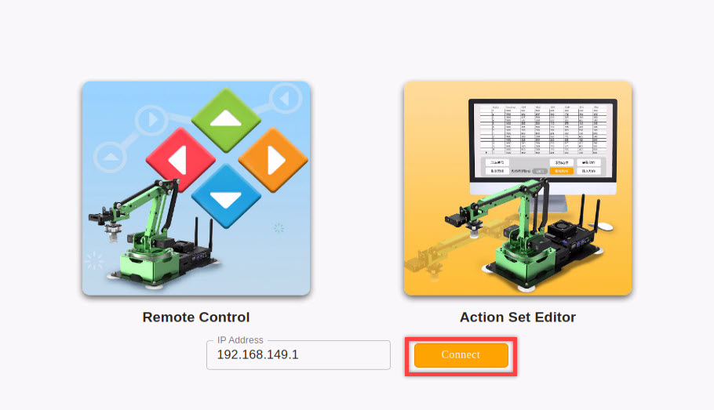

* **Mode introduction**

There are two control modes in PC software, namely Remote Control and <span class="mark">Action Set Editor</span>. The biggest difference between them is that the Remote Control mode interface includes transmitted image area while <span class="mark">Action Set Editor</span> mode interface involves action editing area.

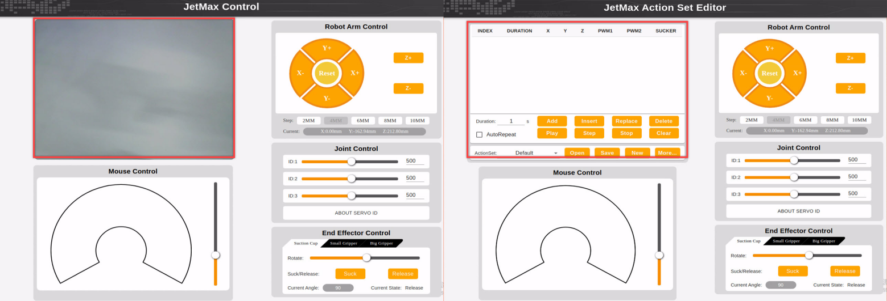

**1. Remote control mode**

 **(1) Introduction**

In remote control mode, you can control the rotation of robotic arm via mouse or setting coordinate value.

**(2) Interface layout**

Click the left icon to enter the Remote Control interface.

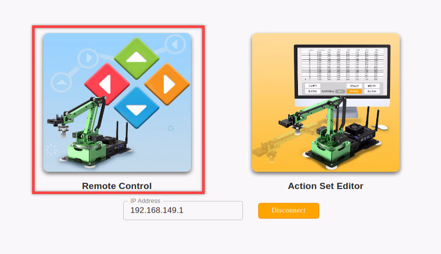

The interface is divided into these 5 parts.

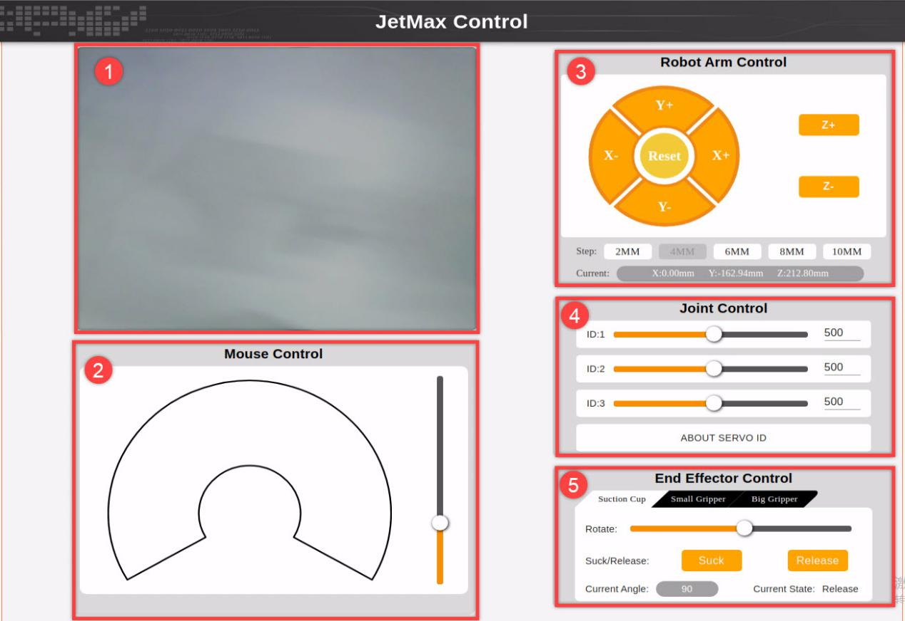

1.  **Transmitted image area**

The real-time image transmitted by the camera will be displayed here.

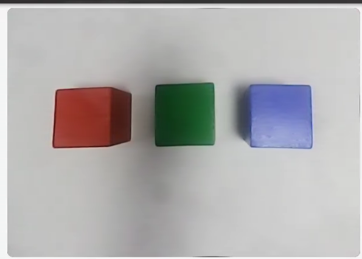

2.  **Mouse control area**

You can directly control the robotic arm to rotate with the mouse. And the function corresponding to the icon is listed below.

|                             Icon                             |                           Function                           |
| :----------------------------------------------------------: | :----------------------------------------------------------: |
|  | Click the sector and the robotic arm will rotate to the point where your mouse stops. |
|  |      Drag the slider to lift and lower the robotic arm       |

3.  **Robotic arm control area**

The robotic arm control area is the coordinate control area. You can control its rotation by setting the value of x, y and z axis. The function for each button is as follow.

<table  class="docutils-nobg" style="margin:0 auto" border="1">
<colgroup>
<col style="width: 69%" />
<col style="width: 30%" />
</colgroup>
<tbody>
<tr>
<td style="text-align: center;">Icon</td>
<td style="text-align: center;">Function</td>
</tr>
<tr>
<td style="text-align: center;"></td>
<td style="text-align: center;"><p>Decrease value of x axis</p>
<p>JetMax will rotate horizontally to the left</p></td>
</tr>
<tr>
<td style="text-align: center;"></td>
<td style="text-align: center;"><p>Increase value of x axis</p>
<p>JetMax will rotate horizontally to the right</p></td>
</tr>
<tr>
<td style="text-align: center;"></td>
<td style="text-align: center;"><p>Decrease value of y axis</p>
<p>JetMax will rotate to the front</p></td>
</tr>
<tr>
<td style="text-align: center;"></td>
<td style="text-align: center;"><p>Increase value of y axis</p>
<p>JetMax will rotate to the back</p></td>
</tr>
<tr>
<td style="text-align: center;"></td>
<td style="text-align: center;">The JetMax will return to original posture</td>
</tr>
<tr>
<td style="text-align: center;"></td>
<td style="text-align: center;"><p>Increase value of z axis</p>
<p>JetMax will be lifted</p></td>
</tr>
<tr>
<td style="text-align: center;"></td>
<td style="text-align: center;"><p>Decrease value of z axis</p>
<p>JetMax will be lowered</p></td>
</tr>
<tr>
<td style="text-align: center;"></td>
<td style="text-align: center;">Select each increasing or decreasing value</td>
</tr>
<tr>
<td style="text-align: center;"></td>
<td style="text-align: center;">Display the real-time coordinate of JetMax</td>
</tr>
</tbody>
</table>

4.  **Joint control area**

Joint control area is an individual servo control area. You can control single servo to rotate in this area.

<table  class="docutils-nobg" style="margin:0 auto" border="1">
<colgroup>
<col style="width: 50%" />
<col style="width: 49%" />
</colgroup>
<tbody>
<tr>
<td style="text-align: center;">Icon</td>
<td style="text-align: center;">Function</td>
</tr>
<tr>
<td style="text-align: center;"></td>
<td style="text-align: center;">Drag the slider to control individual servo to rotate</td>
</tr>
<tr>
<td style="text-align: center;"></td>
<td style="text-align: center;"><p>Input the rotation angle value of the servo</p>
<p>You can click the arrow for minor adjustment</p>
<p>(Click blank area to run the servo after adjustment)</p></td>
</tr>
</tbody>
</table>


5.  **End effector control area**

In this area, you can control different end-of-tools to rotate. And the function for each icon is as follow.

<table  class="docutils-nobg" style="margin:0 auto" border="1">
<colgroup>
<col style="width: 50%" />
<col style="width: 50%" />
</colgroup>
<tbody>
<tr>
<td style="text-align: center;">
<p><strong>Icon</strong></p>
</td>
<td style="text-align: center;">
<p><strong>Function</strong></p>
</td>
</tr>
<tr>
<td style="text-align: center;">
<p></p>
</td>
<td style="text-align: center;">
<p>Select the end-of-tool</p>
</td>
</tr>
<tr>
<td colspan="2" style="text-align: center;">
<p><strong>Buttons under suction cup mode</strong></p>
</td>
</tr>
<tr>
<td style="text-align: center;">
<p></p>
</td>
<td style="text-align: center;">
<p>Drag the slider to adjust the servo rotation angle</p>
</td>
</tr>
<tr>
<td style="text-align: center;">
<p></p>
</td>
<td style="text-align: center;">
<p>Suction cup sucks object</p>
</td>
</tr>
<tr>
<td style="text-align: center;">
<p></p>
</td>
<td style="text-align: center;">
<p>Suction cup releases object</p>
</td>
</tr>
<tr>
<td style="text-align: center;">
<p></p>
</td>
<td style="text-align: center;">
<p>The current angle of the digital servo</p>
</td>
</tr>
<tr>
<td style="text-align: center;">
<p></p>
</td>
<td style="text-align: center;">
<p>The state of the suction nozzle</p>
</td>
</tr>
<tr>
<td colspan="2" style="text-align: center;">
<p><strong>Buttons under small gripper/ big gripper mode</strong></p>
</td>
</tr>
<tr>
<td style="text-align: center;">
<p></p>
</td>
<td style="text-align: center;">
<p>The slider can be dragged to control the rotation of the gripper</p>
</td>
</tr>
<tr>
<td style="text-align: center;">
<p></p>
</td>
<td style="text-align: center;">
<p>The slider can be dragged to control the gripper to open or close</p>
</td>
</tr>
<tr>
<td style="text-align: center;">
<p></p>
</td>
<td style="text-align: center;">
<p>The current angle of digital servo 1</p>
</td>
</tr>
<tr>
<td style="text-align: center;">
<p></p>
</td>
<td style="text-align: center;">
<p>The current angle of digital servo 2</p>
</td>
</tr>
</tbody>
</table>


**2. Action Set Editor**

**(1) Introduction**

In this mode, you can control JetMax to rotate and edit an action group.

**(2) Interface layout**

The interface consists of 5 parts, including action list, mouse control area, robotic arm control area, joint control area and end control area.

<table  class="docutils-nobg" style="margin:0 auto" border="1">
<colgroup>
<col style="width: 50%" />
<col style="width: 50%" />
</colgroup>
<tbody>
<tr>
<td style="text-align: center;"><strong>Icon</strong></td>
<td style="text-align: center;"><strong>Function</strong></td>
</tr>
<tr>
<td style="text-align: center;"></td>
<td style="text-align: center;">Serial number of the action group</td>
</tr>
<tr>
<td style="text-align: center;"></td>
<td style="text-align: center;">Action running time</td>
</tr>
<tr>
<td style="text-align: center;"></td>
<td style="text-align: center;">The current x, y and z axis value of the robotic arm</td>
</tr>
<tr>
<td style="text-align: center;"></td>
<td style="text-align: center;">Current state of NO.1 digital servo</td>
</tr>
<tr>
<td style="text-align: center;"></td>
<td style="text-align: center;">Current state of NO.2 digital servo</td>
</tr>
<tr>
<td style="text-align: center;"></td>
<td style="text-align: center;">Current state of suction cup</td>
</tr>
<tr>
<td style="text-align: center;"></td>
<td style="text-align: center;"><p>Running time of one action</p>
<p>Running time can be input directly</p></td>
</tr>
<tr>
<td style="text-align: center;"></td>
<td style="text-align: center;">Run the current action group in loop</td>
</tr>
<tr>
<td style="text-align: center;"></td>
<td style="text-align: center;">Add action group</td>
</tr>
<tr>
<td style="text-align: center;"></td>
<td style="text-align: center;">Insert action group</td>
</tr>
<tr>
<td style="text-align: center;"></td>
<td style="text-align: center;">Replace action group</td>
</tr>
<tr>
<td style="text-align: center;"></td>
<td style="text-align: center;">Delete action group</td>
</tr>
<tr>
<td style="text-align: center;"></td>
<td style="text-align: center;">Run action group</td>
</tr>
<tr>
<td style="text-align: center;"></td>
<td style="text-align: center;">Run single action group</td>
</tr>
<tr>
<td style="text-align: center;"></td>
<td style="text-align: center;">Stop running action group</td>
</tr>
<tr>
<td style="text-align: center;"></td>
<td style="text-align: center;">Erase all the action group</td>
</tr>
<tr>
<td style="text-align: center;"></td>
<td style="text-align: center;">Action group name</td>
</tr>
<tr>
<td style="text-align: center;"></td>
<td style="text-align: center;">Open action group</td>
</tr>
<tr>
<td style="text-align: center;"></td>
<td style="text-align: center;">Save action group</td>
</tr>
<tr>
<td style="text-align: center;"></td>
<td style="text-align: center;">Create new action group</td>
</tr>
<tr>
<td style="text-align: center;"></td>
<td style="text-align: center;">More setting</td>
</tr>
</tbody>
</table>

### 4.1.2 Action Calling

* **Final goal**

Call and run the built-in action groups through PC software.

* **Preparation**

**1. Boot up/ Connect remotely**

Boot up JetMax and connect the computer to system desktop through No Machine. For detailed instruction, you can refer to “**[1. Getting Ready->1.3 Start the JetMax]()**” and “**[3. AI Vision Games Lesson->3.1 Set Development Environment]()**”

**2. Connect to PC software**

1)  Double click . It is recommended to use Google Chrome.

2)  Enter this address,**192.168.149.1**, in the address bar and press Enter.


3)  Then click the below “**connect**” button.


* **Call action group**

1)  After successfully connecting to the PC software, click “**Action Set Editor**”.


2)  Click the “▼” button shown in the below picture.


3)  Select action group. Here we select “**wave**”.


4)  Then click “**Open**” and you can check the individual action in the action list.


5)  Click “**Run**” button to run the current action group.


### 4.1.3 Edit Action

* **Final goal**

Edit an action group to suck the front block to the left side.

* **Preparation**

**1. Boot up/ Connect remotely**

Boot up JetMax and connect it to system desktop through No Machine. For detained instruction, you can refer to “**[1. Getting Ready->1.3 Start the JetMax]()**” and “**[3.AI Vision Games Lesson->3.1 Set Development Environment]()**”.

**2. Connect to PC software**

1. Double click . It is recommended to use Google Chrome.

2. Enter this address,**192.168.149.1**, in the address bar and press Enter.

   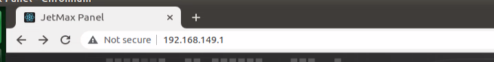

3. Then click the below “connect” button.

   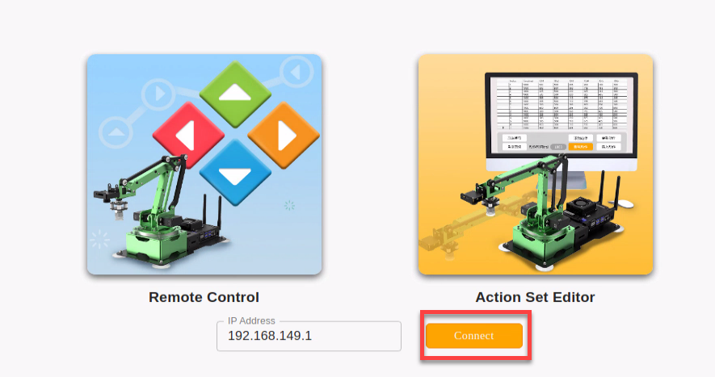

* **Edit action group**

There are two edit modes, respectively individual servo edit mode and coordinate edit mode. The essence of these modes is to convert the angle to coordinate.

You can choose one of them or adopt them alternately. In this lesson, the operation is mainly based on individual servo edit mode, but also involves coordinate edit mode.

**1. Edit action**

1. Click “**Action Set Editor**” icon to enter the editing interface.

   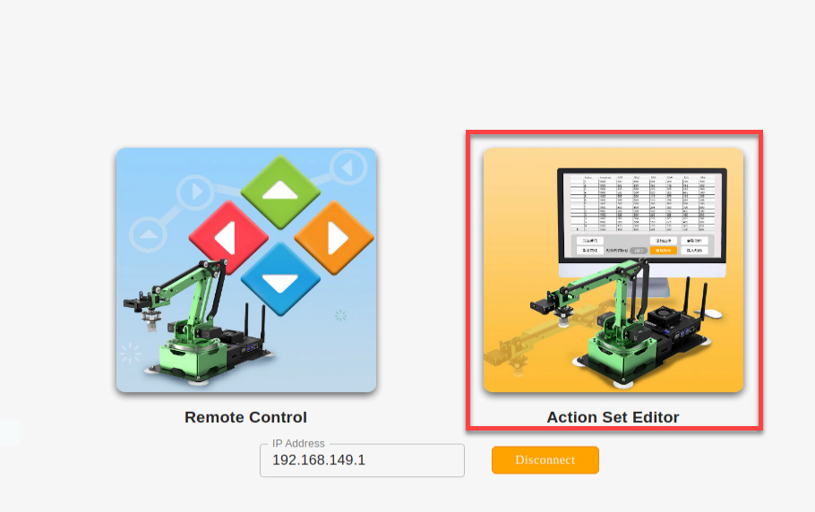

2. Click “**New**” to create a new action group.

   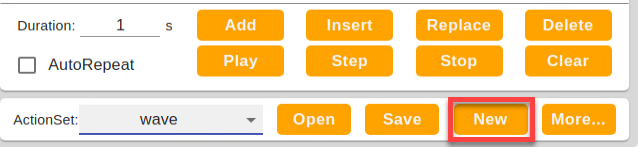

3. Name the action group and click “**OK**”. Here, we name it as **carry**.

   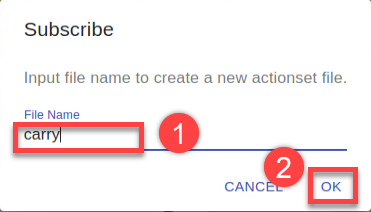

4. Firstly, click “**Reset**” in the robotic arm control area to make JetMax return to initial posture.

   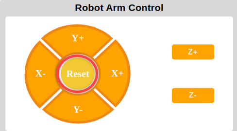

5. Then click “**Add**” to set the initial posture as the first action.

   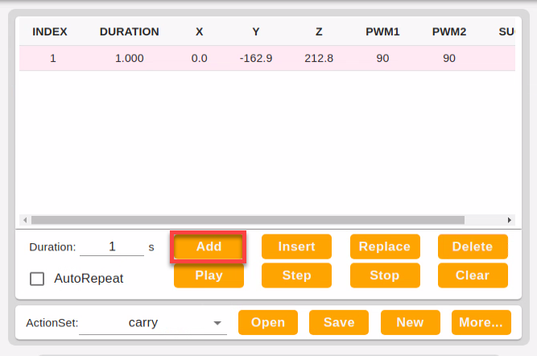

6. Drag ID3 slider to set the value to 421. The robotic arm will be stretched forward to the block. And the real-time coordinate will be displayed in robotic arm control area.

   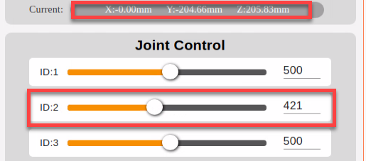

7. Set the duration as 1s, then click “**Add**” to add this action to the action list.

   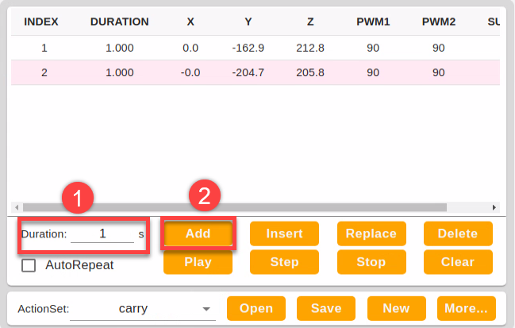

8. In order to make the action group more coherent, we need to add a transitional action after the new added action. Select No.2 action and set the duration as 0.3s. Pay attention here the duration of the transitional action should not be too long. Then click “**Add**”.

   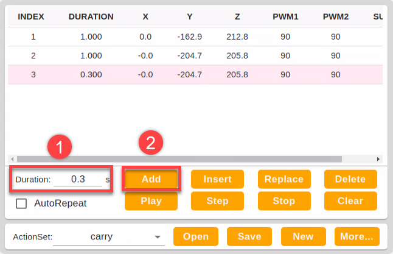

9. Next, lower the robotic arm. Drag ID3 slider to set the value to 654.

   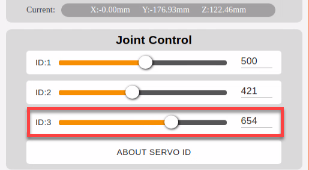

10. Set duration as 1s and click “**Add**” to this action to the action list.

    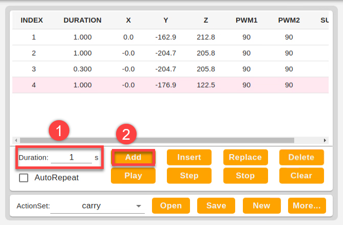

11. Add another transitional action and set the duration time as 0.3s, then click “**Add**”. Now, there are 5 actions in the action list.

    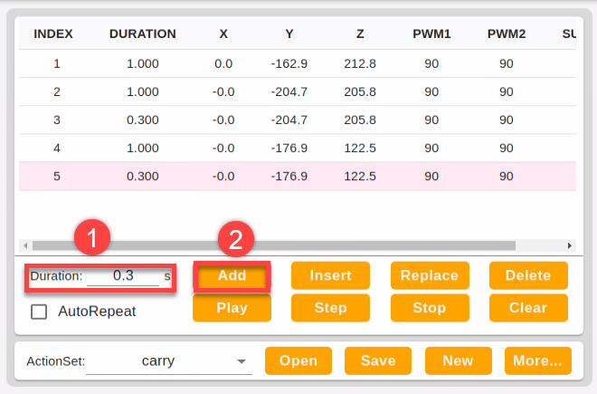

12. Adjust “**Y-**”to make the suction cup above the center of the block.

    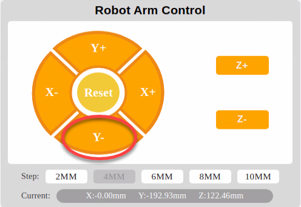

13. Set the duration as 1s and click “**Add**”.

    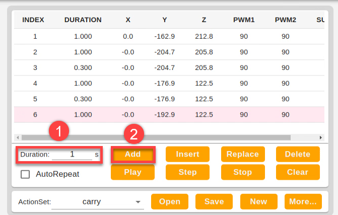

14. Add a transitional action again. Set the duration as 0.3s, then click “**Add**” to create No.7 action.

    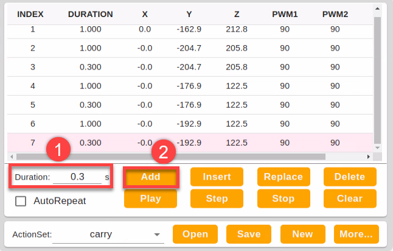

15. Continue, lower the robotic arm to make suction cup fit the center of the block. Adjust “Z-”till the suction cup completely fits the block, then set the duration as 1S and click “**Add**”.

    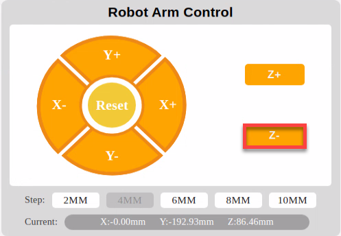

16. Then set the duration as 1s and click “**Add**” to create No.8 action.

    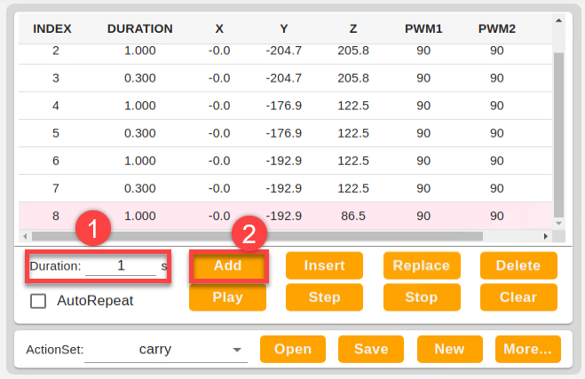

17. Add a transitional action. Set the duration as 0.3s and click “**Add**”.

    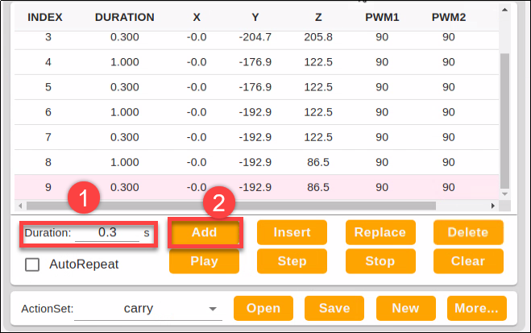

18. Turn on the air pump to make the suction cup suck the block. Click the “**Suck**” button in the end control area. Then set the duration as 0.3s and click “**Add**” to get No.10 action.

    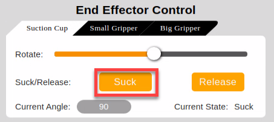

    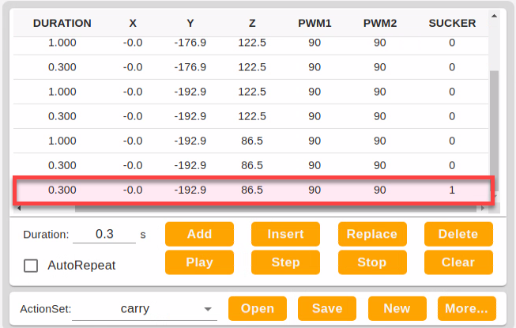

19. Having sucked the block, the robotic arm should be lifted. Drag ID3 slider to set the value to 575.

    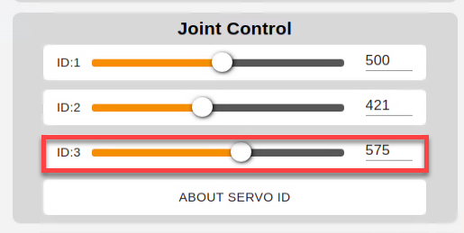

20. Then set the duration time as 1s and click “**Add**”.

    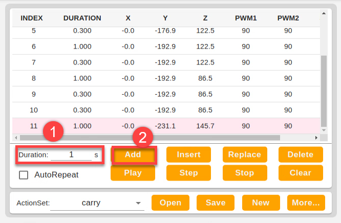

21. Add a transitional action. Set the duration as 0.3s to add No.12 action.

    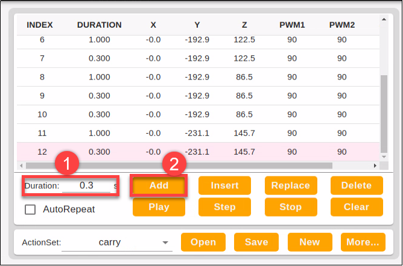

22. Control the robotic arm to rotate to the left side. Drag ID1 slider to set the value to 751.

    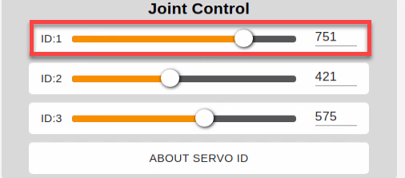

23. Set the duration as 1s and click “**Add**”.

    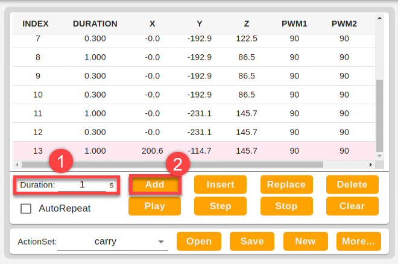

24. Then add a transitional action. Set the duration as 0.3s, then click “**Add**”. Now, No.13 and No.14 action are created.

    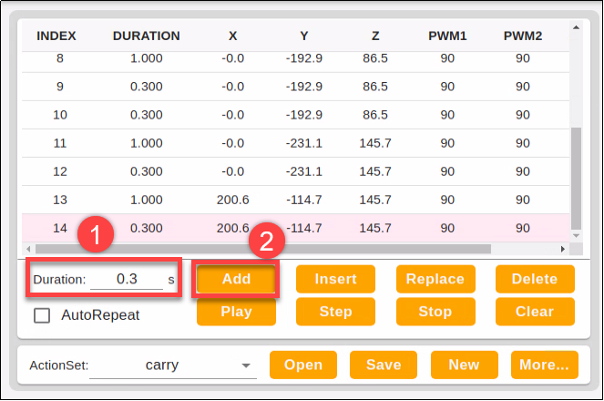

25. Make the robotic arm rotate to the left side and release the block. Click “**Z-**” to make the block close to the ground.

    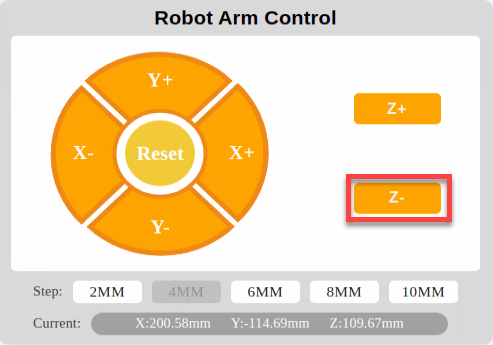

26. Then set the duration as 1s and click “**Add**”.

    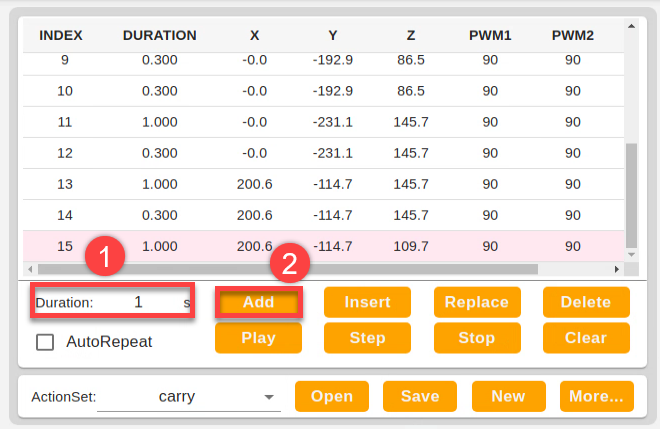

27. Add a transitional action and set the duration as 0.3s

    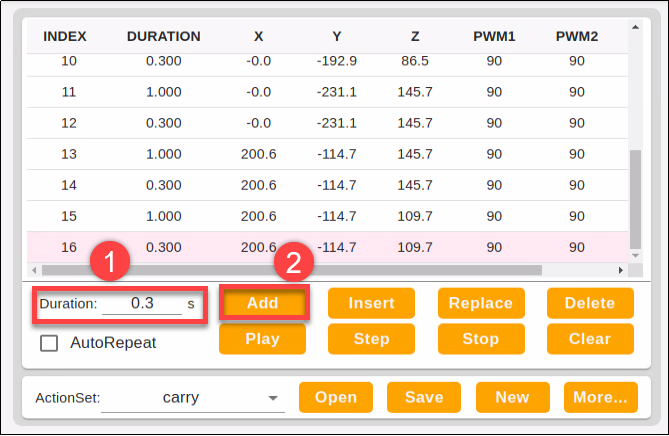

28. At last, click “**Release**” to stop the air pump. Then the block will be placed to the left side.

    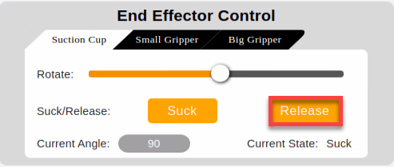

29. Set the duration as 1s and click “**Add**” to form No.17 action.

    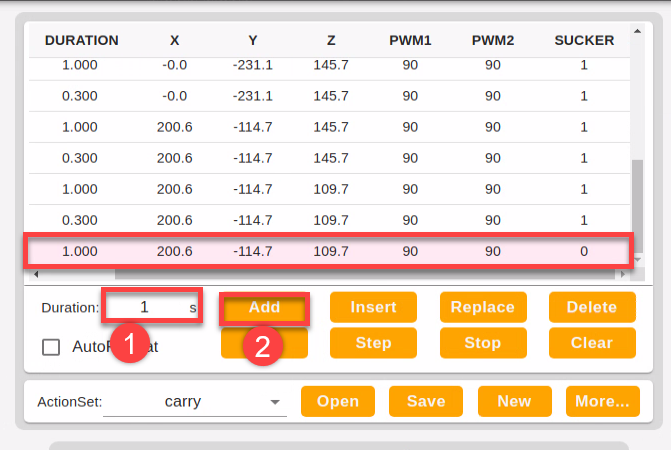

30. After that, make the robotic arm back to the initial posture. Select the first action, then click “**Step**”.

    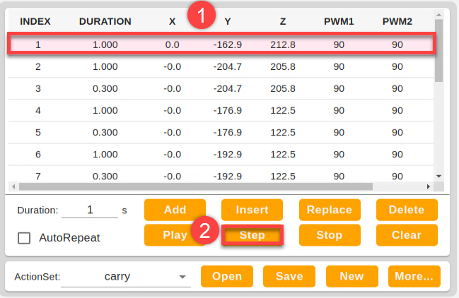

31. Next, set the duration as 1.5s, and click “**Add**” to get No.18 action.

    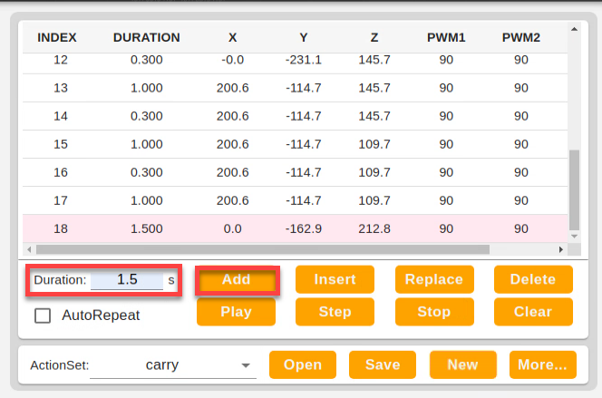

    At this point, the whole action group is completed. The integral action list is as follow.

| No.  | Duration |   X   |   Y    |   Z   | PWM1 | PWM1 | Suction cup |
| :--: | :------: | :---: | :----: | :---: | :--: | :--: | :---------: |
|  1   |  1.000   |  0.0  | -162.9 | 212.8 |  90  |  90  |      0      |
|  2   |  1.000   | -0.0  | -204.7 | 205.8 |  90  |  90  |      0      |
|  3   |  0.300   | -0.0  | -204.7 | 205.8 |  90  |  90  |      0      |
|  4   |  1.000   | -0.0  | -176.9 | 122.5 |  90  |  90  |      0      |
|  5   |  0.300   | -0.0  | -176.9 | 122.5 |  90  |  90  |      0      |
|  6   |  1.000   | -0.0  | -192.9 | 122.5 |  90  |  90  |      0      |
|  7   |  0.300   | -0.0  | -192.9 | 122.5 |  90  |  90  |      0      |
|  8   |  1.000   | -0.0  | -192.9 | 86.5  |  90  |  90  |      0      |
|  9   |  0.300   | -0.0  | -192.9 | 86.5  |  90  |  90  |      1      |
|  10  |  0.300   | -0.0  | -192.9 | 145.7 |  90  |  90  |      1      |
|  11  |  1.000   | -0.0  | -231.1 | 145.7 |  90  |  90  |      1      |
|  12  |  0.300   | -0.0  | -231.1 | 145.7 |  90  |  90  |      1      |
|  13  |  1.000   | 200.6 | -114.7 | 145.7 |  90  |  90  |      1      |
|  14  |  0.300   | 200.6 | -114.7 | 145.7 |  90  |  90  |      1      |
|  15  |  1.000   | 200.6 | -114.7 | 109.7 |  90  |  90  |      1      |
|  16  |  0.300   | 200.6 | -114.7 | 109.7 |  90  |  90  |      1      |
|  17  |  1.000   | 200.6 | -114.7 | 109.7 |  90  |  90  |      1      |
|  18  |  1.500   |  0.0  | -162.9 | 212.8 |  90  |  90  |      0      |

**2. Save action group**

In order to facilitate later debugging and management, you can save this action group. Click “**Save**” to save it.


### 4.1.4 Import and Export Action

* **Preparation**

Boot up JetMax and connect the computer to system desktop through No Machine. For detained instruction, you can refer to “**[1. Getting Ready->1.3 Start the JetMax]()**” and “**[3.AI Vision Games Lesson->3.1 Set Development Environment]()**”.

* **Export action**

**In this lesson, we will take importing and exporting “wave” action group file for example.**

1)  Click system desktop folder icon .

2)  Find the “**wave**” file as follow.

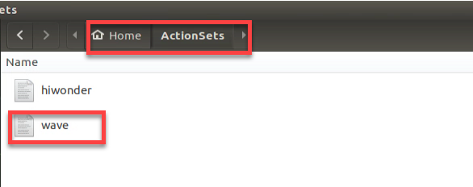

3)  You can directly drag the action file to the computer desktop. Then the action file is exported.

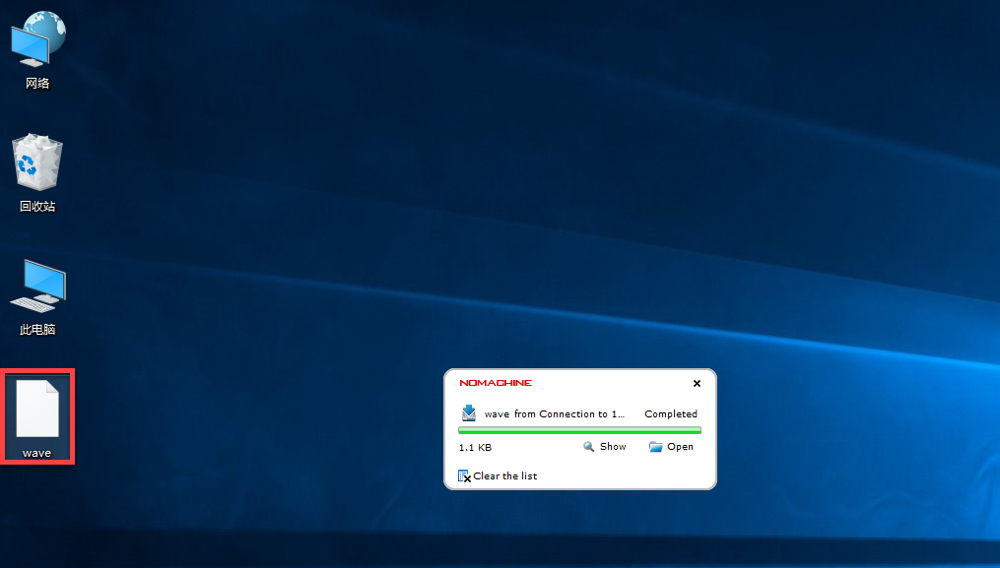

* **Import action**

1)  Drag the “**wave**” action file to the system desktop.

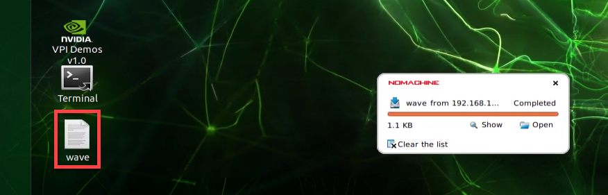

2)  Then paste it into the following path.

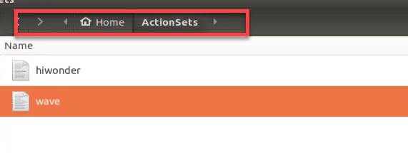

3)  Double click . It is recommended to use Google Chrome.

4)  Enter this address, **192.168.149.1**, in the address bar and press Enter.

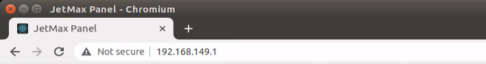

5)  Then click the following “**Connect**” icon to connect your computer to the PC software.


6)  Click “**Action Set Editor**” icon to enter editing interface.

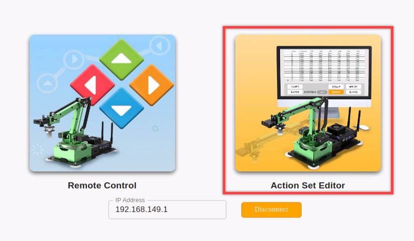

7)  Click the arrow button. When “**wave**” occur, it means the action file is successfully imported.


## 4.2 Wireless Handle Control

### 4.2.1 Preparation

Step 1: insert the handle receiver to any USB port on Jetson Nano.

> [!NOTE]
>
> **Note: please insert the handle receiver before booting up the device.**

Step 2: you need to prepare two AAA batteries. Remove the back shell of the handle and insert the batteries into the battery slot. Please don’t invert the positive and negative pole.


### 4.2.2 Device connection

Step 1: switch on the JetMax

Step 2: turn on the handle. At this time, the two LED lights on it will flash at the same time.

Step 3: wait for a few seconds. The robotic arm will automatically match with the handle. After successful match, the green LED light will light up.

If the handle does not connect to the robotic arm within 30 seconds after turning on, or there is no operation on the handle within 5 minutes after connecting, the handle will enter the sleep mode. If you want to wake it up, you can press the “**START**” key.

### 4.2.3 Mode introduction

There are two control modes, namely coordinate mode and individual servo mode. The handle will be in individual servo mode by default after connection.

Individual servo mode: by pressing the keys on the handle, you can control the robotic arm to rotate forward and inversely.

Coordinate mode: by pressing the keys on the handle, you can control the robotic arm to follow the trajectory of the x,y and z axis to move.

Way to switch the mode: you can press “**SELECT**” key. When the handle emit sound, it means you have successfully switched the mode. When the handle sound once, the handle is switched to coordinate mode. When sound twice, it is switched to individual servo mode.

### 4.2.4 Key Introduction

**The following table is about the key description in coordinate mode. Face to the front of the robot.**

|  Key  |                 Function                 |
| :---: | :--------------------------------------: |
| START | The robotic arm returns to initial state |
|  L1   |           JetMax moves forward           |
|  L2   |          JetMax moves downward           |
| **↑** |           JetMax moves forward           |
| **↓** |          JetMax moves backward           |
| **←** |         JetMax moves to the left         |
| **→** |        JetMax moves to the right         |
| **◻** |       Suction cup rotate clockwise       |
| **△** |   Suction cup rotate counterclockwise    |
| **○** |         Air pump starts pumping          |
| **×** |          Air pump stop pumping           |

**The following table is about the key description in coordinate mode. Face to the front of the robot.**

<table  class="docutils-nobg" style="margin:0 auto" border="1">
<colgroup>
<col style="width: 30%" />
<col style="width: 50%" />
<col style="width: 20%" />
</colgroup>
<tbody>
<tr>
<td style="text-align: center;">
<p><strong>Key</strong></p>
</td>
<td style="text-align: center;">
<p><strong>Function</strong></p>
</td>
<td style="text-align: center;">
<p><strong>Servo</strong></p>
</td>
</tr>
<tr>
<td style="text-align: center;">
<p>START</p>
</td>
<td style="text-align: center;">
<p>The robotic arm returns to initial state</p>
</td>
<td style="text-align: center;">
<p>—</p>
</td>
</tr>
<tr>
<td style="text-align: center;">
<p>L2</p>
</td>
<td style="text-align: center;">
<p>JetMax moves downward</p>
</td>
<td rowspan="2" style="text-align: center;">
<p>No.3 servo</p>
</td>
</tr>
<tr>
<td style="text-align: center;">
<p>L1</p>
</td>
<td style="text-align: center;">
<p>JetMax moves upward</p>
</td>
</tr>
<tr>
<td style="text-align: center;">
<p><strong>↑</strong></p>
</td>
<td style="text-align: center;">
<p>JetMax moves forward</p>
</td>
<td rowspan="2" style="text-align: center;">
<p>No.2 servo</p>
</td>
</tr>
<tr>
<td style="text-align: center;">
<p><strong>↓</strong></p>
</td>
<td style="text-align: center;">
<p>JetMax moves backward</p>
</td>
</tr>
<tr>
<td style="text-align: center;">
<p><strong>←</strong></p>
</td>
<td style="text-align: center;">
<p>JetMax moves to the left</p>
</td>
<td rowspan="2" style="text-align: center;">
<p>No.1 servo</p>
</td>
</tr>
<tr>
<td style="text-align: center;">
<p><strong>→</strong></p>
</td>
<td style="text-align: center;">
<p>JetMax moves to the right</p>
</td>
</tr>
<tr>
<td style="text-align: center;">
<p><strong>🗹</strong></p>
</td>
<td style="text-align: center;">
<p>Suction cup rotate clockwise</p>
</td>
<td rowspan="2" style="text-align: center;">
<p>PWM 9g servo</p>
</td>
</tr>
<tr>
<td style="text-align: center;">
<p><strong>△</strong></p>
</td>
<td style="text-align: center;">
<p>Suction cup rotate counterclockwise</p>
</td>
</tr>
<tr>
<td style="text-align: center;">
<p><strong>○</strong></p>
</td>
<td style="text-align: center;">
<p>Air pump starts pumping</p>
</td>
<td style="text-align: center;">
<p>—</p>
</td>
</tr>
<tr>
<td style="text-align: center;">
<p><strong>×</strong></p>
</td>
<td style="text-align: center;">
<p>Air pump stops pumping</p>
</td>
<td style="text-align: center;">
<p>—</p>
</td>
</tr>
</tbody>
</table>


## 4.3 Mouse Control

### 4.3.1 Preparation 

1)  Boot up JetMax and connect the computer to system desktop through NoMachine. For detained instruction, you can refer to “**[1. Getting Ready->1.3 Start the JetMax]()**” and “**[3. AI Vision Games Lesson->3.1 Set Development Environment]()**”

2)  Prepare a mouse, wired or wireless, and insert the mouse into any port of the computer.

### 4.3.2 Operation Steps

> [!NOTE]
>
> * **The entered command should be case sensitive and space sensitive.**
>
> * **The keywords can be complemented by Tab key.**

1. Double click  to open the terminal.

2. Enter command “**rosrun jetmax_demos mouse_control.py”** and press Enter to start the mouse control mode.

   ```py
   rosrun jetmax_demos mouse_control.py
   ```

3)  If you want to exit this game, directly click the “**x**” button at upper left corner.

### 4.3.3 Operation description 

The mouse control interface is as follow.


> [!NOTE]
>
> * **You must move your mouse within this white area, otherwise it will fail to control the robotic arm.**
>
> * **This mouse control game is in coordinate mode by default.**

The instruction description is as follow:

|              **Instruction**              |           **Reaction of the robotic arm**            |
| :---------------------------------------: | :--------------------------------------------------: |
| Left click+ move the mouse left and right |    JetMax follows x axis to rotate right and left    |
|  Left click+ move the mouse up and down   | JetMax follows y axis to rotate forward and backward |
|       Scroll the mouse up and down        |     JetMax follows z axis to rotate up and down      |
|                Right click                |             The air pump starts pumping              |