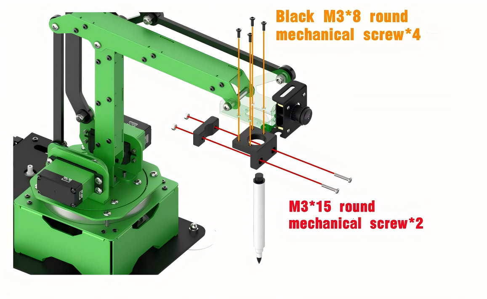

# 5. Various End-of-tools

## 5.1 Big Gripper

<p id="anchor_5_1_1"></p>

### 5.1.1 Big Gripper Installation


### 5.1.2 Object Sorting

* **Preparation** 

In this lesson, you need to install the big gripper on the end of the robotic arm. For the installation details, you can refer to "**[5.1.1 Big Gripper Installation](#anchor_5_1_1)**" in this folder.

* **Program logic** 

The object sorting game is mainly achieved through the combination of PyTorch deep learning framework and Python Torchvision visual library. The process is divided into 2 parts.

**Step 1: image recognition**

Firstly, register and initialize the node of object sorting game to ensure the program can run under the ROS framework. Then, subscribe to the topic `/usb_cam/image_rect_color`, released by the camera, to obtain the image data.

Next, transform the image to PIL image data. Then call the function `transforms.Compose()` in Torchvision library to scale the image, convert tensor object and normalize. After that, perform dimension raising on these data and load them to GPU.

At last, normalize the processed data, then output. Next, call `torch.argma()` function to obtain the classification with largest probability. After that, convert it to CPU data, then temporarily store the results and display the probability of classification

**Step 2: start sorting**

After several recognition, confirm the final sorting result. Then compare the sorting result with the fruit and vegetable list. Having confirmed which category the objects belong to, start the corresponding sorting thread.

There are two sorting threads in the program, namely fruit sorting `move_1()` and vegetable sorting `move_2()`.

Firstly, select and determine the object name to match the corresponding picking action. Due to the sizes of different fruits vary, it it necessary to adjust the opening and closing of the gripper.

Then, the rotation angle of the servo can be obtained through the inverse kinematics calculation to control the servo to complete sorting.

The source code of the program is stored in **/Home/ros/src/jetmax_demos/scripts/obj_classification.py**


* **Operation steps**

The entered command should be case sensitive and the keywords can be completed by Tab key.

1. According to the previous tutorial, connect the computer to system desktop through NoMachine and double click  to open the terminal.

2. Enter commend "**cd ros/src/jetmax_demos/scripts**" and press Enter to enter the directory storing the game program.

```bash
cd ros/src/jetmax_demos/scripts
```

3)  To avoid occupying the memory and affect the starting of object sorting game, please enter command " **./kill_app_funcs.sh**" to exit other games.


4)  At this time, enter password to grant the permission to execute the previous command. And the password is "**hiwonder**". Pay attention to that the pass word will be hidden when you enter the password.


5. Lastly, enter commend "**rosrun jetmax_demos obj_classification.py**" and press Enter to start the game.

```bash
rosrun jetmax_demos obj_classification.py
```

6)  If you want to exit this game, you can press "**Ctrl+C**". If it fails to exit, please try again.

* **Function realization**

After starting the game, the robotic arm will begin to recognize the vegetable and fruit within its vision, then pick them to the corresponding basket.


## 5.2 Electromagnetic Suction Cup

<p id="anchor_5_2_1"></p>

### 5.2.1 Electromagnetic Suction Cup Installation


### 5.2.2 Screw Sorting

* **Preparation** 

Before playing this game, you need to install the electromagnetic suction cup on the end of the robotic arm. For installation details, please refer to "**[5.2.1 Electromagnetic Suction Cup](#anchor_5_2_1)**" in this folder.

* **Program logic**

The process of screw sorting is divided into two parts.

**Step 1: auto detection**

Firstly, subscribe to the real-time image released by the camera node and convert it to Numpy form. Then, covert the image into color space, from RGB to BGR. Next, input it to the yolov5 network to scale, transpose and array expand so as to obtain the information of coordinate, confidence and category.

After that, convert the obtained screw or nut coordinates back to the original image coordinates. If the obtained confidence after recognition is greater than the threshold, display the object name and its confidence value according to the category ID and frame the object to complete the detection.

**Step 2: intelligent sorting**

Having distinguished the screws from the nuts, start the sorting sub thread of the robotic arm. Convert the object pixel coordinate to world coordinate and display it on the terminal.

Then, in order to improve the efficiency to suck the object, we need to calculate the distance between the object current position and the placing position and set the rotation speed based on the distance.

Finally, calculate the angle of the robotic arm relative to the central axis. Then control the corresponding angle of the suction cup rotation and control the robotic arm rotate to the object and suck it to the placing area. After that, the terminal will display "**FINISHED**" as the successful sorting feedback.

The source code of the program is stored in **/Home/ros/src/jetmax_demos/scripts/screw_nut.py**


* **Operation steps**

The entered command should be case sensitive and the key words can be complemented by Tab key.

1. According to the previous tutorial, connect the computer to system desktop through NoMachine. Double click  and open the terminal.

2. Enter command "**cd ros/src/jetmax_demos/scripts**" and press Enter to enter the directory storing the game program.

```bash
cd ros/src/jetmax_demos/scripts
```

3)  In order to avoid occupying the memory and affect the screw sorting game, please enter command "**./kill_app_funcs.sh**" to exit other game.


4)  At this time, you need to input the password to grant the permission to execute the previous command. The password is "**hiwonder**". Pay attention to that the password will be hidden when you enter the password.


5. Lastly, enter command " **rosrun jetmax_demos screw_nut.py**" and press Enter to start the game.

```bash
rosrun jetmax_demos screw_nut.py
```

6)  If you want to exit this game, you can press "**Ctrl+C**". If it fails to exit, please try again.

* **Function realization**

When the game starts, the robotic arm will recognize the screws and nuts within vision. Then they will be sorted separately.


<p id="anchor_5_3"></p>

## 5.3 Pen

### 5.3.1 Pen Installation




### 5.3.2 Draw Stick Figure

* **Preparation**

Before starting this game, you need to install the pen on the end of the robotic arm. For installation details, you can refer to "**[5.3.1 Pen Installation](#anchor_5_3)**".

* **Program logic**

The process of drawing the stick figure consists of three parts.

**Step 1: initial setting**

Firstly, before reading the data, specify the path of ngc file. Then, set the speed of the pen to draw and designate its initial position for setting the reference point for drawing the picture.

**Step 2: obtain the data**

Open the ngc file in the specified path and read the G code line by line so as to obtain the G code interpolation command. Then call `get_param()` function to obtain the x, y and z coordinate of ngc file.

**Step 3: draw the picture**

Call the function `line_interpolation()` to interpolate the path between the start point and the end point. Then calculate the servo angle of each coordinate through inverse kinematics. At last, call point drawing function to draw all the points on the path, thereby completing the drawing of the picture.

The source code of the program is stored in **/Home/ros/src/jetmax_demos/scripts/simple_draw.py**


* **Operation steps**

1. According to the previous tutorial, connect the computer to Jetson Nano desktop through NoMachine and double click  to open the command line terminal.

2. Firstly, enter "**cd ros/src/jetmax_demos/scripts**" command and press Enter to enter the directory storing the game program.

```bash
cd ros/src/jetmax_demos/scripts
```

3. Next, enter "**python3**" to enter the python interface.

```bash
python3
```

4. Then, enter "**import simple_draw**" command to import the picture drawing module.

```bash
import simple_draw
```

5. Lastly, enter "**simple_draw.draw_ngc('gcode/tony.ngc')**" command and press Enter. Then the robotic arm finishes drawing the picture.

```bash
simple_draw.draw_ngc('gcode/tony.ngc')
```

6)  If you want to close the python interface, you can enter "**exit()**".


* **Function realization**

After the command is entered, the robotic arm will control the pen to draw the stick figure of iron man's head.


### 5.3.3 Emotion Recognition and Drawing

* **Preparation**

Before playing this game, you need to install the pen to the end of the robotic arm. For the installation instruction, you can refer to "**[5. Various End-of-tools-> 5.3 Pen](#anchor_5_3)**"

* **Program logic** 

The process of emotion recognition and drawing is divided into two parts.

**Step 1: face recognition**

Firstly, subscribe to the information released by the camera node so as to obtain the image data of human face. Then this image data will be converted into numpy form. Next, scale the original image through OpenCV built-in function `cv2.resize()` in order to reduce the computation of face recognition. After that, the processed image will be recognized through the MTCNN model.

MTCNN is a neural network model for face recognition which involves three layers network structure, including P-Net, R-Net and O-Net. It can perform face framing and key point detection simultaneously. The recognition process is as follow.

1.  Transform the image in different scales to build an image Pyramid, which is beneficial to detect the face of different sizes.

2.  P-Net（Proposal Network）determines whether there is human face in recognition area through face classifier. Then locate the human face area with locator.

3) R-Net（Refine Network）will perform bounding box regression and key point locating on the human area output by the P-Net. Finally, it will output a credible human area.

4) O-Net（Output Network) is a more complicate convolution neural network. It adopts more supervisory to recognize the face area and finally output five facial features.

**Step 2: draw expression**

Firstly, extract the recognized face data and the grayscale will be obtained by color space conversion, then scale it down. After that, according to these detected face information, call `fer.fer()` function to judge the human emotion and display emotion name on the image transmitted by the camera. At last, set the continuous rotation angle of the servos and draw the expression.

The source code of the program is located in **/Home/ros/src/jetmax_demos/scripts/face_expression_draw.py**


* **Operation steps**

The entered command should case sensitive and the keywords can be complemented by **Tab** key.

1. Connect to the system desktop through NoMachine. For detailed instruction, you can refer to "**[3.1 Set Development Environment](https://wiki.hiwonder.com/projects/JetMax/en/latest/docs/3_AI_Vision_Games_Lesson.html#set-development-environment)**". Double click  to open the terminal.

2. Enter command "**cd ros/src/jetmax_demos/scripts**" and press Enter to enter the directory storing the game program.

```bash
cd ros/src/jetmax_demos/scripts
```

3)  In order to avoid memory being occupied and affecting the start of emotion recognition and drawing game, you need to enter command "**./kill_app_funcs.sh**" to exit other games.


4)  At this time, you need to enter the password to grant the permission to execute the previous command. The password is "**hiwonder**". Pay attention to that the password will be hidden when you input the password.


5. Enter command "**rosrun jetmax_demos face_expression_draw.py**" and press Enter to start the game.

```bash
rosrun jetmax_demos face_expression_draw.py
```

6)  If you want to exit this game, you can press "**Ctrl+C**". If it fails to exit the game, you can try again.

* **Function Realization**

> [!NOTE]
>
> * **When playing this game, you should keep away from the robotic arm to avoid hurt.**
>
> * **When making expression, you should shake your head gently, otherwise the robotic arm will make mistake.**

After the game starts, your face need to be pointed at the camera and make different expression in turns. Having recognized the expression, JetMax will display the emotion name on the image transmitted by the camera and draw the recognized expression.

The corresponding display content of your emotion is as follow.

| **Your emotion** |  **Display**  |
| :--------------: | :-----------: |
|      Angry       |  Angry emoji  |
|      Happy       |  Happy emoji  |
|    Poker face    | Neutral emoji |


## 5.4 Small Gripper

### 5.4.1 FlatView


### 5.4.2 TopView

