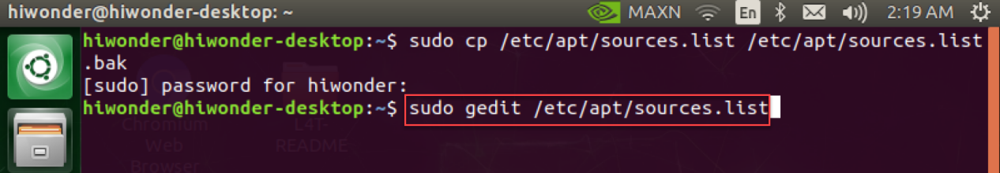
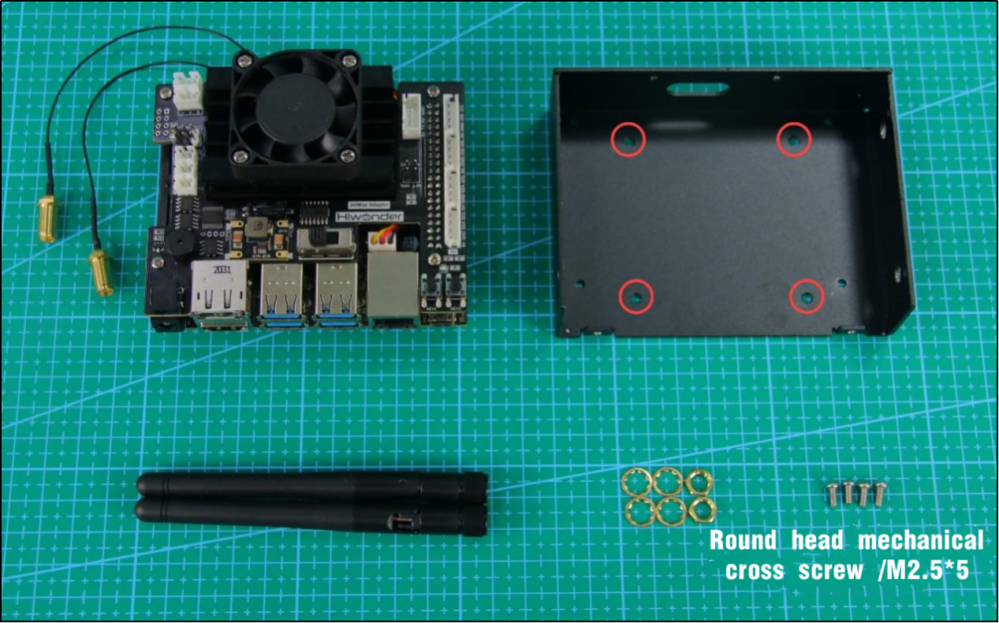
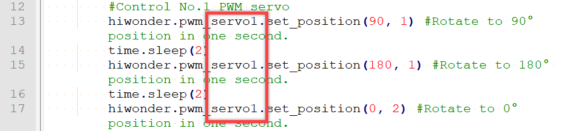
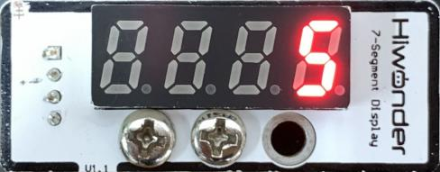

# 6. Advanced Program Lessons

## 6.1 Jetson nano Basic Lessons

### 6.1.1 Jetson Nano Introduction

* **Jetson Nano Introduction**

Jetson Nano takes the lead in the global visual computer technology field. It is an embedded AI platform system designed for a new generation of autonomous machines by NVIDIA. NVIDIA is not only a game graphics card producer but also an AI computing company.


Jetson Nano is launched in 2019 GTC convention. Small but powerful. Adopting quad-core 64-bit ARM CPU and a 128-core integrated NVIDA GPU, Jetson Nano is capable of floating-point operations up to 472 GFLOPS. Besides, Jetson Nano comes in high-efficiency and low-power package with a 5W/10W power mode and 5V DC input. The modules of Jetson Nano are as follow.


Its performance and energy efficiency make it possible for Jetson Nano to run modern AI loads, run multiple neural network in parallel, and process the data from multiple HD sensors simultaneously. It is widely applicable in image sorting, object detection, image segmentation, speech processing, etc. It also supports some common AI frameworks, which enables the developers to integrate their favorite models and frameworks to the products.

Jetson Nano can not only makes AI intelligent robot process great function but also brings support and expansion to the future intelligent cities.

* **Jetson Nano specification**

| No.  | Component/ port |                           Function                           |
| :--: | :-------------: | :----------------------------------------------------------: |
|  1   |       GPU       | NVIDIA Maxwell™ architecture. Equipped with 128 NVIDIA CUDA® cores |
|  2   |       CPU       |         Quad-core ARM® Cortex®-A57 MPCore processor          |
|  3   |       RAM       |                      4 GB 64-bit LPDDR4                      |
|  4   |     Storage     |    Micro SD card slot. You need to purchase SD over 16G.     |
|  5   | Video encoding  |                    4K @ 30 (H.264/H.265)                     |
|  6   | Video encoding  |                    4K @ 60 (H.264/H.265)                     |
|  7   |     Camera      |   12 channels (3x4 or 4x2) MIPI CSI-2 DPHY 1.1 (1.5 Gbps)    |
|  8   |   Connection    |                       gigabit Ethernet                       |
|  9   |     Display     |         HDMI 2.0 or DP1.2 \| eDP 1.4 \| DSI (1 x2) 2         |
|  10  |      UPHY       |            1 x1/2/4 PCIE、1x USB 3.0、3x USB 2.0             |
|  11  |       I/O       |              1x SDIO/2x SPI/4x I2C/2x I2S/GPIO               |

| No.  | Model                       | Application        | Architecture | NVIDIA Jetson Nano | Raspberry Pi 3+ Intel Neural Compute Stick2 | Google Edge Tpu |
| ---- | --------------------------- | ------------------ | ------------ | ------------------ | ------------------------------------------- | --------------- |
| 1    | ResNet-50(224×224)          | Sorting            | Tensorflow   | 36 FPS             | 16 FPS                                      | DNR             |
| 2    | MobileNet-v2(300×300)       | Sorting            | Tensorflow   | 64 FPS             | 30 FPS                                      | 130 FPS         |
| 3    | SSD ResNet-18 (960×544)     | Object detection   | Tensorflow   | 5 FPS              | DNR                                         | DNR             |
| 4    | SSD ResNet-18 (480×272)     | Object detection   | Tensorflow   | 16 FPS             | DNR                                         | DNR             |
| 5    | SSD ResNet-18 (300×300)     | Object detection   | Tensorflow   | 18 FPS             | DNR                                         | DNR             |
| 6    | SSD Mobilenet-V2 (960×544)  | Object detection   | Tensorflow   | 8 FPS              | 1.8 FPS                                     | DNR             |
| 7    | SSD ResNet-18（480×272）    | Object detection   | Tensorflow   | 27 FPS             | 7 FPS                                       | DNR             |
| 8    | SSD ResNet-18（300×300）    | Object detection   | Tensorflow   | 39 FPS             | 11 FPS                                      | 48 FPS          |
| 9    | SSD Mobilenet-V2（960×544） | Object detection   | Tensorflow   | 8 FPS              | 1.8 FPS                                     | DNR             |
| 10   | SSD Mobilenet-V2（480×272） | Object detection   | Tensorflow   | 27 FPS             | 7 FPS                                       | DNR             |
| 11   | SSD Mobilenet-V2（300×300） | Object detection   | Tensorflow   | 39 FPS             | 11 FPS                                      | 48 FPS          |
| 12   | Inception V4(299×299)       | Sorting            | PyTorch      | 11 FPS             | DNR                                         | 9 FPS           |
| 13   | Tiny YOLO V3(416×416)       | Object detection   | Darknet      | 25 FPS             | DNR                                         | DNR             |
| 14   | OpenPose(256×256)           | Posture estimation | Caffe        | 14 FPS             | DNR                                         | DNR             |
| 15   | VGG-19 (224×224)            | Sorting            | MXNet        | 10 FPS             | 5 FPS                                       | DNR             |
| 16   | Super Resolution (481×321)  | Image processing   | PyTorch      | 15 FPS             | DNR                                         | DNR             |
| 17   | Unet(1x512x512)             | segmentation       | Caffe        | 18 FPS             | 5 FPS                                       | DNR             |

### 6.1.2 Burn System Image

The instructions below takes JetAuto as example. They can be applied to Jetson Nano series robots.

* **Preparation**

As Jetson Nano B01 board does not come with a built-in memory module, it’s important to burn the system image onto the SD card and insert the SD card into Jetson Nano so that Jetson Nano can boot up successfully.

Unlike an ISO file that is typically used to install an operating system on a computer, the official OS for the Jetson Nano (Ubuntu system) is an img file that needs to be written directly onto the SD card. For example, burn the system image of JetAuto created by our company.

Before burning the system image, you need to prepare the following stuffs:

1. Card reader

2. Memory card

3. balenaEtcher-Portable (tool for burning the system image). The tool can be found in the same folder.


* **Extract the System Image**

Extract the system image files to a storage path that contains only English characters.


* **Burn System Image**

1)  After completing the above steps, insert the SD card into card reader and connect the card reader to your computer. Then, use the software “**balenaEtcher**” to burn the system image.


2)  Click-on “**Flash from file**” and import the extracted image file.


3. Click-on “**Select target**” to select the SD card onto which the image is burned.


> [!NOTE]
>
> **Note: the SD card will be formatted automatically during the process of image burning. If the SD card contains some important data, please remember to back up the data before burning the image.**

4. Select the corresponding SD card, and then click-on “**Select(1)**”.


5. Click-on “**Flash!**” to start burning the system image. It takes a wile for the burning process to be completed.

   


6)  If the below window pops up, simply click-on “**Cancel**”.


The system image is burned successfully once the interface shows “**Flash Complete!**”.


### 6.1.3 Remote Desktop Connection

This lesson is applicable for Jetson Nano without own display. You can realize remote login through SSH or VNC.

Note: whether using SSH or VNC, you must connect Jetson Nano to the display for the first use. After the configuration is successful, there is no need to connect it to display if the Wi-Fi is not switched.

SSH is a network protocol used for encrypted login between computers and realizes remote control through command line. The default port is 22. Jetson Nano will turn on SSH service by default, so you can directly login with SSH as long as the network connection is normal.

VNC realizes remote control through graphical desktop. And you need to install the configuration software in the system before use.

* Preparation

Before operation, you need to prepare the following things besides the Jetson Nano board.

1)  Smart phone.

2)  Computer. Laptop computer is better. If you use desktop computer, USB wireless network card is needed.

3)  <span class="mark">W</span>ireless network card for Jetson Nano. SMD or USB network card is ok. You can install the SMD network card according to the tutorial in “**[6. Advanced Program Lessons->6.2 Jetson Nano Expansion Board Tutorial->6.2.2 Expansion Board Installation]()**”. For USB network card, you can insert it directly to any USB port of the board.

4)  Card reader and SD card containing the official image.

5)  Putty is the remote login tool. The installation package is stored in “**[Appendix-> Remote Connection Tool]()**”.


6)  VNC Remote desktop connection tool. The installation package is located in “**[Appendix->Remote Connection Tool]()**”.


* **Check the IP**

Having finished the previous steps, you need to check the IP of Jetson Nano.

1)  Create a hotspot by your phone and name it **Hiwonder** and set the password as **123456789**.


2)  Connect your computer to the hotspot created by the phone. After connection, enter “**Win+R**”, then enter “**CMD**” to open the command prompt. And enter “**arp -a**” command in this interface to check the IP address.


3)  When the computer connects to the Wi-Fi successfully, turn on Jetson Nano board and connect it to the same Wi-Fi as your computer.


4)  After connection, we need to obtain the IP address of Jetson Nano. Firstly, press “**Ctrl+Alt+T**” to open the terminal. Then enter command “**ifconfig**” and press Enter.


5)  “**192.168.43.47”** in the red frame is the IP address under the Wi-Fi connection of the demo board and you need to take it down.


Besides the above methods, you can also check the IP in router management interface.

* **Remote connection through SSH**

1)  Following the above operation, turn on the **Putty** software on computer. Input the Jetson Nano IP “**192.168.43.47**” recorded before. The security alert window will pop up for the first login and just click “**Yes**”.


Pay attention to that the computer and Jetson Nano must connect to the same Wi-Fi.


2)  Then enter the username and password. And you can set them according to your preference. The username we set here is hiwonder and the password is hiwonder. After that, press Enter. Pay attention to that the password you enter should be the same as that of the Linux system. When you enter the password, it will be hidden on the screen.


Pay attention to that the user name must be in lower case. Even if the username is set in uppercase, you should enter the username in lower case.

3)  When you input the correct password and enter the system successfully, the system interface is as follow.


* **Remote connection through VNC** 

If you are not familiar with command line, you can control Jetson Nano demo board remotely on your computer screen. This graphical desktop makes it easy for you to operate, which is the same as the Windows desktop.

Raspberry Pi will install RealVNC service by default, so you just need to turn on this service and download the VNC Viewer on your computer. While for Jetson Nano, you need to configure manually. The configuration steps are as follow.

1. Enter “**Ctrl+Alt+T**” to open terminal command line.

2. Enter these command “**sudo apt update**” and “ **sudo apt-get install vino**” in turns to install the required services.

   ```py
   sudo apt update
   ```

   ```py
   sudo apt-get install vino
   ```

3. Enter command “**sudo ln -s ../vino-server.service \\**” and “**/usr/lib/systemd/user/graphical-session.target.wants**” to allow the server to turn on the VNC service when you login.

   ```py
   sudo ln -s ../vino-server.service \
   /usr/lib/systemd/user/graphical-session.target.wants
   ```

4. Enter command “**gsettings set org.gnome.Vino prompt-enabled false**” and “**gsettings set org.gnome.Vino require-encryption false**” to configure the VNC service

   ```py
   gsettings set org.gnome.Vino prompt-enabled false
   ```

   ```py
   gsettings set org.gnome.Vino require-encryption false
   ```


5)  Enter command “**gsettings set org.gnome.Vino authentication-methods "\['vnc'\]"**" and “**gsettings set org.gnome.Vino vnc-password \$(echo -n 'thepassword'\|base64)**” in sequence to set the password for accessing the VNC server.

> [!NOTE]
>
> Note: Please replace the present password “**thepassword**” with the password you want. For example, we replace “**thepassword**” with “**hiwonder**”.

```py
gsettings set org.gnome.Vino authentication-methods "['vnc']"
```

```py
gsettings set org.gnome.Vino vnc-password $(echo -n 'thepassword'|base64)
```

6. After the configuration, enter command “**sudo reboot**” to restart the device.

7. Having restarted the device, open the command line.

8. Enter “**sudo vi /usr/share/glib-2.0/schemas/org.gnome.Vino.gschema.xml**” command and press “**i**” key to enter the following content to the page footing. When they are added, enter “**:wq**” to save and exit.

   ```py
   <key name="enabled" type="b">
   	<summary>Enable remote access to the desktop</summary>
   	<description>
   	If true, allows remote access to the desktop via the RFB
   	protocol. Users on remote machines may then connect to the
   	desktop using a VNC viewer.
   	</description>
   	<default>false</default>
   ```


> [!NOTE]
>
> **Note: Here, you should enter the initial setting password.**


9. Enter “**sudo glib-compile-schemas /usr/share/glib-2.0/schemas**” command.

   ```py
   sudo glib-compile-schemas /usr/share/glib-2.0/schemas
   ```

10. Lastly, enter “**/usr/lib/vino/vino-server**” command for startup. After entering, click the first icon at the upper left corner. Search “**startup applications**” and press Enter. Click “**Add**” to add startup program and you can name it randomly. Then enter “**/usr/lib/vino/vino-server**” in the command bar. When the settings are done, restart the device.

    ```py
    /usr/lib/vino/vino-server
    ```


11) After configuration, open the setting to find “**Desktop Sharing**”, and the sharing is ticked.


12) In the previous step, we have gained the IP address “**192.168.43.47**”.

13) Turn on computer which has installed the VNC Viewer software. Ensure your computer and the demo board connect to the same Wi-Fi and Putty is closed.

14) In the VNC Viewer interface, enter Jetson Nano’s IP address, 192.168.43.47, then press Enter. If the security prompt pops up, click “**Continue**”.


15) Enter the password set before “**hiwonder**” and click “OK”. Now, the Jetson Nano interface appears.


### 6.1.4 Basic Operation of Jetson Nano

Computer is the mixture of complicate hardware and software. In order to manage this complex hardware and software, operating system was launched. The operating system not only provides a operating interface for the interaction between users and computers, but also takes charge of many affairs, including managing and configuring memory, prioritizing the supply and demand of system resource, controlling the input and output devices, operating the network, managing file system, etc.

For users, it serves as a translator translating the user’s command to the content computer can understand. Then it will arrange for the computer to execute the order.

The common used system is Windows operating system while Jetson Nano is Linux system. In Windows operating system, user can send order to computer by clicking the icons. While for Linux operating system, user need to enter the command to publish the order.

In fact, we also can send the command to control the computer in Windows system, likewise you can control the computer by clicking icons in Linux system. For the reason that it is more effective to control the Windows system by icons than by command and the Linux system takes the opposite, people tend to use Windows system for graphical control and Linux system for command-line control.

Linux is an open source system with high operation freedom, which enables users to customize the system. Hence, programmers and makers have a bias for Linux.

System directory refers to the directory storing the main files. The files in the directory will influence whether the system can run normally. Having an understanding of these directories is beneficial for using the system.

* **Open the system directory**

1)  Turn on Jetson Nano and open the terminal.

2)  Enter “**cd ..**” and “**ls**” in turns according to the picture. Having entered one, press Enter. Pay attention to that there is a space between **cd** and **..** .


3)  In Linux, system directory refers to the folders in the below red frame. Linux operating system is completely based on files and file system. All the information are stored as files and defined by file name and storing path. Linux system directory is a tree structure. “**/**” represents the root of the tree structure, that is root directory.


* **Check the system directory**

We can check the system directory through command. As mentioned before, <span class="mark">Linux system is tree structure, so you can operate in the form of tree diagram.</span> The instruction is as follow.

1)  Enter command “**sudo apt-get install tree**” to install the software package.


Pay attention to that you need to input the initially set password.

2. After installation, you can use tree related command.

   **tree**：list all the files in tree diagram

   **tree -L N**：list all the file folders in tree diagram. Subfolder is displayed to the Nth level. There is a space between “**tree**” and “**-**” as well as “**L**” and “**N**”. N should be replaced by number, which indicates the number of folder layer.

3. Enter “**tree -L 1”** command to display the subfolder on 1<sup>st</sup> layer as follow. The Windows system also adopts a tree structure, but it is based on the disk as the root partition. And the C disk and D disk formed are equivalent to the first level of subfolders. For Linux systems, "**/**" is equal to a complete hard disk. We divide this hard disk into multiple partitions such as "**/etc**", "**/dev**", "**/lib**", etc.

   

| Directory name |                           Function                           |
| :------------: | :----------------------------------------------------------: |
|      bin       |            Store frequently used command of Linux            |
|      boot      |               Store the startup file of Linux                |
|      dev       |              Store the external device of Linux              |
|      etc       | Store all the configuration files and subdirectories required by system management |
|      home      |                     Store home directory                     |
|      lib       |            Store the dynamic link shared library.            |
|     media      | Provide conventional mount points for all removable devices  |
|      mnt       |               Mount point for temporary files                |
|      opt       | The directory where additional installation software is placed. |
|      proc      |          Store information about system resources.           |
|      root      |             The home directory of the root user              |
|      run       |              Files required for system running               |
|      sbin      | Store non-essential and less important system binary files and network application tools of the system. |
|      snap      |            A new way to manage software packages             |
|      srv       | Store the file data that needs to be accessed after the service is started. |
|      sys       |       Store kernel, firmware and system related files.       |
|      tmp       |                    Store temporary files                     |
|      usr       | Store user documents, games, graphics files, libraries, and other user and management commands and files. |
|      var       | Store constantly expanding and frequently modified directory. |

### 6.1.5 Change Software Download Source

The default image of Jetson Nano is the official source of Ubuntu .

* **Operation steps**

1)  Enter the "**sudo cp /etc/apt/sources.list /etc/apt/sources.list.bak**" command to back up the original source and change the name of the "**source.list**" file in case you need it.


> [!NOTE]
>
> **Note: you should enter the initially set password.**

2)  Enter “**sudo gedit /etc/apt/sources.list**” command to open “**source.list**” file.



3)  Delete all the content of the “**source.list**” file and paste the following content to it.

deb http://mirrors.tuna.tsinghua.edu.cn/ubuntu-ports/ bionic main multiverse restricted universe

deb http://mirrors.tuna.tsinghua.edu.cn/ubuntu-ports/ bionic-security main multiverse restricted universe

deb http://mirrors.tuna.tsinghua.edu.cn/ubuntu-ports/ bionic-updates main multiverse restricted universe

deb http://mirrors.tuna.tsinghua.edu.cn/ubuntu-ports/ bionic-backports main multiverse restricted universe

deb-src http://mirrors.tuna.tsinghua.edu.cn/ubuntu-ports/ bionic main multiverse restricted universe

deb-src http://mirrors.tuna.tsinghua.edu.cn/ubuntu-ports/ bionic-security main multiverse restricted universe

deb-src http://mirrors.tuna.tsinghua.edu.cn/ubuntu-ports/ bionic-updates main multiverse restricted universe


deb-src http://mirrors.tuna.tsinghua.edu.cn/ubuntu-ports/ bionic-backports main multiverse restricted universe

4)  Save and close the “**source.list**” file.


5)  <span class="mark">Enter “**sudo apt-get update**” command to change to other source. Take changing to Tsinghua University source for example.</span>


> [!NOTE]
>
> **Special note: please input the initially set password in this step.**

6)  After the update is completed, the interface is as follow.


### 6.1.6 Modify Wi-Fi

The computer generally connects to the Wi-Fi starting with "HW", which is created by Jetson Nano. But when there are many robots around, the computer will connect to the wrong Wi-Fi. This lesson will explain in detail how to modify the Wi-Fi name and password.

* **Methods for modifying Wi-Fi** 

Please follow the below steps to operate.

1. Switch on Jetson Nano and wait for it to boot up. Then start Nomachine for remote connection.

2. Double click .

3. Enter command “**sudo vim hiwonder_wifi_conf.py**” and press Enter into the program file.

   ```py
   sudo vim hiwonder_wifi_conf.py
   ```

4)  Enter password, **hiwonder**. The password you enter will not be displayed on the interface. Having input the password, press Enter.


5)  Press “**i**” key to enter the editing mode.


6)  Modify the following three lines of codes.


7)  Modify the mode as “**1**”, that is direct connection mode. Then change the Wi-Fi name and the password. For example, we change the name as “**Hiwonder**” and password as “**12345678**”. Pay attention here the name and the password can only contain alphabet and number. After that, delete “**\#**” of these three lines.


8)  Having completed modifying, press the "**Esc**" key to save the modified content. Then enter "**:wq**" to exit the interface. Note: **:wq** must be entered under the English input method.


9)  Restart Jetson Nano. Now the Wi-Fi name is changed as “**Hiwonder**” and the password as “**12345678**”.


### 6.1.7 Jetson Nano Network Connection

* **LAN mode introduction**

LAN mode is to connect Jetson Nano to wireless router, which is more complicate. LAN mode and direct connection mode cannot be turned on simultaneously. If you want to back to direct connection mode, you can long press KEY1 on expansion board until LED1 flashes.

We take the operation on iOS APP for example. And it is also applicable to Android APP.

Before operation, please switch on Jetson Nano.

* **LAN mode connection**

1. In this lesson, we will connect to AP direct connection mode. Firstly, open WonderPi and click “**+**” button at the lower right corner and select “**LAN mode**”. Follow the instruction to connect the Wi-Fi in phone settings.

   

2. Click the Wi-Fi you want to connect. Here I connect to LH_5G.

   

It is recommended to connect to 5G network. The difference between 2.4G and 5G frequency band is as follow.


The router supporting dual-frequency will distinguish the Wi-Fi name by default under the situation that 2.4 G and 5G are separated.

For example, Wi-Fi “**LH**” is 2.4 frequency band while “**LH_5G**” is 5G frequency band. If your network card does not support 5G frequency band, “**LH_5G**” cannot be searched. The Wi-Fi names vary from different router. The internal frequency band settings is the most important. When Wi-Fi of 5G frequency cannot be searched, you need to modify 5G as 2.4G.


3. Continue, enter the Wi-Fi password. If this interface doesn’t occur, you can click “ **LAN Mode**” again. Having entered the password, click “**Next**”. Please ensure the password you enter is correct.

   

4. The APP will connect to the Wi-Fi automatically, later the prompt of “**Successful Connection**” will pop up. If you are prompted whether to join during the connection process, just click "**Join**".

   

5. After a while, the interface will switch back to the home interface where there is a robotic arm icon. And at the same time, LED1 on the expansion board will light up.

   

6. By long pressing the robotic arm icon, you can check the IP address and ID.


### 6.1.8 Common Linux Command

For controlling Jetson Nano, you need to enter commands. Mastering some essential commands can bring you better playing experience.

The following commands are commonly used during operation.

|   Command   |        Full name        |                        Meaning                        |
| :---------: | :---------------------: | :---------------------------------------------------: |
|     ls      |          List           |        List the file in the current directory         |
|     cd      |    Change Directory     |                   Switch directory                    |
|     pwd     | Print Working Directory |             Display the current directory             |
|    ping     | Packet Internet Groper  |              Network connection testing               |
|  Shut down  |        Shut down        |                  Turn off the device                  |
|   reboot    |         Reboot          |                   Reboot the device                   |
|     cp      |          Copy           |                         Copy                          |
|     rm      |         Remove          |                        Delete                         |
|    mkdir    |     Make directory      |                     Create folder                     |
| man command |         Manual          |         Display help information of “command”         |
|    echo     |          Echo           | Display the entered content on the terminal interface |
|    sudo     |      Superuser do       |          Execute the command as a administer          |
|    clear    |          Clear          |            Clear the words on the terminal            |
|    Find     |          Find           |                        Search                         |
|     mv      |          Move           |                     Rename or cut                     |
|    date     |          Date           |              Read the system date/ time               |

**Pay attention to that the entered commands should be case sensitive.**

### 6.1.9 Jetson Nano File Transmission

When making secondary development of Jetson Nano, we will switch back and forth between Jetson Nano and computer. Hence, you need to learn how to transmit Jetson Nano file to make secondary development more convenient.

* **Winscp installation**

You can find the installation package in “**[Appendix->File Transmission Tool]()**”.

* **Export file in Jetson Nano**

1.  Firstly, turn on Jetson Nano and connect it to the same Wi-Fi as the computer you are using.

2.  Click  after installation.

3.  After that, the below interface will pop up. Here, the demo board and computer will connect to the same Wi-Fi. Hostname: 172.20.10.4; User name: hiwonder; Password: hiwonder.


4.  For the first connection, the warning will pop up and you just need to click “Add”.


5.  After successful connection, computer directories and files will be displayed on the left side and directories and files of demo board on the right side.


6.  At the right side of Jetson Nano, click **New** to create a file named “**File Transmission**” and enter “**Hello Jetson Nano!**”, then save.


5.  Select this file and click “**Download**” at the top. For convenience, the file is placed on the computer desktop.


6.  Go to the desktop and open this file with Notepad. Its content is the same as what we read on Jetson Nano.


* **Import file to Jetson Nano**

Method of importing files to Jetson Nano is similar to that of exporting Jetson Nano files.

1.  Firstly, create a txt file and name it “**imported to demo board**”. Then enter “**Hi,I'm back**!”.


2.  Select this file and click upload on the top. Transfer this file to the demo board system desktop.


3.  Then you can login the demo board system through VNC or SSH to check whether the file is imported or not. And you can refer to “**[6.1.3 Remote Desktop Connection]()**” in this chapter. Here, I login via SSH.


4.  Enter **cat** command to the check the file content. As the result shown, the file is transmitted successfully.


### 6.1.10 System Backup and Recover

To deal with the unexpected situation, like file and data loss or damage, you can copy the SD card data of the system image to other storage devices, which enables you to recover and restore the system in time.

Before operation, you need to prepare a card reader and SD card for backup.

* **Backup**

The comparison of backup methods between Windows and Linux is as follow. You can choose one of them based on your requirements.

| System          | Tool                       | Advantage                                                    | Disadvantage                     |
| --------------- | -------------------------- | ------------------------------------------------------------ | -------------------------------- |
| Windows         | Win32Disklmager、WinImager | It is easy to make image                                     | It takes long time to make image |
| Linux（Ubuntu） | Command line               | The generated image file is small and will not occupy the computer space | The operation is complicated     |

**1. Backup data on Windows**

1) Create a blank file with .img suffix. We recommend you to use “**WinImager**” and the tutorial is available on the Internet.

2.  Insert the SD card storing the system image and select the corresponding SD card drive letter.

3.  Open **Win32Disklmager** and click “**Read**”. Then the Jetson Nano file in SD card will be converted into system image.

**2. Backup data on Linux**

1.  Insert the card reader with SD card into the any USB port of Jetson Nano.

2.  Turn on the demo board, then open command line terminal.

3.  Enter “**sudo fdisk -l**” command to check the the device number of the USB disk to be backed up


4. Enter “**mkdir jetson_nano_data && cd jetson_nano_data**” command to create the backup directory.

   ```py
   mkdir jetson_nano_data && cd jetson_nano_data
   ```

5. Enter commands “**sudo fdisk -l /dev/sdc \> fdisk_info.txt**” and “**sudo parted -s /dev/sdc print \> parted_info.txt**” in turns to back up the information.

   ```py
   sudo fdisk -l /dev/sdc > fdisk_info.txt
   ```

   ```py
   sudo parted -s /dev/sdc print > parted_info.txt
   ```

6.  Next, enter the following commands to back up 12 partitions and partition tables.

```py
sudo dd if=/dev/sdc2 of=./sdc02_TBC.img
sudo dd if=/dev/sdc3 of=./sdc03_RP1.img
sudo dd if=/dev/sdc4 of=./sdc04_EBT.img
sudo dd if=/dev/sdc5 of=./sdc05_WB0.img
sudo dd if=/dev/sdc6 of=./sdc06_BPF.img
sudo dd if=/dev/sdc7 of=./sdc07_TOS.img
sudo dd if=/dev/sdc8 of=./sdc08_EKS.img
sudo dd if=/dev/sdc9 of=./sdc09_LNX.img
sudo dd if=/dev/sdc10 of=./sdc010_DTB.img
sudo dd if=/dev/sdc11 of=./sdc011_RP4.img
sudo dd if=/dev/sdc12 of=./sdc012_BMP.img
sudo dd if=/dev/sdc1 of=./sdc01_APP_16M.img bs=1M count=16
sudo dd if=/dev/sdc of=./sdc_32M.img bs=1M count=32
```

7. Mount the first backed up partition where system data is stored. Enter commands “**sudo mkdir -p/media/fzyzm/ linux_sys**” and “**sudo mount -t ext4 /dev/sdc1 /media/fzyzm/linux_sys**”.

   ```py
   sudo mkdir -p/media/fzyzm/ linux_sys
   ```

   ```py
   sudo mount -t ext4 /dev/sdc1 /media/fzyzm/linux_sys
   ```

8. Enter command “**sudo dump -0uj -f ./dump_backup_20190701.dump.bz2 /media/fzyzm/linux_sys/**” to back up the system data.

   If this error “**DUMP: You can't update the dumpdates file when dumping a subdirectory DUMP: The ENTIRE dump is aborted**” occurs, you can enter the command “**sudo dump -0uj -f ./dump_backup_20190701.dump.bz2 /dev/sdc”** to fix.
   
   ```py
   sudo dump -0uj -f ./dump_backup_20190701.dump.bz2 /media/fzyzm/linux_sys/
   ```

* **Recover** 

Pay attention here you need to enable the root to execute. If you want to recover the data to the current system disk, you can directly start from the 5<sup>th</sup> step.

1.  Enter “**sudo fdisk -l**” command to check the device number of the U disk to be recovered.


2.  Enter the following commands to check the partition status and delete the existing partitions.

```py
parted -s /dev/sdc print
parted -s /dev/sdc rm 1
parted -s /dev/sdc rm 2
parted -s /dev/sdc rm 3
parted -s /dev/sdc rm 4
parted -s /dev/sdc rm 5
parted -s /dev/sdc rm 6
parted -s /dev/sdc rm 7
parted -s /dev/sdc rm 8
parted -s /dev/sdc rm 9
parted -s /dev/sdc rm 10
parted -s /dev/sdc rm 11
parted -s /dev/sdc rm 12
```

3.  Enter command “**parted /dev/sdc --script -- mklabel GPT**” to add partition.

4.  Then enter the following commands to recover the remaining 11 partitions.

```py
dd of=/dev/sdc2 if=./sdc02_TBC.img
dd of=/dev/sdc3 if=./sdc03_RP1.img
dd of=/dev/sdc4 if=./sdc04_EBT.img
dd of=/dev/sdc5 if=./sdc05_WB0.img
dd of=/dev/sdc6 if=./sdc06_BPF.img
dd of=/dev/sdc7 if=./sdc07_TOS.img
dd of=/dev/sdc8 if=./sdc08_EKS.img
dd of=/dev/sdc9 if=./sdc09_LNX.img
dd of=/dev/sdc10 if=./sdc010_DTB.img
dd of=/dev/sdc11 if=./sdc011_RP4.img
dd of=/dev/sdc12 if=./sdc012_BMP.img
```

5.  Enter the below commands in sequence to format and mount the system data partition.

```py
mkfs.ext4 /dev/sdc1
sudo mkdir -p /media/fzyzm/linux_sys
sudo mount -t ext4 /dev/sdc1 /media/fzyzm/linux_sys
```

6.  The last step is to recover the system, enter commands in order “**cd /media/fzyzm/linux_sys”** and “**restore -r -f /media/fzyzm/S_LINUX_OTHER/jetson_nano_data/dump_backup_20190701.dump.bz2**”.

## 6.2 Jetson nano Extension Board Tutorial

### 6.2.1 Jetson Nano Expansion Board Introduction

* **Expansion board diagram**


* **Electronic module function**

<table class="docutils-nobg" border="1">
<colgroup>
<col style="width: 50%" />
<col style="width: 50%" />
</colgroup>
<tbody>
<tr>
<td style="text-align: center;"><strong>Electronic module</strong></td>
<td style="text-align: center;"><strong>Function</strong></td>
</tr>
<tr>
<td style="text-align: center;">DC motor interface</td>
<td style="text-align: left;">It can connect to and drive the external motor</td>
</tr>
<tr>
<td style="text-align: center;">Serial bus servo interface</td>
<td style="text-align: left;">It can connect to and drive serial bus servo as well as read its status</td>
</tr>
<tr>
<td style="text-align: center;">PWM servo interface</td>
<td style="text-align: left;">It can connect to and drive the PWM servo</td>
</tr>
<tr>
<td style="text-align: center;">Buzzer</td>
<td style="text-align: left;">It can make sound through programming</td>
</tr>
<tr>
<td style="text-align: center;">Power interface</td>
<td style="text-align: left;">It can connect to power adaptor</td>
</tr>
<tr>
<td style="text-align: center;">Power switch</td>
<td style="text-align: left;">Turn on/ off the device</td>
</tr>
<tr>
<td style="text-align: center;">Key</td>
<td style="text-align: left;"><p>KEY1: when it is long pressed, the LAN connection mode can be switched to direct connection mode. You can set the LAN through the mobile APP</p>
<p>KEY2: Customized function key</p></td>
</tr>
<tr>
<td style="text-align: center;">Serial port</td>
<td rowspan="4" style="text-align: left;">For expansion</td>
</tr>
<tr>
<td style="text-align: center;">Power supply interface</td>
</tr>
<tr>
<td style="text-align: center;">GPIO interface</td>
</tr>
<tr>
<td style="text-align: center;">IIC interface</td>
</tr>
</tbody>
</table>

### 6.2.2 Expansion Board Installation

In this lesson, you will learn about the installation and wiring method of the Jetson Nano expansion board.

* **Parts list**

You need to prepare the following parts before installation.

|                   **Name**                   | **Quantity** |                  **Name**                  | **Quantity** |
| :------------------------------------------: | :----------: | :----------------------------------------: | :----------: |
|                 Jetson Nano                  |      1       |        Jetson Nano Expansion Board         |      1       |
|                 Cooling fan                  |      1       |                 Heat sink                  |      1       |
|            Wireless network card             |      1       |                  Antenna                   |      2       |
|                   SD card                    |      1       | Round head mechanical cross screw /M2.5\*5 |      18      |
|   Round head mechanical cross screw/M4\*8    |      4       |        Self-tapping screws /M3\*15         |      4       |
|         Double-pass pillar /M2.5\*12         |      4       |       Single-pass pillar /M2.5\*8+6        |      4       |
| Black single-pass isolation pillar /M4\*10+6 |      4       |                                            |              |

* **Installation and wiring**

1)  Firstly, install the brass pillars to the following four round holes. You need to pass the single-cross pillars through the round hole from the back of expansion board. Then tighten them with the threaded end of the double-cross brass pillar.


> [!NOTE]
>
> **Note: please don’t invert the position of these two brass pillars. The single-pass brass pillar is on the back and double-pass brass pillar on the front.**

2)  The look after installation is as the picture shown.


3)  Before installing the antenna adapter cable, you need to remove the heat sink. Unscrew the screws circled below, then open the locks on both sides of the slot outwards. After that, the heat sink can be removed.


4)  Install the antenna adapter cable to the interface circled in the picture.


5)  The finished look is as the picture shown.


6)  Put the heat sink back. Install the heat sink to the slot circled below and fix it with screws.


7)  After the heat sink is installed, the expansion board looks like this.


8)  Install the cooling fan on the heat sink, then fix the four corners, circled below, with screws. After that, wind the wiring of the fan to the back of the heat sink.


9)  Next, connect cooling fan wire to the three pins at the right of the port circled below.


10) The installation effect is as shown.


11) Connect the female headers of Jetson Nano expansion board to the headers of the controller. Then fix the expansion board with the screws.


12) After installation, the product is as shown below.


13) Install Jetson Nano to the base of the metal shell and screw the screws to the round holes circled below.



14) Install the parts of antenna according to the picture.


15) When you install correctly, the finished look of metal shell and antenna is as follow.


16) Install the top of the metal shell.


17) Install the screws to the round holes circled in the below pictures.


18) Install the metal shell of the cooling fan.


19) Install the screws to the round holes circled in the below pictures.


20) Insert the SD card to the card slot.


21) Install the black single-pass isolation pillars to the base of the metal shell.


22) Align the black single-pass isolation pillars with the four holes at the base of JetMax.Then use the screws to fix the Jetson Nano on JetMax.


23) Complete the wiring according to the below table.

| Interface       | Connect to       |
| --------------- | ---------------- |
| S1 interface    | Serial bus servo |
| PWM 1 interface | Digital servo    |
| M1 interface    | Air pump module  |
| M2 interface    | Motor            |
| USB interface   | Camera           |


> [!NOTE]
>
> **For PWM 1 interface, red wire connects to positive pole and black wire to negative pole.**


### 6.2.3 Precautions for Using Expansion Board

* **Precaution**

1.  When the expansion board is working, please don’t use screwdrivers or other metal conductive objects to touch the electronic components on the device.

2.  When the expansion board is working and powered on, you mustn’t unplug the devices except USB and HDMI.

* **Wiring diagram**


| No.  | Position                                                     | Function                                                     |
| ---- | ------------------------------------------------------------ | ------------------------------------------------------------ |
| 1    |  | The serial bus servos can connect to one of them.<br/>Note: connect the serial bus servos to the interface through 3Pin anti-reverse wire. The interval of the wire is 2.54mm. |
| 2    |  | The PWM servos can connect to this interface. Their working voltage is DC 5V.<br/>Note: the negative pole of the servo should connect to “-”, positive pole to “5V” and signal terminal to “S”. |
| 3    |  | TT motor, that is DC motor, can connect to these interfaces. Their working voltage is DC 5V.<br/>Note：1.Connect them to the interfaces through 2Pin anti-reverse wire. The interval of the wire is 2.54mm.<br/><br/>This type of interface is divided into M1, M2, M3. Connect the motor to the correct interface according to the testing code. |
| 4    |  | Used to connect 12V 5A power adapter                         |
| 5    |  | Used to connect sensors or modules with IIC communication. The interface type is 5264-4AW.<br/>Note: you can connect to one of them |
| 6    |  | Used to connect expanded sensors or modules. The interface type is 526-4AW.<br/>Note:1. the working voltage of the external sensors and modules must be DC 5V<br/>2.The positive pole of the module and sensor should connect to “5V”, negative pole to “GND” and signal terminal to “IO5 IO6” and “IO9 IO4” |
| 7    |  | Used to connect electronic parts with serial port communication. The interface is with anti-reverse design and its interval is 2.54mm.<br/>Note: The interface order is “5V TX RX GND” |


### 6.2.4 Control Serial Bus Servo Rotation

* **Preparation**

**1. Hardware wiring**

Connect the serial bus servo to the corresponding interface on the Jetson Nano expansion board. Here, we use LX-15D servo.


> [!NOTE]
>
> **Note: the wire of the serial bus servo is adopted anti-reverse design. Please don’t plug it violently.**

**2. ID setting**

For ID setting, you can turn to JetMax PC software “**BusServoTool**”. Let’s take the example of controlling ID1 servo.

1)  Click  to open PC software.

2)  Click “**Read**”. When the prompt showing “**success**” occurs, it means the ID has been read successfully.


3)  Enter 1 in the “**ID**” bar and click “**Apply**”. When the “**success**” prompt pops up, the ID setting is done.


* **Program logic** 

Based on communication protocol, send the command containing servo ID, rotation angle and time to control the serial bus servo.

The source code of the program locates in **/Home/ros/src /Sensor/scripts/serial_servo_control.py**


* **Operation steps**

1. Open LX terminal and double click the “**Terminal**” icon on the desktop to open Ubuntu command line terminal.

2. When into the interface, enter the command “**cd ros/src/Sensor/scripts**” to enter the directory where the game programs are saved.

   ```py
   cd ros/src/Sensor/scripts
   ```

3. Then enter command “**python3 serial_servo_control.py**” to run the game program.

   ```py
   python3 serial_servo_control.py
   ```

4)  If you want to close this program, you can press “**Ctrl+C**”.

* **Function realization**

When the program starts running, the serial bus servo will spend 5s rotating to “**1000**” point, then spend 8s rotating to “0” point. Next, it will rotate to 180°in 4s. Lastly, rotate to 120°in 2s.

### 6.2.5 Adjust Serial Bus Servo Speed

* **Preparation**

**1. Hardware wiring**

Connect the serial bus servo to the corresponding interface on the Jetson Nano expansion board. Here, we use LX-15D servo.


> [!NOTE]
>
> **Note: the wire of the serial bus servo is adopted anti-reverse design. Please don’t plug it violently.**

**2. ID setting**

For ID setting, you can turn to JetMax PC software “**BusServoTool**”. Let’s take the example of controlling ID1 servo.

1)  Click  to open PC software.

2)  Click “**Read**”. When the prompt showing “**success**” occurs, it means the ID has been read successfully.


3)  Enter 1 in the “**ID**” bar and click “**Apply**”. When the “success” prompt pops up, the ID setting is done.


* **Program logic** 

Based on communication protocol, send the command containing servo ID, rotation angle and time. Then modify rotation time to change the servo speed.

The source code of the program locates in **/Home/ros/src /Sensor/scripts/serial_servo_speed.py**


* **Operation steps**

1. Open LX terminal and double click the “**Terminal**” icon on the desktop to open Ubuntu command line terminal.

2. When into the interface, enter the command “**cd ros/src/Sensor/scripts/**” to enter the directory where the game programs are saved.

   ```py
   cd ros/src/Sensor/scripts/
   ```

3)  Then enter command “**python3 serial_servo_speed.py**” to run the game program.

```py
python3 serial_servo_speed.py
```

4)  If you want to close this program, you can press “**Ctrl+C**”.

* **Function realization**

The serial bus servo connected to the Jetson Nano expansion board will rotate in certain speed.

* **Function extension** 

The servo will rotate from 500 to 800 at 10°per second by default. But we can modify the rotation time to change the servo speed. Locate the following line of the source code file.


Here I will speed up the servo rotation. Modify “10” as “30” to set the rotation speed as 30°per second.


### 6.2.6 Read Serial Bus Servo State

* **Preparation**

**1. Hardware wiring** 

Connect the serial bus servo to the corresponding interface on the Jetson Nano expansion board. Here, we use LX-15D servo.


> [!NOTE]
>
> **Note: the wire of the serial bus servo is adopted anti-reverse design. Please don’t plug it violently.**

**2. ID setting**

For ID setting, you can turn to JetMax PC software “**BusServoTool**”. Let’s take the example of controlling ID1 servo.

1)  Click  to open PC software.

2)  Click “Read”. When the prompt showing “success” occurs, it means the ID has been read successfully.


3)  Enter 1 in the “**ID**” bar and click “**Apply**”. When the “success” prompt pops up, the ID setting is done.


* **Program logic**

<span class="mark">The servo provides voltage, temperature and position feedback which helps for reading the real-time state of the servo.</span>

The source code of the program locates in **/Home/ros/src /Sensor/scripts/serial_servo_read.py**


* **Operation steps**

1. Open LX terminal and double click the “Terminal” icon on the desktop to open Ubuntu command line terminal.

2. When into the interface, enter the command “**cd ros/src/Sensor/scripts**” to enter the directory where the game programs are saved.

   ```py
   cd ros/src/Sensor/scripts
   ```

3. Then enter command “**python3 serial_servo_read.py**” to run the game program.

   ```py
   python3 serial_servo_read.py
   ```

4)  If you want to close this program, you can press “**Ctrl+C**”.

* **Function realization**

When the program starts running, servo ID, current position, current temperature, input voltage, deviation, position range, voltage range and temperature range of the No.1 servo will be displayed in the interface.


### 6.2.7 Control single PWM servo

* **Preparation**

Connect the PWM servo to the corresponding interface on the Jetson Nano expansion board. Here, we use LFD-01M servo.


> [!NOTE]
>
> **Note: please ensure the servo is connected to the right interface, otherwise the servo will be burnt out. The white one is the signal terminal.**

* **Program logic** 

Send pulse signal to control the servo rotation and set the servo rotation angle and rotation time through code parameter.

The source code of this program locates in **/Home/ros/src /Sensor/scripts/pwm_servo_control.py**


* **Operation steps**

1. Open LX terminal and double click “**Terminal**” icon to open Ubuntu command line terminal.

2. When into the interface, enter command “**cd ros/src/Sensor/scripts**” to enter the directory where the game programs are saved.

   ```py
   cd ros/src/Sensor/scripts
   ```

3. Then enter command “**python3 pwm_servo_control.py”** to run the game program.

   ```py
   python3 pwm_servo_control.py
   ```

4)  If you want to close this program, you can press “**Ctrl+C**”.

* **Function realization**

When the program starts running, LFD-01M servo will rotate from 0° to 90°, then 90°to 180°, at last rotate back to 0°. Before you exit the program, the servo will perform this set of action in loop.

* **Function extension**

The default interface for the servo is No.1 interface. And you can change the interface through modifying the source code. Here, we take connecting the servo to No.2 interface for example.

Firstly, find the following codes.



Then, modify “**servo1**” as “**servo2**” as the picture shown.


### **6.2.8 Control Servo Speed**

* **Preparation**

Connect the servo to PWM1 interface on Jetson Nano expansion board. Here, take LFD-01M servo for example.


> [!NOTE]
>
> **Special attention: when connecting, please distinguish the positive pole from negative pole. Red is positive and gray is negative. Please ensure they are not inverted.**

* **Program logic** 

Send pulse signal to control the servo rotation and set the servo rotation angle and rotation time through code parameter.

The source code of the program is stored in **/Home/ros/src /Sensor/scripts/pwm_servo_speed.py.**


* **Operation steps**

1. Double click . When into the interface, enter command “ **cd ros/src/Sensor/scripts**” to enter the directory where the game program is stored.

   ```py
   cd ros/src/Sensor/scripts
   ```

2. Then enter command “**python3 pwm_servo_speed.py**” to run the game program. After entering, press Enter.

   ```py
   python3 pwm_servo_speed.py
   ```

3)  If you want to close this program, press “**Ctrl+C**”.

* **Function realization**

When the program starts running, the servo will rotate clockwise to 90°in 1s, then rotate counterclockwise from 90°to 180°at the speed of 20°per second.

### **6.2.9 Control Multiple PWM Servos**

* **Preparation**

Connect two PWM servos to PWM servo interface on Jetson Nano expansion board. Here, we take LFD-01M servo for example.


> [!NOTE]
>
> **Special note: when connecting, please distinguish the positive pole from negative pole. Red is positive pole and gray is negative pole. Please ensure they are not inverted.**

* **Program logic**

Send pulse signal to control the servo rotation. And set the parameters of different servos to control multiple servos to rotate simultaneously.

The source code of the program is stored in **/Home/ros/src /Sensor/scripts/multi_pwm_servo.py**


* **Operation steps**

1. Double click . When into the interface, enter the command “**cd ros/src/Sensor/scripts**” and press Enter.

   ```py
   cd ros/src/Sensor/scripts
   ```

2. Then enter command “**python3 multi_pwm_servo.py**” to run the game program and press Enter.

   ```py
   python3 multi_pwm_servo.py
   ```

3)  If you want to close this program, you can press “**Ctrl+C**”.

* **Function realization** 

When the program starts running, both of the PWM servos will rotate to 90°. Then it will rotate back to the initial position in 1s. Before the program ends, the servo will perform this set of action in loop.

### 6.2.10 Control Buzzer

* **Preparation**

Jetson Nano expansion board is equipped with a buzzer circled in the following picture.


* **Program logic** 

By setting the high and low level of the buzzer, it can sound when it is switched on.

The source code of the program is stored in **/Home/ros/src /Sensor/scripts/buzzer_control.py**


* **Operation steps**

1. Double click . When into the interface, enter command “**cd ros/src/Sensor/scripts/**” to enter the directory where the game program is stored.

   ```py
   cd ros/src/Sensor/scripts/
   ```

2. Then, enter command “**python3 buzzer_control.py**” to run the game program and press Enter.

   ```py
   python3 buzzer_control.py
   ```

3)  If you want to close this program, you can press “**Ctrl+C**”

* **Function realization**

When the program begins running, the buzzer on the expansion board will sound until the program ends.

### 6.2.11 Control DC Motor

* **Preparation**

Connect the DC motor to the motor interface on Jetson Nano expansion board. Here, we take TT motor with plastic axis, DC 3V-6V, for example.


> [!NOTE]
>
> **Special attention: the 2PIN wire is adopted anti-reverse design. Please don’t plug in violently.**

* **Program logic**

Set the motor parameter through the program. When the value is positive, the motor goes forward while when the value is negative, go back.

The source code of the program lies in **/Home/ros/src /Sensor/scripts/dc_motor.py**


* **Operation steps**

1. Double click . When into the interface, enter the command “**cd ros/src/Sensor/scripts/**” to enter the directory where the game program is stored and press Enter.

   ```py
   cd ros/src/Sensor/scripts/
   ```

2. Then enter command “**python3 dc_motor.py**” to run the game program and press Enter.

   ```py
   python3 dc_motor.py
   ```

3)  If you want to close this program, you can press “**Ctrl+C**”

* **Function realization** 

When the program begins running, the motor connected to M1 interface will rotate forward at 100. And the motor connected to M2 interface will rotate inversely at the same speed. These two motors will cycle this action until the program ends.

* **Function extension**

**1. Adjust speed and direction**

> [!NOTE]
>
> **Note: the motor speed ranges from -100 to 100. Please set the speed within the range, otherwise the motor will be damaged.**

By default, the motor will firstly rotate forward at 100, then rotate inversely at 100. If you want to modify the motor speed and direction, you can modify the following codes.


Take making the motor move forward at decreasing speed for example. Here, modify “**(100)**” and “**(-100)**” as “**（50）**”.


The larger the positive value is, the faster the motor is moving forward. The smaller the negative value, the faster the motor is moving inversely.

**2. Adjust the motor interface**

The default motor interfaces are M1 and M2. If you want to change the interface, you can modify the following codes.


For example, we make the motor connected to M3 rotate forward at 50. You just need to modify “**(3, 0)**” as “（**3，50）**” .


### 6.2.12 Control Serial Port

* **Introduction and significance of serial communication**

It is easy to control the on and off of one LED by setting its voltage. But if you want to control the screen, composed of hundreds of LEDs, to display a complex pattern, it is annoying to set the LED voltage one by one in the program.

In fact, when using some complicated hardware, we need to send lots of commands to make them work normally. To deal with these situation, the serial communication is launched. Surprisingly, serial communication enables us to send multiple data in one time. IIC and SPI communication are similar to it.

Serial port is also called serial communication port. There are various standards for serial communication, such as TTL, RS-232 and RS-485. Pay attention the standards we list refer to level standard. Generally speaking, serial communication is to realize “**communication**” between different devices.

Serial communication is a way to transfer data between devices, and the serial port send and receive data by bit.

* **Data sending and receiving of serial port**

TX and RX communication interfaces are mainly used. And TX interface is for sending data while RX interface is for receiving data.

In this lesson, we will connect TX and RX interfaces on controller together to simulate serial communication.

* **Preparation**

Connect the TX and RX interfaces on Jetson Nano expansion board together with a female to female Dupont cable, as the below picture shown.


* **Program logic**

Control the serial port to send “**abcdefg**” through program. After the message is received by the serial port, the content will be displayed on the terminal. The source code of the program is stored in **/Home/ros/src /Sensor/scripts/serial_port.py**


* **Operation steps**

1. Double click . When into the interface, enter command “**cd ros/src/Sensor/scripts/**” to enter the directory storing the game program. Then press Enter.

   ```py
   cd ros/src/Sensor/scripts/
   ```

2. Then enter command “**python3 serial_port.py**” to run the game program and press Enter.

   ```py
   python3 serial_port.py
   ```

3. If you want to close this program, you can press “**Ctrl+C**”.

* **Function realization**

When the program is running, the received information will be displayed on the terminal continuously.


* **Program analysis**

Receiving and sending data of serial port is divided into 3 steps.

**1. import extension pack**

`Serial` library file is required in the operation. Besides, date and time modules are demanded.


**2. write data to serial port**

After the extension pack is imported, you can set the data to be sent. `Abcdefg` is the character string to be sent, and `utf-8` indicates the character encoding in variable length.

The program is as follow.


**3. acquire the serial port data and display it on the terminal**

The received serial data will be read and display on the terminal. The program is as follow.


## 6.3 Sensor&Module Expanded Course

### 6.3.1 Fan Module Installation and Wiring

* **Installation**


* **Wiring**


### 6.3.2 Fan Tracking and Control

* **Preparation**

In this lesson, you need to install the fan module on JetMax robotic arm. For more details, you can refer to “**[6.3.1 Fan Module Installation and Wiring]()**”.

* **Program logic**

The implementation of the emotion recognition and dot matrix display is divided into three parts.

**Step 1: face recognition**

Firstly, subscribe to the information released by the camera node so as to obtain the image data of human face. Then this image data will be converted into numpy form. Next, scale the original image through OpenCV built-in function `cv2.resize()` in order to reduce the computation of face recognition. After that, the processed image will be recognized through the MTCNN model.

MTCNN is a neural network model of face recognition which involves three layers network structure, including P-Net, R-Net and O-Net. It can perform face framing and key point detection simultaneously. The recognition process is as follow.

1.  Transform the image in different scales to build an image Pyramid, which is beneficial to detect the face of different sizes.

2.  P-Net（Proposal Network）determines whether there is human face in recognition area through face classifier. Then locate the human face area with locator.

3.  R-Net（Refine Network）will perform bounding box regression and key point locating on the human area output by the P-Net. Finally, it will output a credible human area.

4.  O-Net（Output Network) is a more complicate convolution neural network. It adopts more supervisory to recognize the face area and finally output five facial features.

**Step 2: display human face**

Firstly, extract the recognized face data and the grayscale will be obtained by color space conversion, then scale it down. After that, according to these detected face information, call `fer.fer()` function to judge the human emotion and display emotion name on the image transmitted by the camera.

**Step 3: control the fan to rotate**

After the human face is recognized, the controller will directly control the fan module to rotate.

**Step 4: face tracking**

The robotic arm will move following the face.

The source code of the program lies in **/Home/ros/src/Sensor/scripts/face_tracking.py**


* **Operation steps**

The entered command should be case sensitive. And the keywords can be complemented by Tab key.

1. Double click “**Terminal**” icon on the desktop to open the command line terminal.

2. Then, enter the command “**cd ros/src/Sensor/scripts**” to enter the directory storing the game program and press Enter.

   ```py
   cd ros/src/Sensor/scripts
   ```

3. Next, enter the command “**python3 face_tracking.py**” to run the game program and press Enter.

   ```py
   python3 face_tracking.py
   ```

4)  If you want to close this program, you can press “**Ctrl+C**”.

* **Function realization** 

When the program starts running, the robotic arm will recognize the human face within camera vision. If it has detected the human face, it will control the fan to rotate. And the robotic arm will move following the human face.


### 6.3.3 Ultrasonic Sensor Installation and Wiring

* **Installation**


* **Wiring**


### 6.3.4 Ultrasonic Scan and Display

* **Preparation** 

In this operation, you need to install the ultrasonic sensor on JetMax according to “**[6.3.3 Ultrasonic Sensor Installation and Wiring]()**”

* **Program logic**

When the robotic arm rotates, the ultrasonic module will detect the object, then it will converted the received information into image to display. The source code of the program lies in **/Home/ros/src/Sensor/scripts/sonar_radar.py**


* **Operation steps**

The entered command should be case sensitive and the keywords can be complemented by Tab key.

1. Double click the “**Terminal**” icon on the desktop to open the terminal line terminal.

2. When into the interface, enter command “**/Home/ros/src/Sensor/scripts/sonar_radar.py**” to enter the directory storing the game program.

   ```py
   cd ros/src/Sensor/scripts
   ```

3. Enter the command “**python3 sonar_radar.py**” to run the game program and press Enter.

   ```py
   python3 sonar_radar.py
   ```

4)  If you want to close this program, you can press “**Ctrl+C**”.

* **Function realization** 

When the program starts running, the ultrasonic sensor will scan within a radius of 25cm and send the obtained information to the controller so as to draw the radar map.


### 6.3.5 Dot Matrix Display Installation and Wiring

* **Installation**


* **Wiring**


### 6.3.6 Emotion Recognition and Dot Matrix Display

* **Preparation** 

In this lesson, you need to install the dot matrix module on JetMax according to “**[6.3.5 Dot Matrix Module Installation and Wiring]()**”.

* **Program logic** 

**Step 1: face recognition**

Firstly, subscribe to the information released by the camera node so as to obtain the image data of human face. Then this image data will be converted into numpy form. Next, scale the original image through OpenCV built-in function `cv2.resize()` in order to reduce the computation of face recognition. After that, the processed image will be recognized through the MTCNN model.

MTCNN is a neural network model of face recognition which involves three layers network structure, including P-Net, R-Net and O-Net. It can perform face framing and key point detection simultaneously. The recognition process is as follow.

1.  Transform the image in different scales to build an image Pyramid, which is beneficial to detect the face of different sizes.

2.  P-Net（Proposal Network）determines whether there is human face in recognition area through face classifier. Then locate the human face area with locator.

3.  R-Net（Refine Network）will perform bounding box regression and key point locating on the human area output by the P-Net. Finally, it will output a credible human area.

4.  O-Net（Output Network) is a more complicate convolution neural network. It adopts more supervisory to recognize the face area and finally output five facial features.

**Step 2: emotion display**

Firstly, extract the recognized face data and the grayscale will be obtained by color space conversion, then scale it down. After that, according to these detected face information, call `fer.fer()` function to judge the human emotion and display emotion name on the image transmitted by the camera.

**Step 3: emotion display**

Compare the recognized emotion with the dot matrix display library. Then light up the pattern in line with the emotion.

The source code of the program is stored in **/Home/ros/src/Sensor/scripts/face_expression_matrix.py**


* **Operation steps** 

The entered command should be case sensitive. And the keywords can be complemented by Tab key.

1. Double click the “**Terminal**” icon on the desktop to open the command line terminal.

2. When into the interface, enter the command “**cd ros/src/Sensor/scripts**” to enter the directory storing the game program.

   ```py
   cd ros/src/Sensor/scripts
   ```

3. Then enter command “**rosrun Sensor face_expression_matrix.py**” to run the game program

   ```py
   rosrun Sensor face_expression_matrix.py
   ```

4)  If you want to close this program, you can press “**Ctrl+C**”.

* **Function realization**

When the program starts running, the robotic arm will recognize the human face within camera vision. Then determine the recognized emotion and display the emotion information in the returned image as well as the emotion pattern on the dot matrix module.


The patterns to be displayed corresponding to human emotion are as follow.

| **Emotion** |                    **Displayed pattern**                     |
| :---------: | :----------------------------------------------------------: |
|    Happy    |  |
|    Angry    |  |
|     Sad     |  |

### **6.3.7 Digital Tube Installation and Wiring**

* **Installation**


* **Wiring**


### 6.3.8 Gesture Recognition and Digital Tube Display

* **Preparation**

When playing this game, you need to install the camera of the robotic arm horizontally and install the digital tube module on JetMax according to “**[6.3.7 Digital Tube Module Installation and Wiring]()**”.

* **Program logic**

**Step 1: process image**

Firstly, register and initialize the node of this game to ensure the program can run under the ROS framework. Then, subscribe to the topic `/usb_cam/image_rect_color`, released by the camera node, to obtain the image data of the human face.

Next, transform the form of the image data from ROS image to numpy form. Through image flipping and color space transformation, the initially processed inspection screen will be obtained.

**Step 2: recognize and display**

The detection is mainly implemented by MediaPipe. MediaPipe is machine learning model framework for building cross-platform and multi-mode. By calling API, the key point and the target can be detected.

Firstly, pass the detection screen data, initially processed, into `process()` to extract the information. After that, the target hand and the coordinates of 21 marker points can be obtained.

Then, display the parameters of the target, including index, score, label, etc., as recognition feedback.

At last, call API function `draw_landmarks()` of MediaPipe and connect these 21 marker points of the hand to form a recognition picture. And display the content via OpenCV function `cv2.imshow()` to complete the gesture recognition.

**Step 3: recognize and display**

Firstly, input the coordinates of 21 marker points to the list and pass these data to `hand_handle()` function for angle conversion so as to obtain the angle list.

Then, compare these angle data and determine the gesture. And the number of your finger will be displayed on the transmitted image.

Lastly, control the digital tube to display the corresponding number.

The source code of the program lies in **/Home/ros/src/Sensor/scripts/hand_gesture_tube.py.**


* **Operation steps**

The entered command should be case sensitive. And the keywords can be complemented by Tab key.

1. Double click the “**Terminal**” icon on the desktop to open the command line terminal.

2. When into the interface, enter the command “**cd ros/src/Sensor/scripts**” to enter the directory storing the game program.

   ```py
   cd ros/src/Sensor/scripts
   ```

3. Then enter the command “**rosrun Sensor hand_gesture_tube.py**” to run the game program and press enter.

   ```py
   rosrun Sensor hand_gesture_tube.py
   ```

4)  If you want to close this program, you can press “**Ctrl+C**”.

* **Function realization**

When the program starts running, put your hands in front of the camera. If the camera has recognized your fingers successfully, the number of finger will be displayed on the transmitted image and on the digital tube.




### 6.3.9 Touch Sensor Installation and Wiring

* **Installation**


* **Wiring**


### 6.3.10 Touch Control

* **Preparation** 

Before playing this game, you need to install a touch sensor on JetMax according to “**[6.3.9 Touch Sensor Installation and Wiring]()**”.

* **Program logic** 

Firstly, monitor the status of the touch sensor in real time. When you touch the metal surface of the touch sensor, the controller will receive low level signal. When the touch sensor cannot sense the touch, the controller will receive high level signal. Based on this logic, you can set the robotic arm to make the corresponding reaction.

The source code of the program is in **“/Home/ros/src/Sensor/scripts/touch_control.py”**


* **Operation steps**

1. Double click the “**Terminal**” icon on the desktop to open the command line terminal.

2. When into the interface, enter the command “**cd ros/src/Sensor/scripts**” to enter the directory storing the game program.

   ```py
   cd ros/src/Sensor/scripts
   ```

3)  Then enter the command “**rosrun Sensor touch_control.py**” to run the game program and press enter.

```py
rosrun Sensor touch_control.py
```

4)  If you want to close this program, you can press “**Ctrl+C**”.

* **Function realization** 

When the game starts and we touch the metal surface of the touch sensor, the robotic arm will perform corresponding action as follow.

| **Touch**         | **Action**                                                   |
| ----------------- | ------------------------------------------------------------ |
| Short touch once  | The robotic arm will rotate to the left and suck, then return to the initial position |
| Short touch twice | The robotic arm will return to the initial position          |
| Long touch        | The robotic arm will rotate down until reach the threshold, then return to the initial position |


