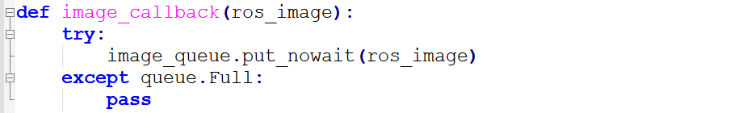

# 8. Deep Learning Lesson

## 8.1 Machine Learning Introduction

### 8.1.1 Preface 

With the increasing popularity and strongly advocacy around the world, Al is changing our lives step by step. The designs used to exist in sci-fi movies are bringing to life. Artificial intelligence is a wide-ranging branch of computer science. It consists of different fields such as machine learning and computer vision.

### 8.1.2 What is machine learning?

Machine learning is the study of how computers can simulate or realize human learning behaviors in order to acquire new knowledge or skills. It is a research field at the intersection of statistics, artificial intelligence, and computer science. With the continuous advancement of artificial intelligence in recent years, machine learning as the core of artificial intelligence has made this term no longer unfamiliar.

Machine learning as the heart of Artificial Intelligent helps people realize self-driving cars, effective speech recognition, efficient web search and greatly improves the understanding of the human genome.

For example, Google's AlphaGo is the first computer Go program to beat a professional Go player and the first to defeat a Go world champion. It works by deep learning. In addition, current popular self-driving cars are realized based on computer system-based intelligent driving device in the car.

### 8.1.3 Machine learning Classification 

Machine learning is divided into supervised learning and unsupervised learning. Supervised learning is the most common in machine learning. Marked data and training target involving in learning is in order to provide correct label for the new data (test data) so that computer can use the provided data to recognize new sample.

Different from supervised learning, unsupervised learning does not have any labels or has the same labels. Various issues are solved based on training sample with unknown categories.

Therefore, supervised learning is often used in data mining and discovering information out of a large number of unlabeled data. The major difference between the supervised learning and the unsupervised learning is that the data set of supervised learning already knows its classification and rule while the unsupervised learning does not know.

## 8.2 Machine Learning Framework Introduction

### 8.2.1 Preface 

Machine learning, the core of artificial intelligent, is an interdisciplinary subject involving probability theory, statistics, approximation theory, convex analysis, algorithmic Complexity theory, and other fields. However, machine learning frameworks is the extremely important part in machine learning process, which is equivalent to the human skeleton.

### 8.2.2 Common machine learning framework

So far, there are a large number of machine learning frameworks. We will introduce you several common types.

* **PyTorch** 

**Introduction:**

PyTourch, the Python version of Torch, is an open-source neural network framework developed by Facebook. Torch is a Tensor library to operate on homogeneous multidimensional rectangular arrays of numbers, which is widely used in the field of machine learning.

In addition to this, PyTorch is an open source machine library implemented in C++ and wrapped in Lua. It still provides rich API to solve neural network related issues.

**Working process:**

① Establish date set

Firstly, collect certain number of images and name them. Then pre-process the data to convert it to Tensor format and further process to form custom data set.

② Establish neural networks

Firstly, initialize parent class and define the structure of each layer. Then, construct the forward propagating process based on the defined layers.

③ Train neural networks

Define a neutral network containing a group of parameters to be learned. Then transfer the data into neural network and forward propagate, and calculate the difference between the output result and target value according to the loss function. At the end, results are gradient back-propagated to each parameter and the network parameters are updated.

* **TensorRT**

**Introduction:**

TensorRT is a high-performance neural network inference library implemented in C++ language launched by Nvidia. It is used as an optimizer and runtime engine for production deployment. It relies on Nvidia's graphics processing units for its high-performance computing capabilities and is focused on inference tasks that complement common neural network learning frameworks including TensorFlow, Caffe, PyTorch, MXNet, and etc

Unlike the commonly used learning frameworks such as TensorFlow, PyTorch and Caffe machine learning frameworks, the purpose of TensorRT is not how to train machine learning model, but to consider how to use the models that has been trained using other frameworks to perform efficient and fast inference.

**Working process：**

The deployment of TensorRT contains two part "**build**" and "**runtime**."


The "**build**" stage mainly completes model conversion from caffe or TensorFlow to TensorRT. When the model is converted, the inter-layer fusion and accuracy calibration in the optimization process will be completed. The output of this step is an optimized TensorRT model for a specific GPU platform and network model, which can be serialized and stored on disk or in memory. The file stored to disk called "plan file".


The "**runtime**" stage mainly completes inference process. Kernel Auto-Tuning and Dynamic Tensor Memory are supposed to be completed in this stage. Firstly, de-serialize the plan file from the previous step and create a runtime engine. Then, input data (such as the images outside the test set or data set). Last, output classification vector and detection results.

<p id="anchor_8_3"></p>

## 8.3 Image Card Training

It is not recommended to use Jetson Nano for training when the data set is large, because the limit of I/O interface's speed and memory makes the training process slow down. And it is recommended to use the computer with discrete graphics card for training under this situation. The training process on Jetson Nano and computer is the same, but you need to configure the related program operating environment.

The image models required in the games have already been trained before delivery. If you want to train your own model, you can refer to this tutorial. We train number cards of 7, 8 and 9 in this lesson.

### 8.3.1 Preparation

1)  Prepare a laptop. If you are using desktop computer, wireless network card, mouse and other tools are needed.

2)  Install and open the remote connection tool NoMachine, according to the tutorial in "**[3. AI Vision Games Lesson->3.1 Set Development Environment->3.1.1 Remote Tool Installation and Connection](https://wiki.hiwonder.com/projects/JetMax/en/latest/docs/3_AI_Vision_Games_Lesson.html#set-development-environment)**" .

### 8.3.2 Training steps

* **Add data set folder**

1. Add a new folder, **My_Data**, for storing data set under any path. But to prevent the normal use of other files during training operations, we advise you to add it to **Home** under **Files**.


2. Create three directories in "**My_Data**" folder, namely Annotations, ImageSets and JPEGImages. "**Annotation**s" is used to store the annotated file. "**ImageSets**" is used to store path file of data set. And "**JPEGImages**" is used to store pictures of data set.


* **Prepare data set**

The pictures can be obtained from the Internet. But you need to modify the resolution rate as 640\*480 to degrade the performance required for subsequent annotation and training. The resolution rate of pictures taken by "**Capture**" is 640\*480 by default.

We will use the pictures taken by "**Capture**" for training. If you want to use the pictures from Internet, you can refer to "**[8.9 Mask Image Training](#anchor_8_9)**".

1. Double click "**Capture**" tool on the desktop. Then turn on the camera to take photos.


2. Click "**Select**" at the lower right corner and select "**/home/hiwonder/My_Data/JPEGImages**" in the pop-up interface. Click "**Open**" to save the picture to this path.


3. Place the cards to be trained within the camera vision, then click "**Save**" to capture the current image.


4. Move the cards, because card pictures at different angle can improve the credibility of the model.

* **Annotate the picture**

1. Double click "**labellmg**" icon on the desktop to open annotation tool.


2. Click "**Change Save Dir**" to set the path to save the annotated data. And I select "**/home/hiwonder/My_Data/Annotations**", then click "Open".


3. Click "**Open Dir**" to open the folder saving the photos, select "**/home/hiwonder/My_Data/JPEGImage"**, then click **"Open".**


4. Click "**Create RectBox**" to create a annotation box.


5. Left press the mouse to drag the rectangular box to frame the object you want to train. Here, we will frame the number 7 card.


6. Release the mouse, and enter the name of this card in pop-up interface, then click "**OK**". Names for 7, 8 and 9 cards respectively are "**num7**", "num8" and "num9".


7. After annotating one picture, click "**save**", then click "**Next Image**".


8. When all the pictures are annotated, files which have the same name as the pictures, in **xml** format will be generated in "**Annotations**" folder. Pay attention to that only if the image materials reach a certain quantity, the model is reliable.


* **Generate related file**

1. Copy "**txt_gen.py**" and "**xml2yolo.py**" files to "**Home/My_Data**" folder, and create file named "**classes.names**".


2. Double click "**Terminal**" icon to enter the terminal interface.

3. Enter command "**cd My_Data/**" and press Enter to enter the folder.

```bash
cd My_Data/
```

4. Enter command "**python3 txt_gen.py**" and press Enter to run the program. Scan the xml file and jpg file with the same name from "**Annotations**" and " **JPEGImages**", then write them to "**all.txt**" folder.

```bash
python3 txt_gen.py
```

5. Next, the contents in "**all.txt**" file are randomly allocated into three files: "**train.txt**", "**val.txt**" **and** "**test.txt**" at a ratio of 80%:15%:5.


6. Enter the data set directory "**facemask**", then modify the "**classes.names**" content with text editor as the picture shown. Pay attention to that enter one card name in one line only.


7. Enter command "**python3 xml2yolo.py**" and press Enter to run the program. Covert the xml files, corresponding to the pictures in "**all.txt**", into txt files required by **yolo**. Then synchronize the txt files to "**JPEGImages**" folder.

```bash
python3 xml2yolo.py
```

8. When the files are generated, enter "**Home/yolov5/data**" under "**Files**" in File Explorer, then create "**My_Data.yaml**" file. And write the following content to this file.


Note: the parameter order of name should be consistent with "**classes.names**".

*  **Start training**

1. Enter command "**cd yolov5/**" to enter yolov5 directory.

```bash
cd yolov5/
```

2. Enter command "**python3 train.py --img-size 160 --weights yolov5s.pt --data data/My_Data.yaml --batch-size 4 --epochs 10**" and press Enter to start training.

```bash
python3 train.py --img-size 160 --weights yolov5s.pt --data data/My_Data.yaml --batch-size 4 --epochs 10
```

3. When the training is completed, related files will be generated in "**yolov5/runs/train/**".


* **change the format** 

To ensure that the neural network data can convert in different architectures, we need to convert the weight file of pytorch into onnx format, then into tensorrt format.

1. Enter command "**cd yolov5/**" to enter yolov5 directory.

```bash
cd yolov5/
```

2. Enter command "**python3 models/export.py --weights runs/train/exp/weights/best.pt --img-size 160 --batch-size 1**" and press Enter to convert the weight file of pytorch into onnx format. Pay attention that "**exp**" in the command need to be modified according to the actual folder generated in "**yolov5/runs/train/**".

```bash
python3 models/export.py --weights runs/train/exp/weights/best.pt --img-size 160 --batch-size 1
```

3. After the file was converted into onnx format, "best.onnx" file will generated in "**Home/yolov5/runs/train/exp/weights**".


4. Enter command "**onnx2trt runs/train/exp/weights/best.onnx -o best.trt**" and press Enter to convert the file in onnx format into tensorrt format. Pay attention that "**exp**" in the command need to be modified according to the actual folder generated in "**yolov5/runs/train/**".

```bash
onnx2trt runs/train/exp/weights/best.onnx -o best.trt
```

5. After the conversion, "**best.trt**" file will be generated in yolov5 directory.


## 8.4 Number Card Recognition

### 8.4.1 Program logic

**Step 1: obtain and process image**

Firstly, subscribe to the real-time image data released by camera node "**/usb_cam/image_rect_color**". Then, convert its format into numpy. Next, covert the color space to obtain the image in BGR format.

**Step 2: recognize and process number**

When the image was obtained and processed, transfer it to `yolov5_tensorrt` library for number recognition and information processing so as to obtain the real-time coordinate, recognition confidence and serial number of the number card.

**Step 3: display the recognition result**

Traverse the number list to find out the number corresponding to the obtained number. Then display its name and recognition confidence on the transmitted image, and frame the number card. Lastly, the name and coordinate of number will be displayed on the terminal.

The source code of the program lies in **/Home/ros/src/Ai_JetMax/scripts/number_recognition.py**


### 8.4.2 Operation steps

The entered command should be case sensitive. And the keywords can be complemented by Tab key.

1. Double click  on the desktop.

2. When into the interface, enter command "**cd ros/src/Ai_JetMax/scripts**" to enter the directory storing the game program.

```bash
cd ros/src/Ai_JetMax/scripts
```

3. Then enter command "**rosrun Ai_JetMax number_recognition.py**" to run the game program

```bash
rosrun Ai_JetMax number_recognition.py
```

4. If you want to close this program, press "**Ctrl+C**".

### 8.4.3 Function realization 

When the game starts and the camera has recognized the number cards, the number and confidence will be displayed on the transmitted image, and the coordinate of number will be displayed in the terminal.


### 8.4.4 Project analysis

Machine learning is to make comparison between collected information about the number cards and number model already learned to obtain the accurate recognition result.

After running the program, call `rospy.Subscriber()` function to turn on the camera, and retrieve the photo taken by the camera.


After the camera is turned on, call `image_proc_a()` function for detecting number, and giving the feedback for obtained information. The specific analysis is as follow.

* **number recognition**

After obtaining the image data collected by the camera, convert the data format and color space. Then pass the preliminary processed image data to `yolov5.detect()` function for target detection in order to extract the number information in the image. Then output the detected result to the outputs variable.


`Yolov5TensorRT` library that is imported in `yolov5_tensorrt` module involves `detect()` function.


The process in `detect()` function is as follow.

1. Call `pre_process()` function to scale the size of number cards to 640\*480.


2. call `inference()` function to process image data


The process of processing image data is divided into the following steps.

1. Transfer the scaled data from CPU to GPU.


2. Run yolov5 inference process and traverse the number material of the model to recognize the number cards of the image.


3. Transmit the obtained data from GPU back to CPU.


* **obtain information**

It is not convenient to use the detected result of the image directly. Hence, we need to convert and process the result with `post_process()` function later to obtain the visual information, including coordinate, confidence, category name, etc.


Parameter `boxes` represents the obtained coordinate of the card

Parameter `confs` represents the obtained recognition confidence of the card

Parameter `classes` represents the category of the card

Parameter `image` represents the detected image

Parameter `outputs` represents the image information

Parameter `0.6` represents only when the recognition confidence is more than 0.6, the direct information can be obtained.

Likewise, `post_process()` function can be found in Yolov5TensorRT library of yolov5_tensorrt module.

The process in `yolov5.post_process()` is as follow.

1. Firstly, segment and fit the original data obtained by `detect()` function to get the data of each card.


2. Segment the data of each card to acquire the box, confidence and classification parameter of each card.


3. Then filter out the recognized cards which is below the confidence.


4. Lastly, perform maximum value depression on matched cards to ensure there is one recognition box.


* **Feedback for obtained information**

After the detected information is obtained, the related information will be given on VNC software.

1. Use `cv2.putText()` function to add text on picture to display the sequence and confidence of number.


The first parameter `image` represents the specific picture to which the text description is added.

The second parameter `card_name +** " "**+ str(float(cls_conf))[:4]` represents the added content. `card_name` represents the sequence of the number. `str(float(cls_conf))[:4]` represents the corresponding confidence of the number.

The third parameter `(x1, y1 - 5)` represents the coordinate of the added text.

The fourth parameter `cv2.FONT_HERSHEY_SIMPLEX` represents the font of the added text.

The fifth parameter `0.7` represents the font size of the added text.

The sixth parameter `COLORS[cls_id]` represents the color of the added text.

The seventh parameter `2` represents the font weight of the added text.

2. Use `cv2.rectangle()` function to draw the rectangle frame, and use it to frame the number card. The specific program is as follow.


The first parameter `image` represents the specific image of the drawn frame.

The second parameter `(x1, y1)` represents the starting coordinate of the rectangle.

The third parameter `(x2, y2)` represents the end coordinate of rectangle.

The fourth parameter `COLORS[cls_id]` represents the color of the rectangle border to be drawn.

The fifth parameter `2` represents the width of rectangle border.

3. use `print()` function to display the coordinate and name of the number card on the terminal. The specific program is as follow.


Parameter `x1` represents X-axis coordinate in upper left corner of the number card

Parameter `y1` represents the Y-axis coordinate in the upper left corner of the number card

Parameter `x2` represents the X-axis value in the lower right corner of the number card

Parameter `y2` represents the Y-axis coordinate of the lower right corner of the number card

Parameter `card_name` represents the sequence of the number

## 8.5 Waste Card Recognition

### 8.5.1 Program logic

**Step 1: obtain and process image**

Firstly, subscribe to the real-time image data released by camera node "**/usb_cam/image_rect_color**". Then, convert its format into numpy. Next, covert the color space to obtain the image in BGR format.

**Step 2: recognize and process waste**

When the image was obtained and processed, transfer it to `yolov5_tensorrt` library for waste recognition and information processing so as to obtain the real-time coordinate, recognition confidence and alphabet.

**Step 3: display the recognition result**

Traverse the waste list to find out the waste category and name corresponding to the obtained waste serial number. Then display the name and recognition confidence on the transmitted image, and frame the waste card.

The source code of this program lies in **/Home/ros/src/Ai_JetMax/scripts/waste_classification.py**


### 8.5.2 Operation steps

The entered command should be case sensitive. And the keywords can be complemented by Tab key.

1. Double click  on the desktop.

2. When into the interface, enter command "**cd ros/src/Ai_JetMax/**" to enter the directory storing the game program.

```bash
cd ros/src/Ai_JetMax/
```

3. Then enter command "**rosrun Ai_JetMax waste_classification.py**" to run the game program

```bash
rosrun Ai_JetMax waste_classification.py
```

4)  If you want to close this program, press "**Ctrl+C**".

### 8.5.3 Function realization 

When the game starts and the camera has recognized the waste cards, the waste name, category and confidence will be displayed on the transmitted image.


|   **Category**   |                  **Card**                   |
| :--------------: | :-----------------------------------------: |
| hazardous_waste  | Storage Battery、Marker、Oral Liquid Bottle |
| recyclable_waste |    Plastic Bottle、Umbrella、Toothbrush     |
|    food_waste    |     Banana Peel、Ketchup、Broken Bones      |
|  residual_waste  | Cigarette End、Plate、Disposable Chopsticks |

### 8.5.4 Project analysis

Machine learning is to make comparison between collected information about the waste cards and waste model already learned to obtain the accurate recognition result.

After running the program, call `rospy.Subscriber()` function to open the camera and retrieve the picture taken by the camera.


After the camera is turned on, call `image_proc()` function, then begin detecting the image, acquiring the information, and give feedback for acquired information. The specific analysis is as follow.

* **waste image recognition**

After obtaining the image data collected by the camera, convert the data format and color space. Then pass the preliminary processed image data to `yolov5.detect()` function for target detection in order to extract the waste category in the image. Then output the detected result to the outputs variable.


Import to Yolov5TensorRT library in yolov5_tensorrt module. This library involves `detect()` function.


The `process in detect()` function is as follow.

1. call `pre_process()` function to scale the size of waste cards to 640\*480.


2. call `inference()` function to process image data


The process of processing the image data is divided into a few steps.

1. Transfer the scaled data from CPU to GPU

.

2. Run yolov5 inference process and traverse the waste card material of the model to recognize the waste cards in the image.


3. Transmit the obtained data from GPU back to CPU.


* **obtain information**

It is not convenient to use the detected result of the image directly. Hence, we need to convert and process the result with `post_process()` function later to obtain the visual information, including coordinate, confidence, category name, etc. The program is as follow.


Parameter `boxes` represents the coordinate of the waste card

Parameter `confs` represents the recognition confidence of the waste card

Parameter `classes` represents the category of the waste card

Parameter `image` represents the image to be detected

Parameter `outputs` represents the image information

Parameter `0.65` represents that only when the recognition confidence is more than 0.65, the direct information can be obtained.

Likewise, `post_process()` function can be found in **Yolov5TensorRT** library of `yolov5_tensorrt` module

The process in `yolov5.post_process()` is as follow.

1. Firstly, segment and fit the original data obtained by `yolov5.detect()` function to get the data of each card.


2. Segment the data of each card to acquire the box, confidence and classification parameter of each card.


3. Then filter out the recognized cards which is below the confidence.


4. Lastly, perform maximum value depression on on matched cards to ensure there is one recognition box.


5. Feedback for obtained information

After obtaining the detected information, the related information will be given on VNC software.

6. Use `cv2.putText()` function to add text on picture to display the sequence and confidence of number.

Take `cv2.putText(image, waste_name + "{:0.2f}".format(float(cls_conf)), (x1, y1 - 5), cv2.FONT_HERSHEY_SIMPLEX, 0.7, COLORS[waste_class_name], 2)` for example.

The first parameter `image` represents the specific picture adding text explanation.

The second parameter `waste_name + "{:0.2f}".format(float(cls_conf))` represents the added content. `waste_name` represents the waste name. `format(float(cls_conf))` represents the corresponding confidence of the waste.

The third parameter `(x1, y1 - 5)` represents the coordinate of the added text.

The fourth parameter `cv2.FONT_HERSHEY_SIMPLEX` represents the font of the added text.

The fifth parameter `0.7` represents the font size of the added text.

The sixth parameter `COLORS[waste_class_name]` represents the color of the added text. Please refer to the below program for the specific settings.

Take`'hazardous_waste': (255, 0, 0)` for example. These 3 values all ranges from 0 to 255. This program represents that the text consists of three colors, including red, green and blue. The first parameter "255" represents red value, the second value `0` represents green value, and the third parameter "0" represents blue value.

The seventh parameter `2` represents the font weight of the added text.

7. use `cv2.rectangle()` function to draw the rectangle frame to frame the waste card. The specific program is as follow.

The first parameter `image` represents the specific image of the drawn frame.

The second parameter `(x1, y1)` represents the start coordinate of the rectangle

The third parameter `(x2, y2)` represents the end coordinate of the rectangle.

The fourth parameter `COLORS[waste_class_name]` represents the color of the rectangle border to be drawn.

The fifth parameter `3` represents the width of the rectangle border.

## 8.6 Waste Sorting

### 8.6.1 Program logic

The process of waste sorting is divided into two parts.

**Step 1: recognize and sort**

Firstly, subscribe to the real-time image data released by the camera node. Then covert this data to Numpy form. After that, input the image to yolov5 network for several operations, including scale, transpose, array expand, etc. After serial operations, the processing result will be obtained.

The obtained coordinate of the waste card will be converted to the original image coordinate. After the coordinate is converted and the waste name is recognized, the waste card will be classified according to the set rules and the category name of the waste will be gained. Next the waste will be framed, then its name and recognition confidence will be displayed.

**Step 2: suck and place**

Firstly, the waste card with highest recognition confidence will be the first to be sorted, then it will be framed with white box. When confirming the next waste card to be sorted, there is no need to compare the recognition confidence between these cards repeatedly. The waste card which is nearest to the first sorted target, is the next to be sorted. In order to ensure the result credibility, the target will be recognized repeatedly.

When the target is confirmed, the process of sorting and transferring will start. The pixel coordinate of the target card will be converted into the world coordinate. Then calculate the distance between the card position and sorting area to control the speed.

Calculate the angle of the robotic arm relative to the central axis and control the corresponding angle of the suction cup rotation. At last, control the robotic arm to pick the waste card, then suck and transfer it to the sorting area.

The source code of the program lies in **/Home/ros/src/jetmax_buildin_funcs/waste_classification/**

**Script/swaste_classification_main.py**


### 8.6.2 Preparation

1)  Please place the robotic arm on the map, then switch on it and calibrate its position. You can calibrate the robotic arm via the mobile APP. For the detailed instruction, you can refer to the **[2. Quick User Experience](https://wiki.hiwonder.com/projects/JetMax/en/latest/docs/2_Quick_User_Experience.html)**. Then place the waste cards to the recognition area. Ensure the cards are not too close to each other and don't place them to edge of the recognition area.

2)  Install and open the No Machine remote tool. For detailed instruction, you can refer to "**[3. AI Vision Games->3.1 Set Development Environment->3.1.1 Remote Tool Installation and Connection](https://wiki.hiwonder.com/projects/JetMax/en/latest/docs/3_AI_Vision_Games_Lesson.html#set-development-environment)**".

### 8.6.3 Operation steps

The entered command should be case-sensitive. And the keywords can be complemented by the Tab key.

* **Enter the game**

1)  Turn on JetMax, then connect to the system desktop through No Machine.

2)  Click .

3)  Enter the game. Then enter command "**rosservice call /waste_classification/enter "{}"**" and press Enter.


* **Turn on camera**

Turn on camera. Double click , then enter the address, **192.168.149.1:8080/** and press Enter. Next, select "**/waste_classification/image_result(Snapshot)**".


* **Start the game**

Start the game. Enter command "**rosservice call /waste_classification/set_running "data: true"**" and press Enter.


* **Stop and exit the game**

1. If you want to stop the game, you can enter command "**rosservice call /waste_classification/ set_running "data: true"**"and press Enter.


2. If you want to exit the game, you can enter command "**rosservice call /waste_classification/exit"{}"** "and press Enter.


### 8.6.4 Function realization

After the game starts, place the waste card to the recognition area. When the camera recognizes the waste card, the robotic arm will suck and transfer them to the corresponding area according to the card category.

|   **Category**   |                  **Card**                   |
| :--------------: | :-----------------------------------------: |
| hazardous_waste  | Storage Battery、Marker、Oral Liquid Bottle |
| recyclable_waste |    Plastic Bottle、Umbrella、Toothbrush     |
|    food_waste    |     Banana Peel、Ketchup、Broken Bones      |
|  residual_waste  | Cigarette End、Plate、Disposable Chopsticks |

### 8.6.5 Project analysis

Machine learning is to make comparison between collected information about the waste cards and waste model already learned to obtain the accurate recognition result. Transfer the recognized waste card and place it to corresponding area.

After running the program, call `rospy.Subscriber()` function first to turn on the camera, and retrieve the picture taken by the camera.


After turning on the camera, call `image_proc()` function, and then detect the image, acquire the information, give feedback for the acquired information and execute action.

- waste image recognition

After obtaining the image data collected by the camera, convert the data format and color space. Then pass the preliminary processed image data to `yolov5.detect()` for target detection in order to extract the waste category in the image. Then output the detected result to the outputs variable.


Import to Yolov5TensorRT library of `yolov5_tensorrt` module. This library involves `detect()` function.


The process in `detect()` is as follow.

1. call `pre_process()` function to scale the size of waste cards to 640\*480.


2. call `inference()` function to process image data


The process of processing the image data is divided into these steps.

1. transfer the scaled data from CPU to GPU.


2. Run yolov5 inference process and traverse the waste card material of the model to recognize the waste cards in the image.


3. Transmit the obtained data from GPU back to CPU.


- obtain information

It is not convenient to use the detected result of the image directly. Hence, we need to convert and process the result with `post_process()` function later to obtain the visual information, including coordinate, confidence, category name, etc. The program is as follow.


Parameter `boxes` represents the coordinate of the card.

Parameters `confs` represents the confidence of the card

Parameter `classes` represents the category of the card

Parameter `image` represents the image to be detected

Parameter `outputs` represents the image information

Parameter `0.65` represents only when the confidence is more than 0.65, the direct information can be obtained.

Likewise, `post_process()` function can be found in Yolov5TensorRT library of yolov5_tensorrt module.

The process in `yolov5.post_process()` is as follow.

1. Firstly, segment and fit the original data obtained by `yolov5.detect()` function to get the data of each card.


2. Segment the data of each card to acquire the box, confidence and classification parameter of each card.


3. Then filter out the recognized cards which is below the confidence.


4. Lastly, perform maximum value depression on matched cards to ensure there is one recognition box.


5. Feedback for obtained information

After obtaining the detected information, the related information will be given on VNC software.

6. Use `cv2.putText()` function to add text on picture. The text is about the waste name and recognition confidence.


The first parameter `image` represents the specific picture to which the text explanation is added.

The second parameter `waste_name +**" " **+ str(float(cls_conf))[:4]` represents the added content. "waste_name" represents the waste name. `str(float(cls_conf))\[:4\]` represents the corresponding confidence of the waste.

The third parameter `(x1, y1 - 5)` represents the coordinate of the added text.

The fourth parameter `cv2.FONT_HERSHEY_SIMPLEX` represents the font of the added text.

The fifth parameter `0.7` represents the font size of the added text.

The sixth parameter `COLORS[waste_class_name]` represents the color of the added text. Please refer to the below program for the specific settings.


Take `'hazardous_waste': (255, 0, 0)` for example. These 3 values all ranges from 0 to 255. This program represents that the text consists of three colors, including red, green and blue. The first parameter `255` represents red value, the second value `0` represents green value, and the third parameter "0" represents blue value.

The seventh parameter `2` represents the font weight of the added text.

7. use `cv2.rectangle()` function to draw the rectangle frame to frame the waste card.


The first parameter `image` represents the specific image of the drawn frame.

The second parameter `(x1, y1)` represents the start coordinate of the rectangle

The third parameter `(x2, y2)` represents the end coordinate of the rectangle

The fourth parameter `COLORS[waste_class_name]` represents the color of the rectangle border to be drawn

The fifth parameter `3` represents the width of the rectangle border

- **Execute the feedback action**

After the waste card is recognized, call threading.Thread() function to transfer the card and place it to the corresponding area.


The first parameter `target=moving` represents action of transferring cards. The specific settings method is as the picture shown.


The second parameter `daemon=True` represents daemon thread. If there is only daemon thread, the entire program will quit.

## 8.7 Alphabet Card Recognition

### 8.7.1 Program logic

**Step 1: recognize and sort**

Firstly, subscribe to the real-time image data released by the camera node "**/usb_cam/image_rect_color**". Then covert this data to Numpy form. After that, perform color space conversion to obtain the image in BGR format.

**Step 2: recognize and process alphabet**

When the image is obtained and processed, pass it to **yolov5_tensorrt** for alphabet recognition and information processing so as to acquire the real-time coordinate, recognition confidence and alphabet of the cards.

**Step 3: display recognition result**

Traverse the alphabet list to locate the alphabet corresponding to the alphabet obtained in **step 2**. Then display its name and recognition confidence in transmitted image, and frame the alphabet card. Lastly, the alphabet and coordinate will be display in the terminal.

The source code of this program lies in **/Home/ros/src/Ai_JetMax/scripts/letter_recognition.py**


### 8.7.2 Operation steps

The entered command should be case sensitive. And the keywords can be complemented by Tab key.

1. Double click  on the desktop.

2. When into the interface, enter the command "**cd ros/src/Ai_JetMax/scripts/**" to enter the directory storing the game program and press Enter.

```bash
cd ros/src/Ai_JetMax/scripts/
```

3. Then enter command "**rosrun Ai_JetMax letter_recognition.py**" to run the game program.

```bash
rosrun Ai_JetMax letter_recognition.py
```

4)  If you want to close this program, you can press "**Ctrl+C**".

### 8.7.3 Function realization

When the game starts and the alphabet cards are recognized by the camera, the alphabet and recognition confidence will be displayed in the transmitted image, and the alphabet coordinate will be displayed in the terminal.


### 8.7.4 Project analysis

Machine learning is to make comparison between collected information about the alphabet cards and alphabet model already learned to obtain the accurate recognition result.

After running the program, call `rospy.Subscriber()` function first to turn on the camera, and retrieve the picture taken by the camera. The program is as follow.


After the camera is turned on, call `image_proc()` function for detecting the letter, acquiring the information and giving feedback for the obtained information. The specific analysis is as follow.

- **Alphabet detection**

After obtaining the image data collected by the camera, convert the data format and color space. Then pass the preliminary processed image data to `yolov5_chars.detect()` function for target detection in order to extract the alphabet information in the image. Then output the detected result to the outputs variable. The program is as follow.


Import to Yolov5TensorRT library of `yolov5_tensorrt` module. This library involves `detect()` function.


The process in `detect()` function is as follow.

1. call `pre_process()` function to scale the size of alphabet cards to 640\*480.


2. call `inference()` function to process image data


The process of processing image data is divided into these steps.

1. Transfer the scaled data from the CPU to the GPU.


2. Run yolov5 inference process to traverse the alphabet material of the model and recognize the alphabet cards in the image.


3. Transfer the obtained data from GPU back to CPU.


- Obtain information

It is not convenient to use the detected result of the image directly. Hence, we need to convert and process the result with `post_process()` function later to obtain the visual information, including coordinate, confidence, category name, etc.


Parameter `boxes` represents the coordinate of the card.

Parameters `confs` represents the confidence of the card

Parameter `classes` represents the category of the card

Parameter `image` represents the image to be detected

Parameter `outputs` represents the image information

Parameter `0.60` represents only when the confidence is more than 0.60, the direct information can be obtained

`Likewise`, `post_process()`function can be found in `Yolov5TensorRT` library of yolov5_tensorrt` module.

The process in `yolov5_chars.post_process()` is as follow.

1. Firstly, segment and fit the original data obtained by `yolov5_chars.detect()`function to get the data of each card.


2. Segment the data of each card to acquire the box, confidence and classification parameter of each card.


3. Then filter out the recognized card which is below the confidence.


4. Lastly, perform maximum value depression on matched cards to ensure there is one recognition box.


- Feedback for obtained information

After obtaining the detected information, the related information will be given on VNC software.

1. Use `cv2.putText()` function to add text on picture to display the sequence and confidence of number.


The first parameter `result_image` represents the specific picture adding text explanation.

The second parameter `char + " " + str(float(cls_conf))[:4]` represents the added text content. `char` represents the letter information. `str(float(cls_conf))[:4]` represents the corresponding recognition confidence of the letter.

The third parameter `(int(x1), int(y1) - 5)` represents the coordinate of the added text.

The fourth parameter `cv2.FONT_HERSHEY_SIMPLEX` represents the font of the added text.

The fifth parameter `0.7` represents the font size of the added text.

The sixth parameter `COLORS[cls_id]` represents the color of the added text.

The seventh parameter `2` represents the font weight of the added text.

- Use `cv2.rectangle()` function to draw the rectangle frame to frame the alphabet card.


The first parameter `result_image` represents the specific image of the drawn frame.

The second parameter `(int(x1), int(y1))` represents the start coordinate of the rectangle.

The third parameter `(int(x2), int(y2))` represents the end coordinate of the rectangle.

The fourth parameter `COLORS[cls_id]` represents the color of the rectangle border to be drawn.

The fifth parameter `3` represents the width of the rectangle border.

- In program, use `print()` function to display the coordinate and name of the alphabet card in the terminal.


Parameter `x1` represents the X-axis coordinate in the upper left corner of the alphabet card.

Parameter `y1` represents the Y-axis coordinate in the upper left corner of the alphabet card.

Parameter `x2` represents the X-axis coordinate in the lower right corner of the alphabet card.

Parameter `y2` represents the Y-axis coordinate in the lower right corner of the alphabet card.

Parameter `char` represents the letter information.

## 8.8 Word Spelling

### 8.8.1 Program logic 

The process of word spelling consists of two parts.

**Step 1: recognize and process**

Firstly, we need to assign a value to `WORD_WANT` variable, and set the words and phrase to be spelled.

Next, subscribe to the real-time image data released by camera node and convert it into numpy format. Then, input the image to the yolov5 network for scaling, transposition, array expansion and other operations to obtain the processing result.

Then, convert the coordinates of the recognized alphabet cards to original image coordinates, and frame them to display alphabet and recognition confidence.

**Step 2: suck and place**

Firstly, save the recognized alphabet ID in `char` variable. If it matches with the alphabet in `WORD_WANT[state.index]` , save it to the **cards** list.

Then, call `max()` function of python to choose the alphabet card with the largest recognition confidence as a reference from the list. After that, calculate the center distance between the <span class="mark">reference card and target card. Next, call</span> `min()` function to find out the target card nearest to the reference card. 

Lastly, when the the reference card is consistent with the ID of the target card, start the process of suction and placing. Calculate the distance between the current position of robotic arm and target card to control the speed. Then calculate the servo angle of suction point and placing point by inverse kinematics to control the servo and motor to complete word spelling.

The source code of the program lies in **/Home/ros/src/jetmax_demos/scripts/alphabetically_main.py**


### 8.8.2 Operation steps

The entered command should be case sensitive. And the keywords can be complemented by Tab key.

1. Double click  on the desktop.

2. When into the interface, enter the command "**cd ros/src/jetmax_demos/scripts/**" to enter the directory storing the game program and press Enter.

```bash
cd ros/src/jetmax_demos/scripts/
```

3. Enter command "**rosrun jetmax_demos alphabetically_main.py**" to run game program and press Enter.

```bash
rosrun jetmax_demos alphabetically_main.py
```

4)  If you want to close this program, you can press "**Ctrl+C**". If it fails, you can try again.

### 8.8.3 Function realization 

When the game starts, the robotic arm will pick the corresponding alphabet cards in spelling orders and place them to one side.

### 8.8.4 Project analysis 

Machine learning is to make comparison between collected information about the alphabet cards and alphabet model already learned to obtain the accurate recognition result. Then transfer the alphabet cards in sequence and place them to the specific position to spell a word.

After running the program, call `rospy.Subscriber()` function first to turn on the camera, and retrieve the picture taken by the camera. The program is as follow.


After the camera is turned on, call `image_proc()` function for detecting the letter, acquiring the information and giving feedback for the obtained information. The specific analysis is as follow.

- **Alphabet detection and processing**

After obtaining the image data collected by the camera, convert the data format and color space. Then pass the preliminary processed image data to `yolov5_chars.detect()` function for target detection in order to extract the alphabet information in the image. Then output the detected result to the **outputs** variable.


Import to Yolov5TensorRT library of yolov5_tensorrt module. This library involves `detect()` function.


The process in `detect()` is as follow.

● call `pre_process()` function to scale the size of alphabet cards to 640\*480.


● call `inference()` function to process the image data


The process of processing image data is divided into these steps.

1. Transfer the scaled data from the CPU to the GPU.


2. Run yolov5 inference process to traverse the alphabet material of the model and recognize the alphabet cards in the image.


3. Transfer the obtained data from GPU back to CPU.


- **Obtain information**

It is not convenient to use the detected result of the image directly. Hence, we need to convert and process the result with `post_process()` function later to obtain the visual information, including coordinate, confidence, category name, etc. The program is as follow.


Parameter `boxes` represents the coordinate of the card.

Parameters `confs` represents the confidence of the card

Parameter `classes` represents the category of the card

Parameter `img_in` represents the image to be detected

Parameter `outputs` represents the image information

Parameter `0.65` represents only when the confidence is more than 0.65, the direct information can be obtained

Likewise, `post_process()` function can be found in Yolov5TensorRT library of yolov5_tensorrt module.

The process in `yolov5_chars.post_process()` is as follow.

The process in `yolov5_chars.post_process()` is as follow.

1. Firstly, segment and fit the original data obtained by `yolov5_chars.detect()` function to get the data of each card.


2. Segment the data of each card to acquire the box, confidence and classification parameter of each card.


3. Then filter out the recognized card which is below the confidence.


4. Lastly, perform maximum value depression on matched cards to ensure there is one recognition box.


- Feedback for obtained information

After obtaining the detected information, compare the detected information with the set word information. If the detected letters are consistent with the set word, related information will display on VNC software.


The following information will be offered.

1. Use `cv2.putText()` function to add text on the picture to display the letter information and recognition information.


The first parameter `result_image` represents the specific picture to which the text is added.

The second parameter `char + " " + str(float(cls_conf))[:4]` represents the added text content. `char` represents the letter information. `str(float(cls_conf))[:4]` represents the recognition confidence of the corresponding letter.

The third parameter `(int(x1), int(y1) - 5)` represents the coordinate of the added text.

The fourth parameter `cv2.FONT_HERSHEY_SIMPLEX` represents the font of the added text.

The fifth parameter `0.7` represents the font size of the added text.

The sixth parameter `COLORS[cls_id]` represents the color of the added text.

The seventh parameter `2` represents the font weight of the added text.

2. use `cv2.rectangle()` function to draw rectangle frame and frame the alphabet card. The specific program is as follow.


The first parameter `result_image` represents the specific image of the drawn frame

The second parameter `(int(x1), int(y1))` represents the starting coordinate of the rectangle

The third parameter `(int(x2), int(y2))` represents the end coordinate of the rectangle

The fourth parameter `COLORS[cls_id]` represents the color of rectangle border.

The fifth parameter `3` represents the width of the rectangle border

- **Word spelling**

The detected letters contain the letters of set word. Then start delivering the alphabet cards in sequence and spelling the word. The specific steps are as follow.

1. If it is detected that the word is not spelled, call `threading.Thread()` function to move and place the card in the corresponding position to spell the word. The specific program is as follow.


The first parameter `target=moving` represents the action of delivering the card. The specific settings methods is as follow.


The second parameter `daemon=True` represents Daemon thread. If there is only daemon thread left, the entire program will exit.

2. After it is detected that the word is spelled, stop delivering the card and set the position of the robotic arm. The specific program is as follow.


<p id="anchor_8_9"></p>

## 8.9 Mask Image Training

It is not recommended to use Jetson Nano for training when the data set is large, because the limit of I/O interface's speed and memory makes the training process slow down. And it is recommended to use the computer with discrete graphics card for training under this situation. The training process on Jetson Nano and computer is the same, but you need to configure the related program operating environment.

The mask recognition image model has already been trained before delivery. If you want to train your own model, you can refer to this tutorial.

### 8.9.1 Preparation

1)  Prepare a laptop. If you are using desktop computer, wireless network card, mouse and other tools are needed.

2)  Install and open the remote connection tool No Machine, according to the tutorial in "**[3. AI Vision Games Lesson->3.1 Set Development Environment->3.1.1 Remote Tool Installation and Connection](https://wiki.hiwonder.com/projects/JetMax/en/latest/docs/3_AI_Vision_Games_Lesson.html#set-development-environment)**" .

### 8.9.2 Training steps

* **Add data set folder**

1)  Add a new folder, **facemask**, for storing data set under any path. But to prevent the normal use of other files during training operations, we advise you to add it to **Home** under **Files**.


2)  Create three directories in "**facemask**" folder, namely Annotations, ImageSets and JPEGImages. "**Annotation**s" is used to store the annotated file. "**ImageSets**" is used to store path file of data set. And "**JPEGImages**" is used to store pictures of data set.


* **Prepare data set**

The pictures can be obtained from the Internet. But you need to modify the resolution rate as 640\*480 to degrade the performance required for subsequent annotation and training. The resolution rate of pictures taken by "**Capture**" is 640\*480 by default.

We will use the pictures from the Internet. If you want to use the personal pictures, you can refer to "**[8.3 Image Card Training](#anchor_8_3)**".

When using the image materials from the Internet to train, you need to copy the downloaded pictures to this path, **/home/facemask/JPEGImage.**


* **Annotate the picture**

1)  Double click "**labellmg**" icon on the desktop to open annotation tool.


2)  Click "**Change Save Dir**" to set the path to save the annotated data. And I select "**/home/hiwonder/facemask/Annotations**", then click "**Open**".


3)  Click "**Open Dir**" to open the folder saving the photos, select "**/home/hiwonder/facemask/JPEGImage**", then click "Open".


4)  Click "**Create RectBox**" to create a annotation box.


5)  Left press the mouse to drag the rectangular box to frame the target you want to train. Here, we frame the persons who don't wear a mask.


6)  Release the mouse, and enter the name of this card in pop-up interface, then click "**OK**". For example, if you are training image without mask, you can enter "**nofacemask**". On the opposite, you can enter "**facemask**".


7)  After annotating one picture, click "**save**", then click "**Next Image**".


8)  When all the pictures are annotated, files, with the same name as the pictures, in xml format will be generated in "**Annotations**" folder. Pay attention to that only if the image materials reach a certain quantity, the model is reliable.


* **Generate related file**

1)  Copy "**txt_gen.py**" and "**xml2yolo.py**" files to "**Home/facemask**" folder, and create file named "**classes.names**".


2. Double click "**Terminal**" icon to enter the terminal interface.

3. Enter command "**cd facemask/**" and press Enter to enter the folder.

```bash
cd facemask/
```

4)  Enter command "**python3 txt_gen.py**" and press Enter to run the program. Scan the xml file and jpg file with the same name from "**Annotations**" and " **JPEGImages**", then write them to "**all.txt**" folder.


5)  Next, the contents in **all.txt**" file are randomly allocated into three files: "**train.txt**", "**val.txt**" and "**test.txt**" at a ratio of 80%:15%:5.


6)  Enter the data set directory "**facemask**", then modify the "**classes.names**" content with text editor as the picture shown. Pay attention to that enter one card name in one line.


7. Enter command "**python3 xml2yolo.py**" and press Enter to run the program. Covert the xml files, corresponding to the pictures in "**all.txt**", into txt files required by yolo. Then synchronize the txt files to "**JPEGImages**" folder.

```bash
python3 xml2yolo.py
```

8)  When the files are generated, enter "**Home/yolov5/data**" under "**Files**" in File Explorer, then create "**facemask.yaml**" file. And write the following content to this file.


Note: the parameter order of name should be consistent with "**classes.names**".

* **Start training**

1. Enter command "**cd yolov5/**" to enter yolov5 directory.

```bash
cd yolov5/
```

2. Enter command "**python3 train.py --img-size 160 --weights yolov5s.pt --data data/facemask.yaml --batch-size 4 --epochs 10**" and press Enter to start training.

```bash
python3 train.py --img-size 160 --weights yolov5s.pt --data data/facemask.yaml --batch-size 4 --epochs 10
```

3)  When the training is completed, related files will be generated in "**yolov5/runs/train//**".


* **change the format**

To ensure that the neural network data can convert in different architectures, we need to convert the weight file of pytorch into onnx format, then into tensorrt format.

1. Enter command "**cd yolov5/**" to enter yolov5 directory.

```bash
cd yolov5/
```

2. Enter command "**python3 models/export.py --weights runs/train/exp/weights/best.pt --img-size 160 --batch-size 1**" and press Enter to convert the weight file of pytorch into onnx format. Pay attention that "**exp**" in the command need to be modified according to the actual folder generated in "**yolov5/runs/train/**".

```bash
python3 models/export.py --weights runs/train/exp/weights/best.pt --img-size 160 --batch-size 1
```

3)  After the file was converted into onnx format, "**best.onnx**" file will generated in "**Home/yolov5/runs/train/exp/weights**".


4. Enter command "**onnx2trt runs/train/exp/weights/best.onnx -o best.trt**" and press Enter to convert the file in onnx format into tensorrt format. Pay attention that "**exp**" in the command need to be modified according to the actual folder generated in "**yolov5/runs/train/**".

```bash
onnx2trt runs/train/exp/weights/best.onnx -o best.trt
```

5)  After the conversion, "**best.trt**" file will be generated in yolov5 directory.


## **8.10 Mask Identification**

### 8.10.1 Program logic

The process of mask identification is divided into 3 parts.

**Step 1: obtain and process image**

Firstly, subscribe to real-time image data released by camera node "**/usb_cam/image_rect_color**". Next, convert it to numpy format, then perform color space conversion to obtain the image in BGR format.

**Step 2: recognize and process the mask**

After the image is obtained and processed, transfer it to **yolov5_tensorrt** library for mask recognition and information processing to obtain the real-time coordinate and recognition confidence of human face wearing a mask.

**Step 3: display recognition result**

Lastly, use the algorithms to traverse all the obtained object contour to find the contour with largest area. And mark the human face wearing a mask in red frame.

The source code of this program is in **/Home/ros/src/jetmax_demos/scripts/face_mask_main.py**


### 8.10.2 Operation steps

The entered command should be case-sensitive. And the keywords can be complemented by the **Tab** key.

1. Double click  on the desktop.

2. When into the interface, enter command "**cd ros/src/jetmax_demos/scripts**" to enter the directory storing the game program and press Enter.

```bash
cd ros/src/jetmax_demos/scripts
```

3. Enter "**rosrun jetmax_demos face_mask_main.py**" to run the game program and press Enter.

```bash
rosrun jetmax_demos face_mask_main.py
```

4)  If you want to close this program, you can press "**Ctrl+C**".

### 8.10.3 Function realization

When the game starts and the camera recognizes human face wearing a mask, human face will be marked in red frame.

### 8.10.4 Project analysis

Machine learning is to make comparison between collected image information and mask image model already learned to obtain the accurate recognition result.

After running the program, first call `rospy.Subscriber()` function to turn on the camera first, and then retrieve the picture taken by the camera. The program is as follow.




After turning on the camera, call `image_proc_a()` function to identify the mask, obtain the information and give feedback for the obtained information. The specific analysis is as follow.

* **Mask identification**

After obtaining the image data collected by the camera, convert the data format and color space. Then pass the preliminary processed image data to `yolov5_chars.detect() `for target detection in order to extract the image information. Then output the detected result to the outputs variable.


Import to Yolov5TensorRT library of `yolov5_tensorrt` module. The library involves `yolov5_chars.detect()` function.


The process in `yolov5_chars.detect()` is as follow.

1. call `pre_process()` function to scale the size of the picture to 640\*480.


2. call `inference()` function to process the image data


Image processing is divided into these steps

1. Transfer the scaled data from CPU to GPU.


2. Run yolov5 inference process and traverse the mask image material of the model to recognize the mask in the image.


3. Transmit the obtained data from GPU back to CPU.


- obtain information

It is not convenient to use the detected result of the image directly. Hence, we need to convert and process the result with `post_process()` function later to obtain the visual information, including coordinate, confidence, category name, etc.


Parameter `boxes` represents the obtained coordinate of human face or mask

Parameter `confs` represents the recognition confidence of human face or mask

Parameter `classes` represents the category of the image

Parameter `image` represents the image to be detected

Parameter `outputs` represents the image information

Parameter `0.6` represents only when the recognition confidence is more than 0.6, the direct information can be obtained.

Parameter `0.2` represents non-maximum suppression which is used to suppress the redundant box.

Likewise, `post_process()` function can be found in `Yolov5TensorRT` library of `yolov5_tensorrt` module.

The process in `yolov5.post_process()` is as follow.

1. Firstly, segment and fit the original data obtained by `yolov5_chars.detect()` function to get the data of each card.


2. Segment the data of each card to acquire the box, confidence and classification parameter of each card.


3. Then filter out the recognized masks which are below the confidence.


4. Lastly, perform maximum value depression on matched mask image to ensure there is one recognition box.


- **Feedback for obtained information**

After obtaining the detected information, related information will display on VNC software.

1. Use `cv2.putText()` function to add text on picture to display the picture information and confidence.


The first parameter `result_image` represents the specific picture to which the text is added.

The second parameter `FACEMASK_LABELS\[cls_id\] +** " " **+ str(float(cls_conf))[:4]` represents the added text content. `FACEMASK_LABELS[cls_id]` indicates whether the people wear a mask or not. `str(float(cls_conf))[:4]` represents the confidence of the detected human face or mask.

The third parameter `(int(x1), int(y1) - 5)` represents the coordinate of the added text

The fourth parameter `cv2.FONT_HERSHEY_SIMPLEX` represents the font of the added text.

The fifth parameter `0.7` represents the font size of the added text.

The sixth parameter `COLORS[cls_id]` represents the color of the added text.

The seventh parameter `2` represents the font weight of the added text.

2. use `cv2.rectangle()` function to draw rectangle frame and frame the alphabet card. The specific program is as follow.


The first parameter `result_image` represents the specific image of the drawn frame

The second parameter `(int(x1), int(y1))` represents the starting coordinate of the rectangle

The third parameter `(int(x2), int(y2))` represents the end coordinate of the rectangle

The fourth parameter `COLORS[cls_id] ` represents the color of rectangle border

The fifth parameter `3` represents the width of the rectangle border

3. Program to make dot matrix module display different patterns so as to indicate that whether the mask is detected or not.


