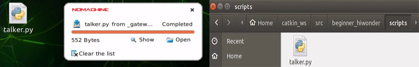
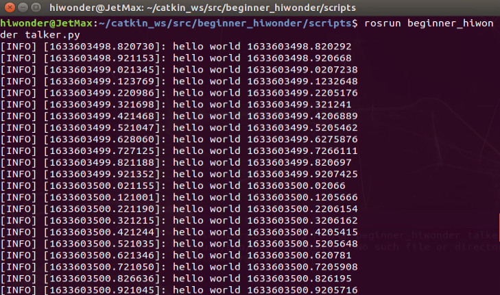

# 9. Ros Basic Lesson

## 9.1 Ros System Introduction

### 9.1.1 Ros System Introduction

Before the introduction to Ros system, we need to understand the definition of operating system. An operating system provides some software and hardware interfaces that we can use directly. Hence, different platform and different function require different operating system to complete the underlying operation.

Ros system is applicable to open-source robot operating system. It offers services similar to operating system, including Hardware abstract description, bottom driver management, shared functions execution, message transfer between programs, program distribution package management. It also provides some tools and libraries for you to obtain, build, write and execute program of multi-machine integration program.

In addition, the biggest difference between Ros and other operating system is interprocess communication. Interprocess communication of traditional operating system is called by system, which consumes lots of system resources and is not suitable for robot.

A robot consists of multiple sensors and perform the specific task through the communication and collaboration of each module. Hence, to be a robot, effective and quick interprocess communication is essential and Ros system offer such function.

### 9.1.2 Features of Ros

1.  Node to node. Separate function.

2.  Simple structure and high integration.

3.  Abundant toolkits and support multi-language.

## 9.2 Ros Common Documents and Terminology Description

### 9.2.1 Ros file system components 

Ros files consist of Packages and Manifest (package.xml).

**Packages**: Software packages constitute Ros applications. Each software package contains libraries, executables, scripts and other things created manually.

**Manifest (package.xml)**: The manifest is a description of the related information of software package, which is used to define the dependencies between related meta-information of the package, including the version, maintainer, and license agreement.

### 9.2.2**Common documents** 

**Urdf**: description document of robot can be applied in robot simulation software. It usually contains node, texture, collision, etc.

**Srv**: Described a service. The srv file is stored in the srv directory, containing request and response. And each request can be separated by "------".

**Package xml**: describe the attribute of feature packs, including name, version, author, etc.

**Strack.xml**: Strack refers to the combination of package, which used to describe the information contained in Package.

**CmakeLists.txt**: compile the configuration file with the help of Cmake

**Launch**: script, each node and service needed to start the robot systematically

### 9.2.3 Basic Ros Terminology 

> [!NOTE]
>
> **Node**: a node is a executable and it can communicate with other nodes through Ros

**Topic**: node can receive messages by sending message to topic or subscribing topic.

**Message**: Message is one type of Ros data, which is used to subscribe and be sent to topic.

**Service**: Service is another way to communicate between nodes. The service allows a node to send a request and get a response.

**Master**: used for Ros name service

### 9.2.4 Common Tools

* **Turtlesim**

Turtlesim is used for Ros or Ros software teaching.

1. Before using, please open the command line terminal.

2. Enter “**roscore**” command and open **master,** mentioned before, which is used to manage nodes.

3. After opening master, we need to enter “**rosrun turtlesim turtlesim_node”** command to start Turtlesim. And now, we open a node also called a process.

   

4. Open a new terminal again and enter “**rosrun turtlesim turtle_teleop_key**” command. Control the movement of the tortoise with front, back, right and left key.

   

   Warm notice: pin top the terminal interface to control.

   

* **QT visual tool** 

Open terminal and enter **“rosrun rqt”** command. Then press “**Tab**” key to unfold the following commands.


In “**[3. AI Vision Games Lesson]()**”, we have used **rqt_image_view** to turn on image returned by camera. And here, we introduce other tools to you.

1. **rqt_console**: toolkit for outputting log

   

2. **rqt_graph**: visual tool for calculation chart

3. **rqt_plot**: visual tool for calculation chart

* **Gazebo Physical Simulation Environment** 

Through building various models, it can make virtual robot work in a real scenario.

Enter “**gazebo**” command and wait to open the gazebo.


* **Rviz visual platform**

It is used to simulate a variety of data of robot, and can be combined with suitable plug-ins.


### 9.2.5 Common Command

Through previous explanation, we have a understanding of basic Ros command. And other basic commands are listed below.

| Name                                                         | Meaning                                                      |
| :----------------------------------------------------------- | :----------------------------------------------------------- |
| roscore                                                      | Combination of nodes and programs and can be used to open Ros service. |
| roscd                                                        | Switch the path.                                             |
| rosls \[package_name\]                                       | Check the file in software package directory.                |
| rospack find \[package name\]                                | Search through package name.                                 |
| rospack depends \[package_name\]                             | Check the libraries relied by package                        |
| rosnode list                                                 | List the running nodes.                                      |
| rostopic list                                                | Obtain the current active topic.                             |
| rosservice list                                              | Display service information of activity.                     |
| rosservice call \[service\] \[args\]                         | Call for service with the input parameter                    |
| rosed \[package_name\] \[filename\]                          | Edit the file locating in some package through default editor. |
| rosrun \[package_name\] \[node_name\] \[\_\_name:=new_name\] | Run the node.                                                |
| rosmsg show message-type-name                                | View the details of message type.                            |

## 9.3 Basic Ros Case 1- Creating messages and services

###  9.3.1 Message and service

msg (message): msg is text file used to describe the data value published by the ROS node. It can generate source code for messages written in different programming languages.

srv (service): srv is used to describe the Ros service type. It, consisting of request and response, directly builds on the Ros msg format to achieve request and response communication between nodes.

### 9.3.2 Create a Ros Software Package

We need to create a software package before creating message and service.

1. First, create a catkin workspace. Double-click on “**Terminal**” in remote desktop of NoMachine to open the terminal.

   

2. Enter “**mkdir -p ~/ros/src**” command in the terminal and press “**Enter**” to create a workspace named “**catkin_ws**” in the ~ directory.

   ```py
   mkdir -p ~/ros/src
   ```

   

3. Enter “**cd ~/catkin_ws/src**” command and press “**Enter**” to access the  
   source file space (src) directory of catkin_ws.

   ```py
   cd ~/catkin_ws/src
   ```

4. Enter “**catkin_create_pkg beginner_hiwonder std_msgs rospy roscpp**” command, and then press “**Enter**”. Create a software package named “**beginner_hiwonder**” and add dependency (msgs、rospy、roscpp).

   

5. Enter “**cd ..**” command and press “**Enter**” to return to the previous directory ~/catkin_ws/.

   ```py
   cd ..
   ```

6. Enter “**catkin_make**” command and press “**Enter**” to complete the construction of software package in catkin workspace.

   

7. Enter “**. ~/catkin_ws/devel/setup.bash**” command and press “**Enter**” to validate configuration file. Then, add “catkin_ws” workspace to the Ros environment.

   ```py
   . ~/catkin_ws/devel/setup.bash
   ```

###  9.3.3 Create a Message 

1. We need to define a new message in the software package created before. Initially, please open remote desktop of NoMachine, and double-click “**Teminal**” icon to open the terminal.

   

2. Enter “**roscd beginner_hiwonder**” command and press “**Enter**” to access the software package path.

   ```py
   roscd beginner_hiwonder
   ```

> [!NOTE]
>
> Attention: If “**No such package/stack ‘beginner_hiwonder**” occurs, software package may be not stored in environment variable ROS_PACKAGE_PATH.


And we need to add the path of the software package to the environment variable **ROS_PACKAGE_PATH**.

3. Firstly, enter **“echo "source ~/catkin_ws/devel/setup.bash" \>\> ~/.bashrc**” command and press “**Enter**”.

   ```py
   echo "source ~/catkin_ws/devel/setup.bash" >> ~/.bashrc
   ```

4. Then, enter “**source ~/.bashrc”** command and press “Enter” to complete.

   ```py
   source ~/.bashrc
   ```

5. Enter “**mkdir msg**” command and press “Enter” to create a msg folder.

   ```py
   mkdir msg
   ```

6. Enter “**echo "int64 num" \> msg/Num.msg”** command and press “Enter” to write int64 num message field to the Num.msg file.

   ```py
   echo "int64 num" > msg/Num.msg
   ```

7. Open the package.xml saved in the path of “**/home/ubuntu/catkin_ws/src/beginner_hiwonder/”**, and ensure it contains following two lines, framed in the picture, and not be commented. If not contained, the following two lines should be added.

   

   

8. Open the CMakeLists.txt saved in the path of **“/Home/catkin_ws/src/beginner_hiwonder/”**, and call and add a message_generation dependency to an existing find_package.

   

9. In the same file, add the**. MSG** file manually. Find the corresponding program block and modify according to the following figure.

   

   

10. To ensure `generate_messages()` is called, please modify in the same file according to the following figure.

    

    

11. Enter “**rosmsg show beginner_hiwonder/Num**” command and press “**Enter**” to check whether the written message field is recognized by Ros system. If recognition is successful, the command shown in the red box will appear.

    

###  9.3.4 Create a Service

1. Based on the software package created before, we need to create a service. Please open remote desktop of NoMachine, and Double-click “**Teminal**” icon to open the terminal.

   

2. Enter “**roscd beginner_hiwonder**” command and press “**Enter**” to access the software package path.

   ```py
   roscd beginner_hiwonder
   ```

3. Enter “**mkdir srv**” command and press “**Enter**” to create a srv folder.

   ```py
   mkdir srv
   ```

4. Enter “**roscp rospy_tutorials AddTwoInts.srv srv/AddTwoInts.srv”** command and press “**Enter**”. Copy **AddTwoInts** in rospy_tutorials and paste it to beginner_hiwonder.

   ```py
   roscp rospy_tutorials AddTwoInts.srv srv/AddTwoInts.srv
   ```

5. Open CMakeLists.txt saved in the path of **/home/ubuntu/catkin_ws/src/beginner_hiwonder/ and add** .srv file manually. Then modify the corresponding program block as follows.

   

   

6. Enter “**rossrv show beginner_hiwonder/AddTwoInts**” command and press “**Enter**” to check whether the written message field is recognized by Ros system.

   

##  9.4 Ros Basic Case 2- Write a Simple Publisher and Subscriber

### 9.4.1 Write the publisher node

In this lesson, we are going to create a talker node and the node source code is making references to github open source code.

1. Enter “**roscd beginner_hiwonder**” command and press “**Enter**”. Then enter beginner_hiwonder software package newly created.

   ```py
   roscd beginner_hiwonder
   ```

2. Enter “**mkdir scripts**” command and press “**Enter**”. Then create a scripts directory to save Python script.

   ```py
   mkdir scripts
   ```

3. Drag the code file of publisher node, talker.py, to the desktop of NoMachine. The code file is under JexMax data path “**[9. ROS Basic Lesson/9.4 Ros Basic Case 2- Write a Simple Publisher and Subscriber/ Ros Related Program]()**”

   Then, move the talker.py to "**/home/ubuntu/catkin_ws/src/beginner_hiwonder/scripts/**".

   

4. On the terminal that has just opened, enter “**cd scripts**” command and press “**Enter**” to enter a new scripts directory.

   ```py
   cd scripts
   ```

5. Enter “**chmod +x talker.py**” command and press “Enter”. Give execute permission to talker.py.

   ```py
   chmod +x talker.py
   ```

6. If wanting to revise or edit talker.py file, you need to enter “**rosed beginner_hiwonder talker.py**” command and press “Enter”.

   ```py
   rosed beginner_hiwonder talker.py
   ```

7. Then press “i” to revise. When finishing revising, press “Ese” and enter “**：wq**” and save to quit.

   

8. Add the following content to the cMakelists.txt file. Ensure that Python scripts are installed correctly and that the suitable Python interpreter is used.

   ```py
   catkin_install_python(PROGRAMS scripts/talker.py DESTINATION
   \${CATKIN_PACKAGE_BIN_DESTINATION})
   ```

   

   

### 9.4.2 Write subscriber node 

In this lesson, we are going to create a listener node and the node source code is making references to github open source code.

1. Drag the code file of listener node, listener.py, to the desktop of NoMachine. The code file is under JexMax data path “**[9. ROS Basic Lesson/Lesson 4 Ros Basic Case 2- Write a Simple Publisher and Subscriber/ Ros Related Program]()**”

   Then, move listener.py to “**/home/ubuntu/catkin_ws/src/beginner_hiwonder/scripts/**”.

   

2. Open command line terminal to enter

   “**cd ~/catkin_ws/src/beginner_hiwonder/scripts/**” command and press “**Enter**” to enter scripts directory newly created.

   ```py
   cd ~/catkin_ws/src/beginner_hiwonder/scripts/
   ```

3. Enter “**chmod +x listener.py”** command and press “Enter”**.** Give execute permission to listener.py.

   ```py
   chmod +x listener.py
   ```

4. If wanting to revise or edit listener.py file, you need to enter “**rosed beginner_hiwonder listener.py**” command and press “Enter”.

   ```py
   rosed beginner_hiwonder listener.py
   ```

5. Then press “i” to revise it. When finishing revising, press “Ese” and enter “**：wq**” and save to quit.

   

6. Add the following content to the cMakelists.txt file. Ensure that Python scripts are installed correctly and that the suitable Python interpreter is used.

   ```py
   catkin_install_python(PROGRAMS scripts/talker.py scripts/listener.py DESTINATION \${CATKIN_PACKAGE_BIN_DESTINATION})
   ```

   

   

### 9.4.3 Verify publisher and subscriber 

1. To ensure the Python code is generated automatically for created message and service, we need to return to catkin workspace and enter “**cd ~/catkin_ws**” command, then press “**Enter**”.

   ```py
   cd ~/catkin_ws
   ```

2. Next, enter “**catkin_make**” command and press “**Enter**”.

   

3. Enter “**roscore**” command and start the node manager.

   ```py
   roscore
   ```

   If it is opened, the following prompt will appear.

   

4. Before running the program, please make sure the setup.\*sh file of the workspace is sourced after calling catkin_make. If not, you need to return to the created workspace and make setup.\*sh take effect. Enter “**source ./devel/setup.bash**” command and then press “**Enter**”

   ```py
   source ./devel/setup.bash
   ```

5. Enter “**rosrun beginner_hiwonder talker.py**” command to run publisher of talker. And you can quit the publisher node by pressing “**Ctrl+C**”.

   

6. Open a new command line terminal and enter “**rosrun beginner_hiwonder listener.py**” to run subscriber of listener. And you can quit the subscriber node by pressing “**Ctrl+C**”.

   

> [!NOTE]
>
> * The subscriber node cannot subscribe message until starting the publisher node.
>
> * If you need to receive all publisher message, you can start the subscriber node first, then turn on publisher node.

##  9.5 Ros Basic Case 3- Write simple server and client

### 9.5.1 Write service node

In this lesson, we will create simple service node, **add_two_ints_server**. The node code is making reference to open-source code github. The node will receive two integers and return their sum.

Firstly, we need to build the service, **AddTwoInts.srv**, according to “**[9.3 Ros Basic Case 1- Creating messages and services]()**”

1. Drag the code file of server node, add_two_ints_server.py, to the desktop of NoMachine. The code file is under JetMax data path “**[9. ROS Basic Lesson/9.5 Ros Basic Case 3- Write simple server and client/ Ros Related Program]()**”

   Then, move add_two_ints_server.py to "**/Home/catkin_ws/src/beginner_hiwonder/scripts/**".

   

2. Open terminal and enter “**cd ~/catkin_ws/src/beginner_hiwonder/scripts/**” command and press “Enter” to enter the scripts directory newly created.

   ```py
   cd ~/catkin_ws/src/beginner_hiwonder/scripts/

3. Open terminal and enter “**chmod +x add_two_ints_server.py**” command and press “**Enter**”. Give execute permission to **add_two_ints_server.py**.

   ```py
   chmod +x add_two_ints_server.py
   ```

4. If wanting to revise or edit **add_two_ints_server.py** file, you need to enter “**rosed beginner_hiwonder add_two_ints_server.py**” command and press “Enter”.

   ```py
   rosed beginner_hiwonder add_two_ints_server.py
   ```

5. Then press “**i**” to revise. When finishing revising, press “**Esc**” and enter “**:wq**” and save to quit.

   

6. Add the following content to the **CMakeLists.txt** file. Ensure that Python scripts are installed correctly and that the suitable Python interpreter is used.

   ```py
   catkin_install_python(PROGRAMS scripts/add_two_ints_server.py DESTINATION
   ${CATKIN_PACKAGE_BIN_DESTINATION})
   ```

   

###  9.5.2 Write server node

In this lesson, we will create simple client node, add_two_ints_server. The node code is making reference to open-source code github. The node will print the sum of the parameters read by add_two_ints_server.

1. Drag the code file of client node, add_two_ints_client.py, to the desktop of NoMachine. The code file is under JetMax data path “**[9.ROS Basic Lesson/9.5 Ros Basic Case 3- Write simple server and client/ Ros Related Program]()**”.

   Then, move **add_two_ints_client.py** to **“/home/ubuntu/catkin_ws/src/beginner_hiwonder/scripts/”.**

   

2. Open terminal and enter “**cd ~/catkin_ws/src/beginner_hiwonder/scripts/”** command to switch to the directory where add_two_ints_client.py is saved.

   ```py
   cd ~/catkin_ws/src/beginner_hiwonder/scripts/
   ```

3. Then enter “**chmod +x add_two_ints_server.py**” command and press “Enter”. Give execute permission to **add_two_ints_client.py**.

   ```py
   chmod +x add_two_ints_server.py
   ```

4. If wanting to revise or edit add_two_ints_client.py file, you need to enter “**rosed beginner_hiwonder add_two_ints_client.py**” command and press “**Enter**”. Then press “i”. When finishing revising, press “**Ese**” and enter “**:wq**” and save to quit.

   ```py
   rosed beginner_hiwonder add_two_ints_client.py
   ```

5. Then press “**i**” to modify. When finishing revising, press “**Ese**” and enter “**:wq**” and save to quit.

   

6. Add the following content to the cMakelists.txt file. Ensure that Python scripts are installed correctly and that the suitable Python interpreter is used.

   ```py
   catkin_install_python(PROGRAMS scripts/add_two_ints_server.py scripts/add_two_ints_client.py
   DESTINATION \${CATKIN_PACKAGE_BIN_DESTINATION})
   ```

   

### 9.5.3 Verify simple server and client 

1. To ensure the Python code is generated automatically for created message and service, we need to return to catkin workspace and enter “**cd ~/catkin_ws/**” command. Then, press “**Enter**”.

   ```py
   cd ~/catkin_ws/
   ```

2. Run catkin_make. Enter “**catkin_make**” command and press “Enter”.

   

3. Enter “**roscore**” command and start the node manager. If turned on, the following prompt will appear.

   ```py
   roscore
   ```

   

4. Before running the program, please make sure the setup.\*sh file of the workspace is sourced after calling catkin_make. If not, you need to return to the created workspace and make setup.\*sh take effect.

   ```py
   source ./devel/setup.bash
   ```

5. Enter “**rosrun beginner_hiwonder add_two_ints_server.py**” command to run the service.

   ```py
   rosrun beginner_hiwonder add_two_ints_server.py
   ```

   

6. Open a new command line terminal and enter “**rosrun beginner_hiwonder add_two_ints_client.py 1 3**” to run client.

   ```py
   rosrun beginner_hiwonder add_two_ints_client.py 1 3
   ```

   

   > [!NOTE]
   >
   > **Parameters are required to run the client. For example, 1 and 3, framed in the picture.**


## 9.6 ROS Basic Command

### 9.6.1 ROS command description

Through entering command in shell, ROS can use the file system, edit source code, build, debug, manage feature pack, etc. For using ROS correctly, you need to master ROS specialized command.

Description and example of function of each command are given to let you quickly get familiar with ROS command.

### 9.6.2 Collection of ROS command

ROS commands are divided into ROS shell command, ROS executive command, ROS information command and ROS catkin command and ROS feature pack command.

* **ROS shell command**

  | Command | CommandInterpretation     | Description                                         |
  | ------- | ------------------------- | --------------------------------------------------- |
  | roscd   | ros+cd(changes directory) | Move to the designated directory of ROSfeature pack |
  | rosls   | ros+ls(lists files)       | Display the file and directory of ROSfeature pack   |
  | rosed   | ros+ed(editor)            | Edit the file of ROS feature pack                   |
  | roscp   | ros+cp(copies files)      | Copy the file of ROS feature pack                   |
  | rospd   | ros+pushd                 | Add the directory to ROS directory index            |
  | rosd    | ros+directory             | Display the directory of ROS directoryindex         |

* **ROS executive command**

  | Command   | Command interpretation | Description                                                  |
  | --------- | ---------------------- | ------------------------------------------------------------ |
  | roscore   | ros+core               | Master(ROS name service) +   rosout (log record)+ parameter  server (parameter management) |
  | rosrun    | ros+run                | Run node                                                     |
  | roslaunch | ros+launch             | Run multiple nodes and set running option                    |
  | rosclean  | rosclean               | Check or delete ROS log files                                |

* **ROS information command**

  | Command    | Command interpretation | Description                                     |
  | ---------- | ---------------------- | ----------------------------------------------- |
  | rostopic   | ros+topic              | Confirm ROS topic information                   |
  | rosservice | ros+service            | Confirm ROS serviceinformation                  |
  | rosnode    | ros+node               | Confirm ROS node information                    |
  | rosparam   | ros+param(parameter)   | Confirm and modify ROS parameter information    |
  | rosbag     | ros+bag                | Record and playback ROS information             |
  | rosmsg     | ros+msg                | Display ROS information type                    |
  | rossrv     | ros+srv                | Display ROS service type                        |
  | rosversion | ros+version            | Display version information of ROS feature pack |
  | roswtf     | ros+wtf                | Check ROS system                                |

* **ROS catkin command**

  | Command                   | Description                                                  |
  | ------------------------- | ------------------------------------------------------------ |
  | catkin_create_pkg         | Generate feature pack automatically                          |
  | catkin_make               | Build based on catkin build system                           |
  | catkin_eclipse            | Modify the feature pack generated by catkin build system so as to use it in Eclipseenvironment |
  | catkin_prepare_release    | Log cleanup and version tapping when publishing              |
  | catkin_generate_changelog | Generate or update CHANGELOG.rst file                        |
  | catkin_init_workspace     | Initialize the work directory of catkin build system         |
  | catkin_find               | Search catkin                                                |

* **ROS feature pack command**

  | Command       | Command interpretation | Description                                                  |
  | ------------- | ---------------------- | ------------------------------------------------------------ |
  | rospack       | ros+pack(age)          | Check the informationrelated to ROS feature pack             |
  | rosinstall    | ros+install            | Install ROS additional feature pack                          |
  | rosdep        | ros+dep(endencies)     | Install the dependency files for the feature pack            |
  | roslocate     | ros+locate             | Command related to ROS feature pack information              |
  | roscreate-pkg | ros+create-pkg         | Generate ROS feature pack automatically. It is used in   old rosbuild system |
  | rosmake       | ros+make               | Build ROS feature pack. It is used in old rosbuild system    |

## 9.7 RQT Tool

  ### 9.7.1 Introduction to RQT tool

* **Description**

  ROT is a set of tools for convenient graphical representation. It can implement the various graphical tools and interfaces in the form of plugins. Besides, it run all the existing GUI tools as dockable windows within rqt.

  You can send command to “**rqt**” to run RQT tool and plug-ins. GUI allows all plug-ins to load and run. And of course, you can run the plug-ins with the independent window.

* **Component structure**

  RQT consists of three metapackages.

  `rqt`：core basic structure module

  `rqt_common_plugins`：used for bandend tool of build

  `rqt_robot_plugins`：used for the interactive tool with robot

* **Advantage of the framework**

  Compared with building GUI from zero, framework has the following advantages.

1. involve standardized public GUI routine

2. multiple widgets can dock at one window

3. it is easy to convert the existed Qt widgets into RQt plug-in

4. Receive backup from ROS Answers

5. support cross platform and multiple programming languages

6. Manageable life cycle. RQT plug-in adopts public API, which makes maintenance and reusing easier.

  ### 9.7.2 RQT running 

> [!NOTE]
>
> **Note: if RQT tool has already been installed in the system, there is no need to install again.**

  Open the terminal, enter command “**rosrun rqt\_**”, and press “**Tab**” key to unfold the following commands.


  In previous AI vision games, **rqt_image_view** is used to display the transmitted image.


  There are other useful tools.

  1. **rqt_console**：log output toolbox


  2. **rqt_graph**: Computational graph visualization tools


  3. **rqt_plot**: Computational graph visualization tools


  ### 9.7.3 Function of plug-in 

|       Plug-in       |                     Function description                     |
| :-----------------: | :----------------------------------------------------------: |
|   topics monitor    | It can monitor the transferring data of the current topic, including occupied bandwidth, topic frequency, etc. It is equal to **rostopic echo msg_name** |
|  message publisher  | publish a topic with custom name, and specific the type of information published by the topic, published data and published frequency. |
| message type brower | You can view all currently defined message types, including your own defined msg. Its function is equal to **rosmsg show msg_name** |
|   robot steering    | publish a topic **cmd_vel** and publish **Twist** topic message. Speed and angle variables can be modified visually, which is convenient for controlling command. |
|         bag         | It can be used to record a bag file package, and you can specify which topics to record. You can also open a bag file package which can easily control **play** of bag package to play or pause, and can specify the previous frame and the next frame to play. |

  the plug-in of bag is as follow.

|   **Plug-in**   |                   **Function description**                   |
| :-------------: | :----------------------------------------------------------: |
|   node_graph    |        view all the nodes running on the current node        |
| process monitor | view all current nodes, and PID, occupied CPU, occupied storage of the node |
|     launch      | it is convenient to select package and launch file in the visual interface. Run and pause one node of launch |
|   image view    | It is convenient to check the transferred picture message in ROS topic, which is convenient for us to observe the image currently seen by the robot |
|      plot       | Data of the topic can be display graphically, which makes the changes of topic message intuitive facilitating debugging |
|     tf tree     |       Can display the current tree structure of **tf**       |
|      rviz       | rviz tool is integrated in rqt and we can open rviz tool in rqt |


